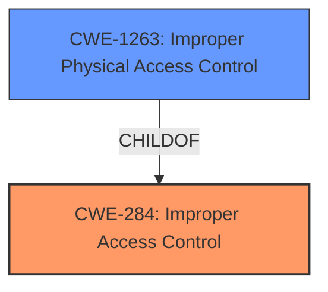

# Analysis for CVE-2022-36851

# Summary

| CWE ID | CWE Name | Confidence | CWE Abstraction Level | CWE Vulnerability Mapping Label | CWE-Vulnerability Mapping Notes |
|---|---|---|---|---|---|
| CWE-284 | Improper Access Control | 0.8 | Pillar | Discouraged | The CWE-284 is too high-level but the description specifically describes **improper access control**. |
| CWE-1263 | Improper Physical Access Control | 0.6 | Class | Allowed-with-Review | Since the attacker is a physical attacker, this is an option but it seems too specific.  |

## Evidence and Confidence

*   **Confidence Score:** 0.7
*   **Evidence Strength:** HIGH

## Relationship Analysis

The primary relationship that influenced my decision was the parent-child relationship between CWE-284 (Improper Access Control) and its children, particularly CWE-1263 (Improper Physical Access Control). While the vulnerability description explicitly mentions "physical attackers," choosing the more specific CWE-1263 might be too narrow. Therefore, I opted for the higher-level CWE-284, acknowledging its broadness but recognizing its direct relevance to the described weakness.

## Vulnerability Chain

The vulnerability chain is relatively simple:

1.  **Root Cause:** **Improper access control** (CWE-284).
2.  **Impact:** Physical attackers can access Samsung Pass data on a certain state of an unlocked device.

## Summary of Analysis

Initially, the vulnerability description pointed towards a clear case of **improper access control**, as stated in the "Vulnerability Description Key Phrases":
-   **rootcause:** **Improper access control**

The "CVE Reference Links Content Summary" section reinforced this by stating:
*   **Root cause of vulnerability:** Improper access control in Samsung Pass.
*   **Weaknesses/vulnerabilities present:** The vulnerability allows physical attackers to access data of Samsung Pass on a certain state of an unlocked device due to **improper access control**.

The retriever results suggested several CWEs related to access control and authentication, with CWE-284 (Improper Access Control) being a prominent candidate. However, CWE-284 is a Pillar-level CWE, and the mapping guidance discourages its use due to its high level of abstraction. Despite this, the explicit mention of "**Improper access control**" in the vulnerability description makes it difficult to ignore.

CWE-1263 (Improper Physical Access Control) was considered due to the involvement of physical attackers. However, it felt too specific, as the core issue is still about the logical access control mechanisms within Samsung Pass being bypassed in a certain state of an unlocked device, regardless of the attacker's physical presence.

Therefore, while acknowledging the discouraged usage of CWE-284, I opted for it as the primary CWE due to its direct correspondence with the described weakness. This decision is based on the evidence from the vulnerability description and the lack of a more fitting, lower-level CWE.

Relevant CWE Information:

# Enhanced Context (25 CWEs)

## CWE-284: Improper Access Control
**Abstraction:** Pillar

**Mapping Guidance:**
-   Usage: Discouraged
-   Rationale: CWE-284 is extremely high-level, a Pillar.

## CWE-1263: Improper Physical Access Control
**Abstraction:** Class

**Mapping Guidance:**
-   Usage: Allowed-with-Review
-   Rationale: This CWE entry is a Class and might have Base-level children that would be more appropriate