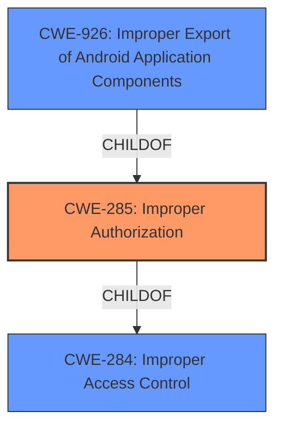

# Analysis for CVE-2022-36856

# Summary
| CWE ID | CWE Name | Confidence | CWE Abstraction Level | CWE Vulnerability Mapping Label | CWE-Vulnerability Mapping Notes |
|---|---|---|---|---|---|
| CWE-285 | Improper Authorization | 0.8 | Class | Primary | Allowed-with-Review |
| CWE-926 | Improper Export of Android Application Components | 0.6 | Variant | Secondary | Allowed |
| CWE-284 | Improper Access Control | 0.5 | Pillar | Secondary | Discouraged |

## Evidence and Confidence

*   **Confidence Score:** 0.7
*   **Evidence Strength:** MEDIUM

## Relationship Analysis
The primary CWE selected is CWE-285, which is a Class-level CWE. While it is generally recommended to use Base or Variant level CWEs, the available evidence suggests that the authorization mechanism is present but implemented incorrectly. The vulnerability description mentions "**Improper access control** vulnerability" and that the "patch defined a proper permission to prevent improper access to emergency call," which suggests that some form of access control was in place but was not sufficient. CWE-285 is a child of CWE-284 (Improper Access Control), which is a high-level Pillar. CWE-926, Improper Export of Android Application Components, is included as an alternative because the vulnerability exists within the Android Telecom application, and improper component exporting could lead to the observed **improper access control**.

## Vulnerability Chain
The vulnerability chain starts with an **improper access control** implementation, leading to the impact of an attacker being able to start emergency calls.
  - Root Cause: **Improper Authorization** (CWE-285)
  - Impact: Attacker can start emergency calls.

## Summary of Analysis
The initial assessment, based on the vulnerability description and the CVE reference, points to an **improper access control** issue. The vulnerability description mentions "**Improper access control** vulnerability in Telecom application prior to SMR Sep-2022 Release 1 allows attacker to start emergency calls via undefined permission." The key phrase also highlights "**Improper access control**" as the root cause. The CVE reference summary confirms this by stating, "Improper access control vulnerability in Telecom application prior to SMR Sep-2022 Release 1 allows attacker to start emergency calls via undefined permission." The patch information reinforces this further: "The patch defined a proper permission to prevent improper access to emergency call."

Based on this evidence, CWE-285 (Improper Authorization) is chosen as the primary CWE. It is a Class-level CWE, and the mapping guidance suggests considering its children for more specific mappings. However, without further information about the specific authorization failure, sticking with CWE-285 is appropriate.

CWE-284 is a high-level Pillar that is too generic and is discouraged.

CWE-926 (Improper Export of Android Application Components) is also considered because the application is an Android Telecom application. This could be a contributing factor if the component handling emergency calls was improperly exported, enabling unauthorized access. The retriever results also list it as a candidate.

While ideally a more specific Base or Variant CWE would be preferred, the provided information is insufficient to pinpoint the exact nature of the authorization flaw beyond the general "improper" category.

Relevant CWE Information:

# Enhanced Context (25 CWEs)

## CWE-274: Improper Handling of Insufficient Privileges
**Abstraction Level**: Base
**Similarity Score**: 0.76
**Source**: dense

**Description**:
The product does not handle or incorrectly handles when it has insufficient privileges to perform an operation, leading to resultant weaknesses.

**Mapping Guidance**:
- Usage: Discouraged
- Rationale: This CWE entry could be deprecated in a future version of CWE.

*This CWE was not selected because the vulnerability description indicates that the issue is with improper access control, not with the handling of insufficient privileges.*

## CWE-280: Improper Handling of Insufficient Permissions or Privileges 
**Abstraction Level**: Base
**Similarity Score**: 0.76
**Source**: dense

**Description**:
The product does not handle or incorrectly handles when it has insufficient privileges to access resources or functionality as specified by their permissions. This may cause it to follow unexpected code paths that may leave the product in an invalid state.

**Mapping Guidance**:
- Usage: Allowed
- Rationale: This CWE entry is at the Base level of abstraction, which is a preferred level of abstraction for mapping to the root causes of vulnerabilities.

*This CWE was not selected because the description focuses on the product's failure to handle cases where it has insufficient privileges, whereas the provided text indicates improper authorization.*

## CWE-653: Improper Isolation or Compartmentalization
**Abstraction Level**: Class
**Similarity Score**: 0.75
**Source**: dense

**Description**:
The product does not properly compartmentalize or isolate functionality, processes, or resources that require different privilege levels, rights, or permissions.

**Mapping Guidance**:
- Usage: Allowed
- Rationale: This CWE entry is at the Base level of abstraction, which is a preferred level of abstraction for mapping to the root causes of vulnerabilities.

*This CWE was not selected because the description centers on a lack of isolation, while the provided text indicates an access control issue.*

## CWE-807: Reliance on Untrusted Inputs in a Security Decision
**Abstraction Level**: Base
**Similarity Score**: 0.75
**Source**: dense

**Description**:
The product uses a protection mechanism that relies on the existence or values of an input, but the input can be modified by an untrusted actor in a way that bypasses the protection mechanism.

**Mapping Guidance**:
- Usage: Allowed
- Rationale: This CWE entry is at the Base level of abstraction, which is a preferred level of abstraction for mapping to the root causes of vulnerabilities.

*This CWE was not selected because there is no mention of untrusted inputs being directly used in a security decision.*

## CWE-1220: Insufficient Granularity of Access Control
**Abstraction Level**: Base
**Similarity Score**: 0.75
**Source**: dense

**Description**:
The product implements access controls via a policy or other feature with the intention to disable or restrict accesses (reads and/or writes) to assets in a system from untrusted agents. However, implemented access controls lack required granularity, which renders the control policy too broad because it allows accesses from unauthorized agents to the security-sensitive assets.

**Mapping Guidance**:
- Usage: Allowed
- Rationale: This CWE entry is at the Base level of abstraction, which is a preferred level of abstraction for mapping to the root causes of vulnerabilities.

*This CWE was not selected because there is no detail about the access control granularity or the access control policy. The provided text indicates that the access control mechanism is improperly implemented.*

## CWE-303: Incorrect Implementation of Authentication Algorithm
**Abstraction Level**: Base
**Similarity Score**: 0.74
**Source**: dense

**Description**:
The requirements for the product dictate the use of an established authentication algorithm, but the implementation of the algorithm is incorrect.

**Mapping Guidance**:
- Usage: Allowed
- Rationale: This CWE entry is at the Base level of abstraction, which is a preferred level of abstraction for mapping to the root causes of vulnerabilities.

*This CWE was not selected because the problem described is an improper authorization, not an improper authentication algorithm.*

## CWE-754: Improper Check for Unusual or Exceptional Conditions
**Abstraction Level**: Class
**Similarity Score**: 0.74
**Source**: dense

**Description**:
The product does not check or incorrectly checks for unusual or exceptional conditions that are not expected to occur frequently during day to day operation of the product.

**Mapping Guidance**:
- Usage: Allowed-with-Review
- Rationale: This CWE entry is a Class and might have Base-level children that would be more appropriate

*This CWE was not selected because the description is about missing or improper checks for unusual conditions, which is not clearly demonstrated in the vulnerability description.*

## CWE-1390: Weak Authentication
**Abstraction Level**: Class
**Similarity Score**: 0.74
**Source**: dense

**Description**:
The product uses an authentication mechanism to restrict access to specific users or identities, but the mechanism does not sufficiently prove that the claimed identity is correct.

**Mapping Guidance**:
- Usage: Allowed-with-Review
- Rationale: This CWE entry is a Class and might have Base-level children that would be more appropriate

*This CWE was not selected because the focus is on improper authorization not authentication.*

## CWE-639: Authorization Bypass Through