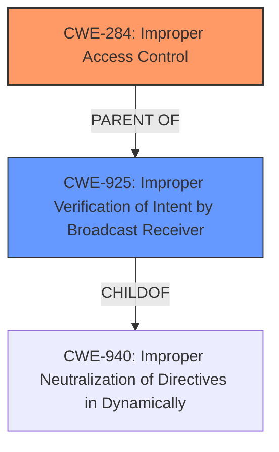

# Raw Analyzer Response for CVE-2022-36866

# Summary
| CWE ID | CWE Name | Confidence | CWE Abstraction Level | CWE Vulnerability Mapping Label | CWE-Vulnerability Mapping Notes |
|---|---|---|---|---|---|
| CWE-284 | Improper Access Control | 0.75 | Pillar | Primary | Discouraged |
| CWE-925 | Improper Verification of Intent by Broadcast Receiver | 0.65 | Variant | Secondary | Allowed |

## Evidence and Confidence

*   **Confidence Score:** 0.70
*   **Evidence Strength:** MEDIUM

## Relationship Analysis
The primary relationship considered was that CWE-284 [Improper Access Control] is a high-level Pillar, and therefore discouraged from being used. While the **rootcause** of the vulnerability is **improper access control**, the retriever results pointed to more specific weaknesses. CWE-925 [Improper Verification of Intent by Broadcast Receiver] is a Variant level and a child of CWE-940.

## Vulnerability Chain
The chain of root cause and weaknesses is as follows:
1.  **Root Cause:** **Improper Access Control** in the Broadcaster component.
2.  **Weakness:** The application fails to properly verify the source of Intents received by the Broadcast Receiver (CWE-925).
3.  **Impact:** Attackers can identify the device by exploiting this vulnerability.

## Summary of Analysis
The initial assessment identified **improper access control** as the **rootcause**. However, further analysis and the retriever results indicate a more specific weakness related to the verification of Intents by the Broadcast Receiver.

The vulnerability description states, "Improper access control vulnerability in Broadcaster in Group Sharing prior to versions... allows attackers to identify the device." The CVE Reference Links Content Summary confirms this: "The vulnerability stems from a lack of proper access control in the Broadcaster component of the Group Sharing application."

CWE-284 is a high-level Pillar, and its mapping guidance discourages its use. The retriever results suggest CWE-925 as a more specific Variant. The description of CWE-925, "The Android application uses a Broadcast Receiver that receives an Intent but does not properly verify that the Intent came from an authorized source," aligns well with the vulnerability, given that the attack vector is via implicit broadcasts. The fix described involves adding proper access control check logic for broadcasting data.

Therefore, while **improper access control** is the **rootcause**, CWE-925 better describes the specific weakness. However, since **improper access control** is the root cause, it's included as the primary CWE, even though it is discouraged.

Relevant CWE Information:

# Enhanced Context (25 CWEs)
The following CWEs were identified as potentially relevant to this vulnerability:

## CWE-664: Improper Control of a Resource Through its Lifetime
**Abstraction Level**: Pillar
**Similarity Score**: 0.74
**Source**: dense

**Description**:
The product does not maintain or incorrectly maintains control over a resource throughout its lifetime of creation, use, and release.

**Mapping Guidance**:
- Usage: Discouraged
- Rationale: This CWE entry is high-level when lower-level children are available.

## CWE-284: Improper Access Control
**Abstraction:** Pillar
**Status:** Incomplete

### Description
The product does not restrict or incorrectly restricts access to a resource from an unauthorized actor.

### Extended Description
Access control involves the use of several protection mechanisms such as:

  - Authentication (proving the identity of an actor)

  - Authorization (ensuring that a given actor can access a resource), and

  - Accountability (tracking of activities that were performed)

When any mechanism is not applied or otherwise fails, attackers can compromise the security of the product by gaining privileges, reading sensitive information, executing commands, evading detection, etc.

There are two distinct behaviors that can introduce access control weaknesses:

  - Specification: incorrect privileges, permissions, ownership, etc. are explicitly specified for either the user or the resource (for example, setting a password file to be world-writable, or giving administrator capabilities to a guest user). This action could be performed by the program or the administrator.

  - Enforcement: the mechanism contains errors that prevent it from properly enforcing the specified access control requirements (e.g., allowing the user to specify their own privileges, or allowing a syntactically-incorrect ACL to produce insecure settings). This problem occurs within the program itself, in that it does not actually enforce the intended security policy that the administrator specifies.

### Alternative Terms
Authorization: The terms "access control" and "authorization" are often used interchangeably, although many people have distinct definitions. The CWE usage of "access control" is intended as a general term for the various mechanisms that restrict which users can access which resources, and "authorization" is more narrowly defined. It is unlikely that there will be community consensus on the use of these terms.

### Relationships
None

### Mapping Guidance
**Usage:** Discouraged
**Rationale:** CWE-284 is extremely high-level, a Pillar. Its name, "Improper Access Control," is often misused in low-information vulnerability reports [REF-1287] or by active use of the OWASP Top Ten, such as "A01:2021-Broken Access Control". It is not useful for trend analysis.
**Comments:** Consider using descendants of CWE-284 that are more specific to the kind of access control involved, such as those involving authorization (Missing Authorization (CWE-862), Incorrect Authorization (CWE-863), Incorrect Permission Assignment for Critical Resource (CWE-732), etc.); authentication (Missing Authentication (CWE-306) or Weak Authentication (CWE-1390)); Incorrect User Management (CWE-286); Improper Restriction of Communication Channel to Intended Endpoints (CWE-923); etc.
**Reasons:**
- Frequent Misuse
- Abstraction
**Suggested Alternatives:**
- CWE-862: Missing Authorization
- CWE-863: Incorrect Authorization
- CWE-732: Incorrect Permission Assignment for Critical Resource
- CWE-306: Missing Authentication
- CWE-1390: Weak Authentication
- CWE-923: Improper Restriction of Communication Channel to Intended Endpoints