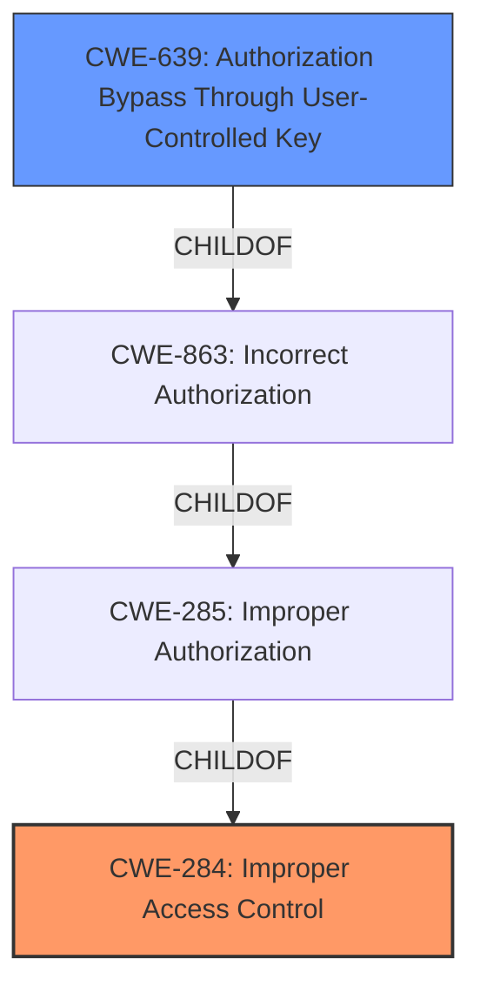

# Analysis for CVE-2022-36867

# Summary
| CWE ID | CWE Name | Confidence | CWE Abstraction Level | CWE Vulnerability Mapping Label | CWE-Vulnerability Mapping Notes |
|---|---|---|---|---|---|
| CWE-284 | Improper Access Control | 0.8 | Pillar | Primary | Discouraged |
| CWE-639 | Authorization Bypass Through User-Controlled Key | 0.6 | Base | Secondary | Allowed |

## Evidence and Confidence

*   **Confidence Score:** 0.7
*   **Evidence Strength:** MEDIUM

## Relationship Analysis
The primary CWE is CWE-284, which is a high-level Pillar. CWE-639 is a child of CWE-863 (Incorrect Authorization), which in turn is a child of CWE-285 (Improper Authorization). CWE-285 is a child of CWE-284. This indicates a hierarchical relationship moving from general access control issues to more specific authorization bypass vulnerabilities. The abstraction levels influenced the decision to start with the more general CWE-284 due to the limited details in the description, while recognizing CWE-639 as a more specific possibility if more details were available.

## Vulnerability Chain
The vulnerability chain starts with **improper access control**, leading to the **impact** of allowing attackers to access sensitive information. The chain here is short but represents the core flow:

1.  **Root Cause:** **Improper Access Control**
2.  **Impact:** Access to Sensitive Information

## Summary of Analysis
The initial analysis focused on identifying the root cause and impact of the vulnerability. The description clearly states "**Improper access control** vulnerability... allows attackers to access sensitive information." The CVE Reference Links Content Summary further supports this, stating "Root Cause: Improper access control within the Editor Lite application" and "Weakness: The Editor Lite application fails to properly restrict access to sensitive information." Given this evidence, and noting that the provided "Retriever Results" listed CWE-284 as the top candidate, CWE-284 was chosen as the primary CWE.

However, the description lacks detailed information about the specific mechanism of the **improper access control**. Therefore, while CWE-284 is a reasonable starting point, it is a high-level classification.

CWE-639, Authorization Bypass Through User-Controlled Key, was considered as a more specific alternative due to its higher relevance score in the retriever results and its description aligning with potential authorization issues. However, without further details on the exact method of bypass (e.g., modification of URL parameters, cookies, etc.), it's difficult to confirm this with high confidence.

Ultimately, the selected CWEs are at the optimal level of specificity given the available evidence. CWE-284 captures the general **improper access control**, while acknowledging that a more specific CWE, such as CWE-639, might be applicable with additional information.

Relevant CWE Information:

# Enhanced Context (25 CWEs)
The following CWEs were identified as potentially relevant to this vulnerability:

## CWE-639: Authorization Bypass Through User-Controlled Key
**Abstraction Level**: Base
**Similarity Score**: 0.74
**Source**: dense

**Description**:
The system's authorization functionality does not prevent one user from gaining access to another user's data or record by modifying the key value identifying the data.

**Mapping Guidance**:
- Usage: Allowed
- Rationale: This CWE entry is at the Base level of abstraction, which is a preferred level of abstraction for mapping to the root causes of vulnerabilities.

## CWE-284: Improper Access Control
**Abstraction:** Pillar
**Status:** Incomplete

### Description
The product does not restrict or incorrectly restricts access to a resource from an unauthorized actor.

### Extended Description
Access control involves the use of several protection mechanisms such as:
  - Authentication (proving the identity of an actor)
  - Authorization (ensuring that a given actor can access a resource), and
  - Accountability (tracking of activities that were performed)
When any mechanism is not applied or otherwise fails, attackers can compromise the security of the product by gaining privileges, reading sensitive information, executing commands, evading detection, etc.
There are two distinct behaviors that can introduce access control weaknesses:
  - Specification: incorrect privileges, permissions, ownership, etc. are explicitly specified for either the user or the resource (for example, setting a password file to be world-writable, or giving administrator capabilities to a guest user). This action could be performed by the program or the administrator.
  - Enforcement: the mechanism contains errors that prevent it from properly enforcing the specified access control requirements (e.g., allowing the user to specify their own privileges, or allowing a syntactically-incorrect ACL to produce insecure settings). This problem occurs within the program itself, in that it does not actually enforce the intended security policy that the administrator specifies.

### Mapping Guidance
**Usage:** Discouraged
**Rationale:** CWE-284 is extremely high-level, a Pillar. Its name, "Improper Access Control," is often misused in low-information vulnerability reports [REF-1287] or by active use of the OWASP Top Ten, such as "A01:2021-Broken Access Control". It is not useful for trend analysis.
**Comments:** Consider using descendants of CWE-284 that are more specific to the kind of access control involved, such as those involving authorization (Missing Authorization (CWE-862), Incorrect Authorization (CWE-863), Incorrect Permission Assignment for Critical Resource (CWE-732), etc.); authentication (Missing Authentication (CWE-306) or Weak Authentication (CWE-1390)); Incorrect User Management (CWE-286); Improper Restriction of Communication Channel to Intended Endpoints (CWE-923); etc.