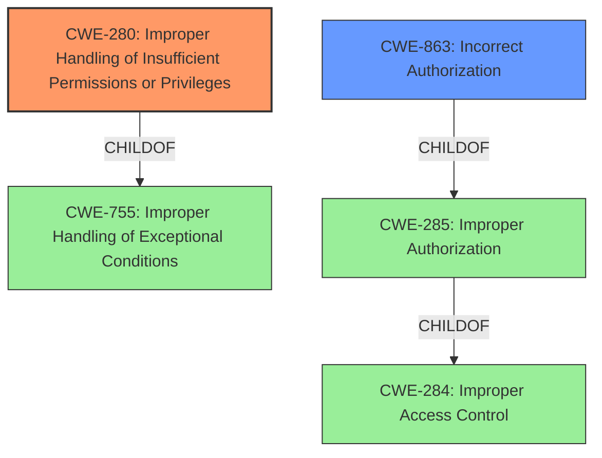

# Analysis for CVE-2022-36874

# Summary
| CWE ID  | CWE Name | Confidence | CWE Abstraction Level | CWE Vulnerability Mapping Label | CWE-Vulnerability Mapping Notes |
|-----------------|-----------------------------------------------------------------------------------------------------------------|------------|-----------------------|------------------------------------|------------------------------------------------------------------------------------------------------------------------------------|
| **CWE-280** | Improper Handling of Insufficient Permissions or Privileges | 1.0 | Base | Primary | Allowed |
| CWE-863 | Incorrect Authorization | 0.7 | Class | Secondary Candidate | Allowed-with-Review |

## Evidence and Confidence

*   **Confidence Score:** 0.9
*   **Evidence Strength:** HIGH

## Relationship Analysis
The primary relationship that influenced the decision was the direct match of the vulnerability description to the definition of CWE-280. The hierarchy also played a role, guiding towards the more specific Base level CWE-280 instead of a higher-level Class or Pillar. CWE-863 was considered as a potential secondary weakness, but its description of performing an authorization check, albeit incorrectly, did not align as well with the **improper handling of insufficient permissions or privileges**.

## Vulnerability Chain
The vulnerability chain starts with the **improper handling of insufficient permissions or privileges** (CWE-280), which leads to the attacker gaining unauthorized access to device IMEI and Serial number.

## Summary of Analysis
The initial assessment strongly pointed towards CWE-280 due to the direct correlation between the vulnerability description and the CWE definition. The description explicitly states "**Improper Handling of Insufficient Permissions or Privileges**", aligning precisely with CWE-280. Further solidifying this choice is the CVE Reference Links Content Summary, which states "**Root cause of vulnerability**: Improper handling of insufficient permissions or privileges in the Water plugin."

The relationship analysis confirmed that CWE-280, being a Base level CWE, is more specific and appropriate than its parent Class CWE-755 (Improper Handling of Exceptional Conditions) or the Pillar CWE-284 (Improper Access Control). The Retriever results also listed CWE-280 as the top match with a score of 0.288.

CWE-863 was considered because it deals with authorization, but the vulnerability is more about the *handling* of privileges rather than an incorrect check. The evidence clearly indicates that the application **improperly handles insufficient permissions**, directly pointing to CWE-280.

Therefore, the final decision is to classify this vulnerability as CWE-280 (Improper Handling of Insufficient Permissions or Privileges), as it accurately represents the root cause and aligns with the provided evidence.

Relevant CWE Information:

# Enhanced Context (25 CWEs)
The following CWEs were identified as potentially relevant to this vulnerability:

## CWE-280: Improper Handling of Insufficient Permissions or Privileges 
**Abstraction Level**: Base
**Similarity Score**: 0.77
**Source**: dense

**Description**:
The product does not handle or incorrectly handles when it has insufficient privileges to access resources or functionality as specified by their permissions. This may cause it to follow unexpected code paths that may leave the product in an invalid state.

**Mapping Guidance**:
- Usage: Allowed
- Rationale: This CWE entry is at the Base level of abstraction, which is a preferred level of abstraction for mapping to the root causes of vulnerabilities.