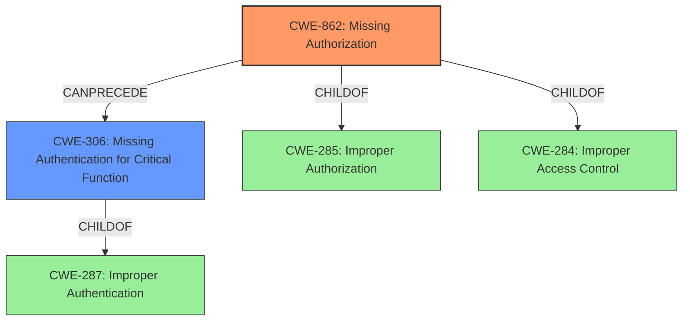

# Enhanced Analysis for CVE-2022-36876

# Summary
| CWE ID  | CWE Name                                                     | Confidence | CWE Abstraction Level | CWE Vulnerability Mapping Label | CWE-Vulnerability Mapping Notes |
| ------- | ------------------------------------------------------------ | ---------- | ----------------------- | ------------------------------- | ----------------------------- |
| CWE-862 | Missing Authorization                                        | 0.9        | Class                   |                                 | Allowed-with-Review           |
| CWE-306 | Missing Authentication for Critical Function               | 0.7        | Base                    |                                 | Allowed                       |
| CWE-284 | Improper Access Control                                      | 0.6        | Pillar                  |                                 | Discouraged                   |

- The Primary CWE is CWE-862
- The secondary candidate CWEs are CWE-306, and CWE-284

## Evidence and Confidence

*   **Confidence Score:** 0.8
*   **Evidence Strength:** HIGH

## Relationship Analysis
The primary CWE is CWE-862 **Missing Authorization**, which is a Class-level CWE. It is a child of CWE-285 **Improper Authorization** and CWE-284 **Improper Access Control**, and has children like CWE-939 **Improper Authorization in Handler for Custom URL Scheme** and CWE-425 **Direct Request ('Forced Browsing')**. CWE-306 **Missing Authentication for Critical Function** is a Base-level CWE and a child of CWE-287 **Improper Authentication**. The relationship between CWE-862 and CWE-306 is that authentication often precedes authorization. Since the vulnerability description specifically mentions the **improper authorization** leading to access without authentication, CWE-862 is chosen as the primary CWE. CWE-306 is considered as a secondary CWE because the access to the account list happens without authentication.



## Vulnerability Chain
The vulnerability chain starts with **improper authorization**, which allows a physical attacker to access the account list without authentication.

## Summary of Analysis
The initial assessment identified **Improper Authorization** as the root cause, which is supported by the vulnerability description and CVE Reference Links Content Summary. The selection of CWE-862 **Missing Authorization** is based on the fact that the authorization check is missing when a physical attacker tries to access the account list without proper authentication. The CVE Reference Links Content Summary states "Lack of proper user authentication when accessing the account list in the UPI payment feature."

The retriever results also suggest CWE-862 as a candidate. While CWE-284 **Improper Access Control** and CWE-285 **Improper Authorization** were also considered, they are higher-level classes. CWE-863 **Incorrect Authorization** was also considered, but the description indicates that the authorization check is not performed, which aligns better with **Missing Authorization** rather than **Incorrect Authorization**. CWE-306 **Missing Authentication for Critical Function** is considered as a secondary CWE, as the successful authorization would require proper authentication first.

The decision to use CWE-862 is based on the direct evidence of **improper authorization** and the impact of access without authentication. The relationship analysis confirms that CWE-862 is a more specific child of CWE-285 and CWE-284, which are high-level classes.

Relevant CWE Information:
- CWE-862 **Missing Authorization**: The product does not perform an authorization check when an actor attempts to access a resource or perform an action.
- CWE-306 **Missing Authentication for Critical Function**: The product does not perform any authentication for functionality that requires a provable user identity or consumes a significant amount of resources.
- CWE-284 **Improper Access Control**: The product does not restrict or incorrectly restricts access to a resource from an unauthorized actor.


## CWE Relationship Analysis

Current CWEs represent these abstraction levels: .


### Vulnerability Chain Analysis

**Chain starting from CWE-862:**
- 862 (Missing Authorization) - ROOT


**Chain starting from CWE-425:**
- 425 (Direct Request ('Forced Browsing')) - ROOT


### CWE Relationship Diagram

```mermaid
graph TD
    classDef primary fill:#f96,stroke:#333,stroke-width:2px
    classDef secondary fill:#69f,stroke:#333
    classDef tertiary fill:#9e9,stroke:#333
```