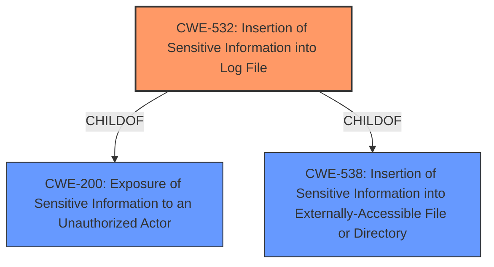

# Raw Analyzer Response for CVE-2022-36878

# Summary
| CWE ID | CWE Name | Confidence | CWE Abstraction Level | CWE Vulnerability Mapping Label | CWE-Vulnerability Mapping Notes |
|---|---|---|---|---|---|
| CWE-532 | Insertion of Sensitive Information into Log File | 1 | Base | Allowed | Primary CWE |
| CWE-200 | Exposure of Sensitive Information to an Unauthorized Actor | 0.7 | Class | Discouraged | Secondary Candidate |

## Evidence and Confidence

*   **Confidence Score:** 0.85
*   **Evidence Strength:** HIGH

## Relationship Analysis
The primary CWE is CWE-532 (Insertion of Sensitive Information into Log File), which is a child of both CWE-200 (Exposure of Sensitive Information to an Unauthorized Actor) and CWE-538 (Insertion of Sensitive Information into Externally-Accessible File or Directory). The vulnerability involves sensitive information (IMEI) being written to a log file, which directly aligns with CWE-532. CWE-200 is a broader class that encompasses various forms of information exposure, while CWE-532 is a more specific base-level CWE that accurately describes the root cause.

## Vulnerability Chain
The vulnerability chain involves the following:
1.  **Root Cause:** **Insertion of Sensitive Information** (IMEI) into a log file (CWE-532).
2.  **Impact:** A local attacker can access the IMEI via log analysis, leading to **Exposure of Sensitive Information** (CWE-200).

## Summary of Analysis
The analysis indicates that the most appropriate CWE is CWE-532 (Insertion of Sensitive Information into Log File). The vulnerability description clearly states that the IMEI (International Mobile Equipment Identity) is exposed via a log file. This aligns directly with the definition of CWE-532.

The supporting evidence is:
*   "**Exposure of Sensitive Information** in Find My Mobile prior to version 7.2.25.14 allows local attacker to access IMEI via log."
*   "**Root cause of vulnerability:** Improper access control"
*   "**Weaknesses/vulnerabilities present:** Exposure of sensitive information due to improper logging."
*   "**Impact of exploitation:** A local attacker can access the device's IMEI (International Mobile Equipment Identity) via device logs."

CWE-200 (Exposure of Sensitive Information to an Unauthorized Actor) was considered but deemed less specific. While the vulnerability does result in exposure of sensitive information, the root cause is the **insertion** of that information into a log file, making CWE-532 a more precise classification. Furthermore, the mapping guidance for CWE-200 discourages its use as a general catch-all for confidentiality loss.

Other CWEs were considered from the Retriever Results, but none were as directly relevant as CWE-532. For instance, CWE-213 (Exposure of Sensitive Information Due to Incompatible Policies) and CWE-359 (Exposure of Private Personal Information to an Unauthorized Actor) were less relevant because they didn't specifically address the logging aspect of the vulnerability. CWE-497 (Exposure of Sensitive System Information to an Unauthorized Control Sphere) was also less relevant as the exposed information (IMEI) is more directly related to the user's device than the system itself.
CWE-284 (Improper Access Control) is a Pillar level CWE that is also discouraged.
CWE-522 (Insufficiently Protected Credentials) is not a good fit as the IMEI is not a credential.
CWE-927 (Use of Implicit Intent for Sensitive Communication) is related to Android applications using implicit intents, which is not the case here.
CWE-1272 (Sensitive Information Uncleared Before Debug/Power State Transition) is not applicable as the issue is not related to state transitions.
CWE-319 (Cleartext Transmission of Sensitive Information) is not applicable as the information is not transmitted, but rather logged.

Therefore, CWE-532 is the most appropriate CWE as it accurately reflects the vulnerability's root cause.