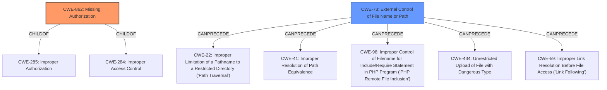

# Analysis Report for CVE-2022-36909

# Vulnerability Analysis Report: CVE-2022-36909

## Description


## Analysis (with Relationship Data)

# Summary
| CWE ID | CWE Name | Confidence | CWE Abstraction Level | CWE Vulnerability Mapping Label | CWE-Vulnerability Mapping Notes |
|---|---|---|---|---|---|
| CWE-862 | Missing Authorization | 1.0 | Class | Primary | Allowed-with-Review |
| CWE-73 | External Control of File Name or Path | 0.5 | Base | Secondary | Allowed |

## Evidence and Confidence

*   **Confidence Score:** 0.8
*   **Evidence Strength:** HIGH

## Relationship Analysis
The primary weakness is **CWE-862 Missing Authorization**, which is a Class-level CWE. The retriever results also suggest **CWE-863 Incorrect Authorization** as a candidate, but since the description states "**missing permission check**," **CWE-862** is a better fit than **CWE-863**. Both **CWE-862** and **CWE-863** are children of **CWE-285 Improper Authorization** and **CWE-284 Improper Access Control**.

The secondary weakness is **CWE-73 External Control of File Name or Path** because the attacker can specify a file path to check and a URL to upload the SSH key. **CWE-73** can precede **CWE-22 Improper Limitation of a Pathname to a Restricted Directory ('Path Traversal')**, **CWE-41 Improper Resolution of Path Equivalence**, **CWE-98 Improper Control of Filename for Include/Require Statement in PHP Program ('PHP Remote File Inclusion')**, **CWE-434 Unrestricted Upload of File with Dangerous Type**, and **CWE-59 Improper Link Resolution Before File Access ('Link Following')**.



## Vulnerability Chain
The chain of weaknesses is as follows:
1.  **Missing Authorization (CWE-862)**: The plugin **fails to perform sufficient permission checks**.
2.  **External Control of File Name or Path (CWE-73)**: Attacker-specified file path and URL.
3.  **Impact**: This allows attackers to check for the existence of an attacker-specified file path and upload an SSH key file to an attacker-specified URL.

## Summary of Analysis
The initial assessment identified **CWE-862 Missing Authorization** as the primary weakness due to the "**missing permission check**" mentioned in the vulnerability description and "**does not perform sufficient permission checks**" in the CVE Reference Links Content Summary. This aligns perfectly with the definition of **CWE-862**, which states that "The product does not perform an authorization check when an actor attempts to access a resource or perform an action."
The **CWE-73 External Control of File Name or Path** is a secondary weakness because the attacker can specify a file path to check and a URL to upload the SSH key.
The graph relationships confirm that **CWE-862** is a higher-level class, while **CWE-73** is a base-level weakness that can precede other file-related weaknesses. The selection of **CWE-862** and **CWE-73** is based on the evidence available and the relationships between CWEs. These CWEs are selected to provide optimal specificity.

Relevant CWE Information:

# Enhanced Context (25 CWEs)

## CWE-693: Protection Mechanism Failure
**Abstraction Level**: Pillar
**Similarity Score**: 0.78
**Source**: dense

**Description**:
The product does not use or incorrectly uses a protection mechanism that provides sufficient defense against directed attacks against the product.

**Mapping Guidance**:
- Usage: Discouraged
- Rationale: This CWE entry is extremely high-level, a Pillar.

*Not Selected*: This is a very high-level CWE (Pillar) and does not provide enough detail about the specific weakness. The "**missing permission check**" is more specific than a general **Protection Mechanism Failure**.

## CWE-538: Insertion of Sensitive Information into Externally-Accessible File or Directory
**Abstraction Level**: Base
**Similarity Score**: 0.76
**Source**: dense

**Description**:
The product places sensitive information into files or directories that are accessible to actors who are allowed to have access to the files, but not to the sensitive information.

**Mapping Guidance**:
- Usage: Allowed
- Rationale: This CWE entry is at the Base level of abstraction, which is a preferred level of abstraction for mapping to the root causes of vulnerabilities.

*Not Selected*: While sensitive information (SSH key) is involved, the root cause is the **missing authorization**, not the insertion of sensitive information. The insertion is a consequence of the **missing authorization**.

## CWE-668: Exposure of Resource to Wrong Sphere
**Abstraction Level**: Class
**Similarity Score**: 0.75
**Source**: dense

**Description**:
The product exposes a resource to the wrong control sphere, providing unintended actors with inappropriate access to the resource.

**Mapping Guidance**:
- Usage: Discouraged
- Rationale: CWE-668 is high-level and is often misused as a catch-all when lower-level CWE IDs might be applicable. It is sometimes used for low-information vulnerability reports [REF-1287]. It is a level-1 Class (i.e., a child of a Pillar). It is not useful for trend analysis.

*Not Selected*: Similar to **CWE-693**, this is a high-level CWE that does not provide enough specific information about the weakness. The **missing authorization** is a more precise description of the problem.

## CWE-73: External Control of File Name or Path
**Abstraction Level**: Base
**Similarity Score**: 0.75
**Source**: dense

**Description**:
The product allows user input to control or influence paths or file names that are used in filesystem operations.

**Mapping Guidance**:
- Usage: Allowed
- Rationale: This CWE entry is at the Base level of abstraction, which is a preferred level of abstraction for mapping to the root causes of vulnerabilities.

*Selected as secondary*: The attacker can specify a file path to check and a URL to upload the SSH key.

## CWE-552: Files or Directories Accessible to External Parties
**Abstraction Level**: Base
**Similarity Score**: 0.75
**Source**: dense

**Description**:
The product makes files or directories accessible to unauthorized actors, even though they should not be.

**Mapping Guidance**:
- Usage: Allowed
- Rationale: This CWE entry is at the Base level of abstraction, which is a preferred level of abstraction for mapping to the root causes of vulnerabilities.

*Not Selected*: Similar to **CWE-538**, the accessibility of files is a consequence of the **missing authorization**, not the primary weakness.

## CWE-807: Reliance on Untrusted Inputs in a Security Decision
**Abstraction Level**: Base
**Similarity Score**: 0.75
**Source**: dense

**Description**:
The product uses a protection mechanism that relies on the existence or values of an input, but the input can be modified by an untrusted actor in a way that bypasses the protection mechanism.

**Mapping Guidance**:
- Usage: Allowed
- Rationale: This CWE entry is at the Base level of abstraction, which is a preferred level of abstraction for mapping to the root causes of vulnerabilities.

*Not Selected*: While the attacker provides input, the primary issue is the **missing authorization** check, not the reliance on untrusted inputs in a security decision.

## CWE-703: Improper Check or Handling of Exceptional Conditions
**Abstraction Level**: Pillar
**Similarity Score**: 0.75
**Source**:


## CWE Relationship Analysis

Current CWEs represent these abstraction levels: .


### Vulnerability Chain Analysis

**Chain starting from CWE-862:**
- 862 (Missing Authorization) - ROOT


**Chain starting from CWE-552:**
- 552 (Files or Directories Accessible to External Parties) - ROOT


### CWE Relationship Diagram

```mermaid
graph TD
    classDef primary fill:#f96,stroke:#333,stroke-width:2px
    classDef secondary fill:#69f,stroke:#333
    classDef tertiary fill:#9e9,stroke:#333
```


*Report generated on 2025-03-30 15:20:10*
