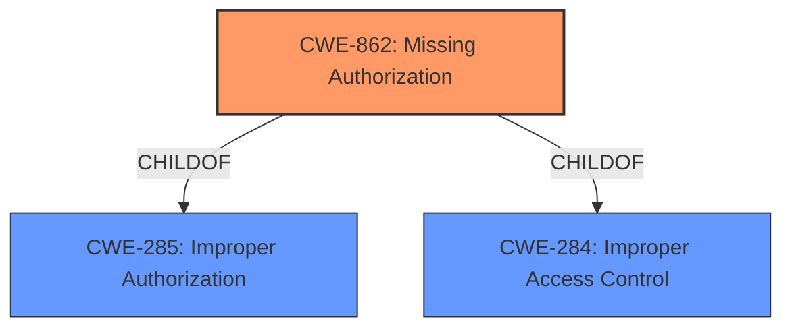

# Raw Analyzer Response for CVE-2022-36915

# Summary
| CWE ID | CWE Name | Confidence | CWE Abstraction Level | CWE Vulnerability Mapping Label | CWE-Vulnerability Mapping Notes |
|---|---|---|---|---|---|
| CWE-862 | Missing Authorization | 1.0 | Class | Allowed-with-Review | Primary CWE |

## Evidence and Confidence

*   **Confidence Score:** 1.0
*   **Evidence Strength:** HIGH

## Relationship Analysis
The primary CWE, CWE-862, is a Class-level weakness, which means there might be more specific Base or Variant level CWEs available. It is a child of CWE-285 (Improper Authorization) and CWE-284 (Improper Access Control). Given that the description explicitly states a **missing permission check**, CWE-862 is the most appropriate choice.

## Vulnerability Chain
The vulnerability chain is straightforward: The **root cause** is the **missing authorization** check (CWE-862), which leads to the **impact** of attackers being able to check whether attacker-specified file patterns match workspace contents.

## Summary of Analysis
The initial analysis correctly identified CWE-862 as the primary CWE due to the **lack of a permission check**.

The vulnerability description states that the Jenkins Android Signing Plugin 2.2.5 and earlier **does not perform a permission check** in a method implementing form validation. This directly aligns with the description of CWE-862, which states: "The product **does not perform an authorization check** when an actor attempts to access a resource or perform an action." The CVE Reference Links Content Summary confirms this by stating: "**Root cause of vulnerability**: The Android Signing Plugin **does not perform a permission check** in a method implementing form validation."

The retriever results also list CWE-862 as the top result, further supporting this classification.

The MITRE mapping guidance for CWE-862 indicates "Allowed-with-Review" since it is a Class and might have more specific Base-level children. However, in this case, the description is precise enough that a more specific child is not necessary. The **missing authorization** is the core issue.

Based on the evidence, relationship analysis, and mapping guidance, CWE-862 is the most appropriate classification.

Other CWEs Considered:

*   CWE-863 (Incorrect Authorization): This was considered, but it implies that an authorization check is performed, but incorrectly. The vulnerability description explicitly states that **no permission check** is performed, making CWE-862 a more accurate fit.
*   CWE-285 (Improper Authorization): This is a parent of CWE-862, but is too general. CWE-862 provides a more specific description of the vulnerability.
*   CWE-732 (Incorrect Permission Assignment for Critical Resource): This was considered, but it focuses on the incorrect assignment of permissions, rather than a **missing check** altogether.
*   CWE-639 (Authorization Bypass Through User-Controlled Key): This was considered, but the weakness is about the authorization bypass due to user-controlled key, and not the **missing permission check**.