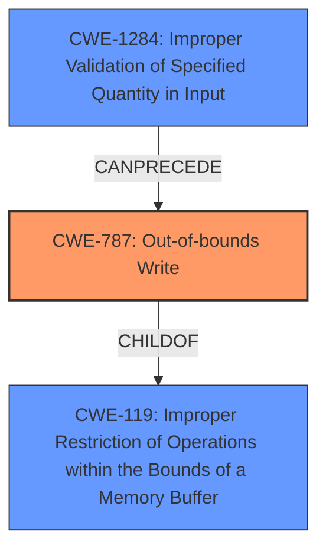

# Analysis Report for CVE-2022-36938

# Vulnerability Analysis Report: CVE-2022-36938

## Description


## Analysis (with Relationship Data)

# Summary
| CWE ID | CWE Name | Confidence | CWE Abstraction Level | CWE Vulnerability Mapping Label | CWE-Vulnerability Mapping Notes |
|---|---|---|---|---|---|
| CWE-787 | Out-of-bounds Write | 1.0 | Base | Allowed | Primary CWE |
| CWE-1284 | Improper Validation of Specified Quantity in Input | 0.7 | Base | Allowed | Secondary CWE |
| CWE-119 | Improper Restriction of Operations within the Bounds of a Memory Buffer | 0.5 | Class | Discouraged | Secondary CWE |

## Evidence and Confidence

*   **Confidence Score:** 0.9
*   **Evidence Strength:** HIGH

## Relationship Analysis
The primary CWE, CWE-787 **Out-of-bounds Write**, is a child of CWE-119 **Improper Restriction of Operations within the Bounds of a Memory Buffer**, indicating a more specific type of buffer error. CWE-119 is a class-level CWE and discouraged, while CWE-787 is a base-level CWE and allowed. This informed the choice of CWE-787 as the primary mapping. CWE-787 can follow other CWEs, but in this case, it is the root cause. CWE-1284 **Improper Validation of Specified Quantity in Input** can precede CWE-787, indicating a potential chain where improper input validation leads to an out-of-bounds write.



## Vulnerability Chain
The vulnerability chain starts with a **missing size validation** check in the Dex file sections. This leads to a potential **out-of-bounds write** (CWE-787) when loading the string index table, ultimately resulting in potential remote code execution.

## Summary of Analysis
The initial analysis indicated a potential for **out-of-bounds address access** when loading the string index table. The provided information supports that the root cause is the lack of validation of the size of the dex file sections, which leads to a buffer overflow.

The evidence to support this includes:
- **Vulnerability Description Key Phrases**: "**rootcause:** **out of bound address access**"
- **CVE Reference Links Content Summary**: "The code previously lacked sufficient checks to ensure the sizes of section tables within a Dex file were within the bounds of the file itself." and "Although not explicitly stated, the lack of bounds checking could potentially lead to exploitable conditions such as out of bounds reads or writes."
- **CVE Reference Links Content Summary**: "Checks on `class_defs_off` and `class_defs_size`", "Checks on `string_ids_off` and `string_ids_size`", "Checks on `type_ids_off` and `type_ids_size`", "Checks on `proto_ids_off` and `proto_ids_size`", "Checks on `field_ids_off` and `field_ids_size`", "Checks on `method_ids_off` and `method_ids_size`"

Based on this analysis, CWE-787 **Out-of-bounds Write** is the most appropriate primary CWE. CWE-1284 **Improper Validation of Specified Quantity in Input** is a secondary CWE, as the root cause involves missing validation of the size of the dex file sections. CWE-119 **Improper Restriction of Operations within the Bounds of a Memory Buffer** is a more general CWE and is discouraged for use when a more specific CWE is available.

The selected CWEs are at the optimal level of specificity because CWE-787 directly describes the **out-of-bounds write** condition, and CWE-1284 captures the **missing validation** aspect of the vulnerability.

Relevant CWE Information:

# Enhanced Context (25 CWEs)

## CWE-226: Sensitive Information in Resource Not Removed Before Reuse
**Abstraction Level**: Base
**Similarity Score**: 0.76
**Source**: dense

**Description**:
The product releases a resource such as memory or a file so that it can be made available for reuse, but it does not clear or "zeroize" the information contained in the resource before the product performs a critical state transition or makes the resource available for reuse by other entities.

**Mapping Guidance**:
- Usage: Allowed
- Rationale: This CWE entry is at the Base level of abstraction, which is a preferred level of abstraction for mapping to the root causes of vulnerabilities.

**Why Not Used**: This CWE is not relevant because the vulnerability is not related to sensitive information being left in a resource after reuse.

## CWE-1289: Improper Validation of Unsafe Equivalence in Input
**Abstraction Level**: Base
**Similarity Score**: 0.76
**Source**: dense

**Description**:
The product receives an input value that is used as a resource identifier or other type of reference, but it does not validate or incorrectly validates that the input is equivalent to a potentially-unsafe value.

**Mapping Guidance**:
- Usage: Allowed
- Rationale: This CWE entry is at the Base level of abstraction, which is a preferred level of abstraction for mapping to the root causes of vulnerabilities.

**Why Not Used**: This CWE is not relevant because the vulnerability is not related to validating equivalence of potentially unsafe values.

## CWE-404: Improper Resource Shutdown or Release
**Abstraction Level**: Class
**Similarity Score**: 0.76
**Source**: dense

**Description**:
The product does not release or incorrectly releases a resource before it is made available for re-use.

**Mapping Guidance**:
- Usage: Allowed-with-Review
- Rationale: This CWE entry is a Class and might have Base-level children that would be more appropriate

**Why Not Used**: This CWE is not relevant because the vulnerability is not related to improper resource shutdown or release.

## CWE-908: Use of Uninitialized Resource
**Abstraction Level**: Base
**Similarity Score**: 0.75
**Source**: dense

**Description**:
The product uses or accesses a resource that has not been initialized.

**Mapping Guidance**:
- Usage: Allowed
- Rationale: This CWE entry is at the Base level of abstraction, which is a preferred level of abstraction for mapping to the root causes of vulnerabilities.

**Why Not Used**: This CWE is not relevant because the vulnerability is not related to using an uninitialized resource.

## CWE-665: Improper Initialization
**Abstraction Level**: Class
**Similarity Score**: 0.75
**Source**: dense

**Description**:
The product does not initialize or incorrectly initializes a resource, which might leave the resource in an unexpected state when it is accessed or used.

**Mapping Guidance**:
- Usage: Discouraged
- Rationale: This CWE entry is a level-1 Class (i.e., a child of a Pillar). It might have lower-level children that would be more appropriate

**Why Not Used**: This CWE is not relevant because the vulnerability is not related to improper initialization of a resource.

## CWE-125: Out-of-bounds Read
**Abstraction Level**: Base
**Similarity Score**: 0.75
**Source**: dense

**Description**:
The product reads data past the end, or before the beginning, of the intended buffer.

**Mapping Guidance**:
- Usage: Allowed
- Rationale: This CWE entry is at the Base level of abstraction, which is a preferred level of abstraction for mapping to the root causes of vulnerabilities.

**Why Not Used**: While an out-of-bounds read is possible, the vulnerability description and reference link content summary focus on writing out of bounds, therefore CWE-787 is a better fit.

## CWE-131: Incorrect Calculation of Buffer Size
**Abstraction Level**: Base
**Similarity Score**: 0.75
**Source**: dense

**Description**:
The product does not correctly calculate the size to be used when allocating a buffer, which could lead to a buffer overflow.

**Mapping Guidance**:
- Usage: Allowed
- Rationale: This CWE entry is at the Base level of abstraction, which is a preferred level of abstraction for mapping to the root causes of vulnerabilities.

**Why Not Used**: While incorrect calculation of buffer size can lead to a buffer overflow, the vulnerability is due to the missing size validation check.

## CWE-667: Improper Locking
**Abstraction Level**: Class
**Similarity Score**: 0.75
**Source**: dense

**Description**:
The product does not properly acquire or release a lock on a resource, leading to unexpected resource state changes and behaviors.

**Mapping Guidance


## CWE Relationship Analysis

Current CWEs represent these abstraction levels: .


### Vulnerability Chain Analysis

**Chain starting from CWE-131:**
- 131 (Incorrect Calculation of Buffer Size) - ROOT


**Chain starting from CWE-908:**
- 908 (Use of Uninitialized Resource) - ROOT


### CWE Relationship Diagram

```mermaid
graph TD
    classDef primary fill:#f96,stroke:#333,stroke-width:2px
    classDef secondary fill:#69f,stroke:#333
    classDef tertiary fill:#9e9,stroke:#333
```


*Report generated on 2025-03-31 10:06:48*
