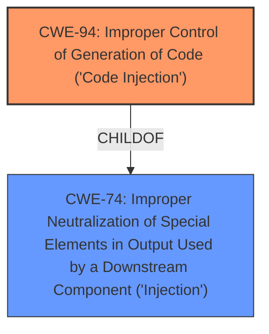

# Analysis for CVE-2022-37009

# Summary
| CWE ID | CWE Name | Confidence | CWE Abstraction Level | CWE Vulnerability Mapping Label | CWE-Vulnerability Mapping Notes |
|---|---|---|---|---|---|
| CWE-94 | Improper Control of Generation of Code ('Code Injection') | 0.7 | Base | Allowed-with-Review | Primary CWE |

## Evidence and Confidence

*   **Confidence Score:** 0.7
*   **Evidence Strength:** LOW

## Relationship Analysis
The primary relationship that influenced the selection was the ChildOf relationship between CWE-94 and CWE-74 (Improper Neutralization of Special Elements in Output Used by a Downstream Component ('Injection')). While CWE-74 is a Class-level CWE and thus discouraged, CWE-94 is a Base-level CWE and a child of CWE-74, making it a more specific and appropriate choice.

## Vulnerability Chain
The vulnerability chain is relatively simple:
1.  **ROOT CAUSE:** The application allows control of code generation, which leads to...
2.  **IMPACT:** Local code execution.

## Summary of Analysis
The initial assessment identified CWE-94 as the primary candidate due to the "local code execution" impact and the possibility of controlling code generation via a Vagrant executable. The retriever results also listed CWE-94 as the top candidate.

The final decision to assign CWE-94 is based on the limited evidence provided. The vulnerability description mentions "local code execution via a Vagrant executable," which suggests that the application might be constructing or generating code based on some external input related to the Vagrant executable. The vulnerability description does not provide sufficient detail to confirm this, hence the confidence score of 0.7.

The selection of CWE-94 is at the optimal level of specificity because it directly addresses the **improper control of code generation** leading to code execution.

Relevant CWE Information:

# Enhanced Context (25 CWEs)

## CWE-94: Improper Control of Generation of Code ('Code Injection')
**Abstraction:** Base
**Status:** Draft

### Description
The product constructs all or part of a code segment using externally-influenced input from an upstream component, but it does not neutralize or incorrectly neutralizes special elements that could modify the syntax or behavior of the intended code segment.

### Extended Description
When a product allows a user's input to contain code syntax, it might be possible for an attacker to craft the code in such a way that it will alter the intended control flow of the product. Such an alteration could lead to arbitrary code execution.
### Observed Examples
- **CVE-2023-29374:** Math component in an LLM framework translates user input into a Python expression that is input into the Python exec() method, allowing code execution - one variant of a "prompt injection" attack.

### Mapping Guidance
**Usage:** Allowed-with-Review
**Rationale:** This entry is frequently misused for vulnerabilities with a technical impact of "code execution," which does not by itself indicate a root cause weakness, since dozens of weaknesses can enable code execution.

## Other CWEs Considered

*   **CWE-78: Improper Neutralization of Special Elements used in an OS Command ('OS Command Injection')** - This was considered, but the description mentions "Vagrant executable", suggesting more direct code generation rather than just OS command injection. Therefore, CWE-94 is more appropriate.
*   **CWE-497: Exposure of Sensitive System Information to an Unauthorized Control Sphere** - This was considered because the Vagrant executable might expose sensitive information, but the primary impact is code execution, making CWE-94 more relevant.
*   **CWE-611: Improper Restriction of XML External Entity Reference** - This was considered due to the possibility of XML configuration files being used by Vagrant, but the description doesn't suggest XML-specific issues.
*   **CWE-1336: Improper Neutralization of Special Elements Used in a Template Engine** - This was considered because Vagrant might use templates, but there's no direct evidence of template engine usage.
*   **CWE-917: Improper Neutralization of Special Elements used in an Expression Language Statement ('Expression Language Injection')** - Similar to CWE-1336, this was considered but lacks specific evidence.
*   **CWE-732: Incorrect Permission Assignment for Critical Resource** - The Vagrant executable might have incorrect permissions, but the primary impact is code execution, making CWE-94 more relevant.