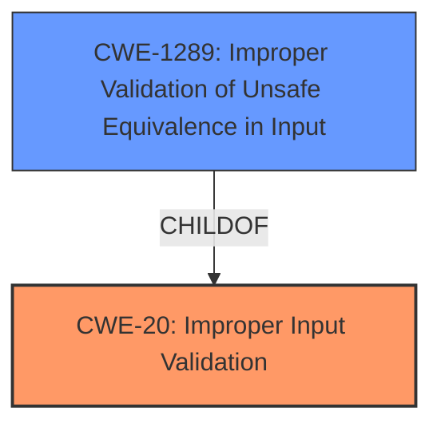

# Enhanced Analysis for CVE-2022-37010

# Summary
| CWE ID | CWE Name | Confidence | CWE Abstraction Level | CWE Vulnerability Mapping Label | CWE-Vulnerability Mapping Notes |
|---|---|---|---|---|---|
| CWE-20 | Improper Input Validation | 0.7 | Class | Primary | Allowed-with-Review |
| CWE-1289 | Improper Validation of Unsafe Equivalence in Input | 0.6 | Base | Secondary | Allowed |

## Evidence and Confidence

*   **Confidence Score:** 0.7
*   **Evidence Strength:** LOW

## Relationship Analysis
The primary relationship influencing the decision is the parent-child relationship where CWE-20 is a class and CWE-1289 is a base. This indicates that CWE-1289 is a specific type of input validation issue. While CWE-1289 is more descriptive, the evidence is too weak to confirm this, so CWE-20 is chosen as primary.



## Vulnerability Chain
The chain of the vulnerability starts with **missed email address validation** (**ROOT CAUSE**) leading to **User Name Is Not Defined** dialog.

## Summary of Analysis
The initial assessment considered the provided information and the retriever results, focusing on the root cause of the vulnerability. The final decision hinges on the lack of explicit detail, favoring a broader classification (CWE-20) while acknowledging a more specific possibility (CWE-1289).

The assessment is heavily based on the limited evidence from the vulnerability description: "email address validation in the Git **User Name Is Not Defined** dialog was missed".

The graph relationships influenced the selection by guiding towards the appropriate level of specificity. While CWE-1289 is more descriptive, the absence of concrete evidence supporting the "unsafe equivalence" aspect led to prioritizing the higher-level CWE-20.

CWE-20 is selected as the primary CWE due to its general applicability to input validation issues. CWE-1289 is a secondary candidate because it represents a more specific type of input validation failure, but evidence is not strong enough to confirm.

Relevant CWE Information:

# Enhanced Context (25 CWEs)

## CWE-1289: Improper Validation of Unsafe Equivalence in Input
**Abstraction Level**: Base
**Similarity Score**: 0.82
**Source**: dense

**Description**:
The product receives an input value that is used as a resource identifier or other type of reference, but it does not validate or incorrectly validates that the input is equivalent to a potentially-unsafe value.

**Mapping Guidance**:
- Usage: Allowed
- Rationale: This CWE entry is at the Base level of abstraction, which is a preferred level of abstraction for mapping to the root causes of vulnerabilities.

## CWE-20: Improper Input Validation
**Abstraction Level**: class
**Similarity Score**: 2.98
**Source**: graph

**Description**:
CWE-20: Improper Input Validation

**Mapping Guidance**:
- Usage: Discouraged
- Rationale: CWE-20 is commonly misused in low-information vulnerability reports when lower-level CWEs could be used instead, or when more details about the vulnerability are available [REF-1287]. It is not useful for trend analysis. It is also a level-1 Class (i.e., a child of a Pillar).

**Relationships**:
- CHILDOF -> CWE-707
- PEEROF -> CWE-345
- CANPRECEDE -> CWE-22
- CANPRECEDE -> CWE-41
- CANPRECEDE -> CWE-74

## Technical Explanation for CWE-20

*   How the vulnerability's details match the CWE's characteristics: The vulnerability description states that email address validation was missed. This indicates a failure to properly validate input, which aligns with the general definition of CWE-20.
*   The security implications and potential impact: The security implication is that an invalid or malicious email address could be used, potentially leading to account compromise or other security issues.
*   Any parent-child relationships or chain patterns that influenced your mapping: CWE-20 is a parent class, and more specific input validation CWEs could be children. The evidence is not sufficient to pinpoint a more specific CWE.
*   Whether the weakness is primary or secondary in the vulnerability: This is considered the primary weakness due to the direct statement of missed validation.
*   How the official MITRE mapping guidance influenced your decision: CWE-20 usage is discouraged when lower-level CWEs are available. However, in this case, the lack of detailed information prevents a more specific mapping.

## Technical Explanation for CWE-1289

*   How the vulnerability's details match the CWE's characteristics: This CWE describes cases where input is not properly validated for equivalence to an unsafe value. If the missed email validation allowed values that were superficially valid but functionally unsafe, this CWE would apply.
*   The security implications and potential impact: The potential impact is that an attacker could craft an email address to bypass security checks and gain unauthorized access or privileges.
*   Any parent-child relationships or chain patterns that influenced your mapping: CWE-1289 is a child of CWE-20, indicating a more specific type of input validation issue.
*   Whether the weakness is primary or secondary in the vulnerability: This is considered a secondary candidate because there is no specific information about 'unsafe equivalence'.
*   How the official MITRE mapping guidance influenced your decision: CWE-1289 is allowed and considered base level, but it requires strong evidence of unsafe equivalence, which is lacking.

## Considered but not used

*   CWE-497, CWE-1336, CWE-451, CWE-79, CWE-1007, CWE-106, CWE-494, CWE-94, CWE-327: These CWEs were considered based on the retriever results but were deemed less relevant as they focus on different aspects such as information exposure, template injection, UI misrepresentation, cross-site scripting, or code injection, none of which align directly with the **missed email address validation** issue described in the vulnerability.


## CWE Relationship Analysis

Current CWEs represent these abstraction levels: .


### Vulnerability Chain Analysis

**Chain starting from CWE-79:**
- 79 (Improper Neutralization of Input During Web Page Generation ('Cross-site Scripting')) - ROOT


**Chain starting from CWE-327:**
- 327 (Use of a Broken or Risky Cryptographic Algorithm) - ROOT


### CWE Relationship Diagram

```mermaid
graph TD
    classDef primary fill:#f96,stroke:#333,stroke-width:2px
    classDef secondary fill:#69f,stroke:#333
    classDef tertiary fill:#9e9,stroke:#333
```