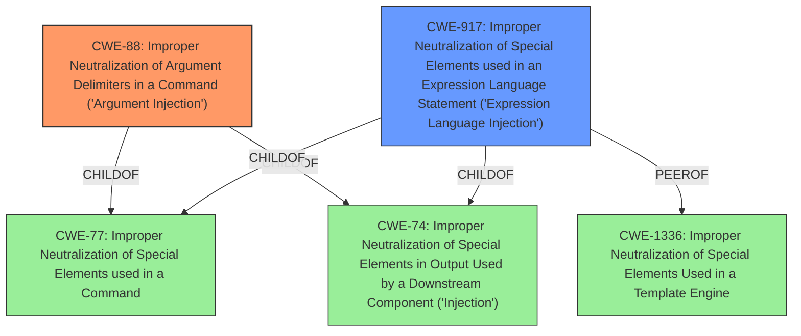

# Analysis Report for CVE-2022-37027

# Vulnerability Analysis Report: CVE-2022-37027

## Description


## Analysis (with Relationship Data)

# Summary
| CWE ID | CWE Name | Confidence | CWE Abstraction Level | CWE Vulnerability Mapping Label | CWE-Vulnerability Mapping Notes |
|---|---|---|---|---|---|
| CWE-88 | Improper Neutralization of Argument Delimiters in a Command ('Argument Injection') | 0.9 | Base | Allowed | Primary CWE |
| CWE-917 | Improper Neutralization of Special Elements used in an Expression Language Statement ('Expression Language Injection') | 0.6 | Base | Allowed | Secondary CWE |

## Evidence and Confidence

*   **Confidence Score:** 0.75
*   **Evidence Strength:** HIGH

## Relationship Analysis
The primary CWE is CWE-88, which is a base-level CWE and a child of CWE-77 (Improper Neutralization of Special Elements used in a Command) and CWE-74 (Improper Neutralization of Special Elements in Output Used by a Downstream Component ('Injection')). CWE-917 (Improper Neutralization of Special Elements used in an Expression Language Statement ('Expression Language Injection')) is considered a secondary CWE. It is a peer of CWE-1336 (Improper Neutralization of Special Elements Used in a Template Engine) and a child of CWE-77 and CWE-74. The relationship analysis highlights that the vulnerability is related to the injection of special elements.



## Vulnerability Chain
The vulnerability chain starts with the **improper injection of arbitrary Java JVM options** via the web interface by an authenticated user. This leads to the enabling of JMX services, which finally results in remote code execution as the system user. The root cause is the **lack of proper input validation and sanitization** of the Java JVM options, enabling the attacker to inject malicious arguments.

## Summary of Analysis
The primary weakness is the **improper injection of arbitrary Java JVM options**, which allows for remote code execution.

The vulnerability description clearly states that an authenticated system user can **inject arbitrary Java JVM options**. The "**weakness:** **inject arbitrary Java JVM options**" phrase strongly suggests an injection vulnerability. The CVE Reference Links Content Summary confirms this, stating that the root cause is that "The AhsayCBS web interface allows authenticated administrators to modify JVM runtime options, including **injecting arbitrary parameters**." The summary also mentions that "The application fails to sanitize or validate user-supplied parameters that influence the Java Virtual Machine's startup configuration."

CWE-88 (Improper Neutralization of Argument Delimiters in a Command ('Argument Injection')) is selected as the primary CWE because the vulnerability involves the injection of arbitrary arguments into the Java JVM options. The description of CWE-88, "The product constructs a string for a command to be executed by a separate component in another control sphere, but it does not properly delimit the intended arguments, options, or switches within that command string," closely matches the vulnerability where the application fails to properly delimit arguments passed to the JVM.

CWE-917 (Improper Neutralization of Special Elements used in an Expression Language Statement ('Expression Language Injection')) is considered as a secondary CWE because Java JVM options might be processed as expressions.

CWE-79 (Improper Neutralization of Input During Web Page Generation ('Cross-site Scripting')), CWE-22 (Improper Limitation of a Pathname to a Restricted Directory ('Path Traversal')), CWE-770 (Allocation of Resources Without Limits or Throttling)), CWE-190 (Integer Overflow or Wraparound), CWE-1336 (Improper Neutralization of Special Elements Used in a Template Engine), CWE-78 (Improper Neutralization of Special Elements used in an OS Command ('OS Command Injection')), CWE-843 (Access of Resource Using Incompatible Type ('Type Confusion')), CWE-1284 (Improper Validation of Specified Quantity in Input), CWE-41 (Improper Resolution of Path Equivalence), CWE-94 (Improper Control of Generation of Code ('Code Injection')) are not selected as they do not accurately represent the **injection of arguments** into the JVM. CWE-20 (Improper Input Validation) is too high level and does not provide enough specificity.

The selected CWEs are at the optimal level of specificity because they directly address the root cause of the vulnerability: the improper handling of arguments passed to the JVM.


## CWE Relationship Analysis

Current CWEs represent these abstraction levels: .


### Vulnerability Chain Analysis

**Chain starting from CWE-79:**
- 79 (Improper Neutralization of Input During Web Page Generation ('Cross-site Scripting')) - ROOT


**Chain starting from CWE-190:**
- 190 (Integer Overflow or Wraparound) - ROOT


### CWE Relationship Diagram

```mermaid
graph TD
    classDef primary fill:#f96,stroke:#333,stroke-width:2px
    classDef secondary fill:#69f,stroke:#333
    classDef tertiary fill:#9e9,stroke:#333
```


*Report generated on 2025-03-31 04:23:47*
