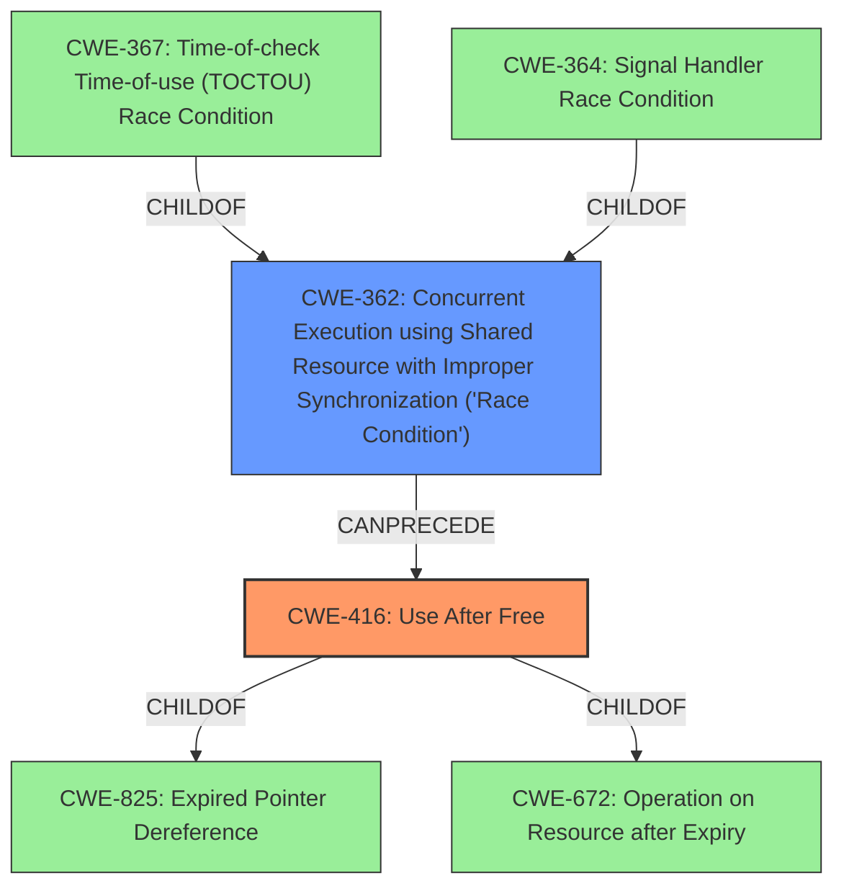

# Raw Analyzer Response for CVE-2022-37035

# Summary
| CWE ID | CWE Name | Confidence | CWE Abstraction Level | CWE Vulnerability Mapping Label | CWE-Vulnerability Mapping Notes |
|---|---|---|---|---|---|
| CWE-416 | Use After Free | 1.0 | Variant | Allowed | Primary CWE |
| CWE-362 | Concurrent Execution using Shared Resource with Improper Synchronization ('Race Condition') | 1.0 | Class | Allowed-with-Review | Secondary Candidate |

## Evidence and Confidence

*   **Confidence Score:** 1.0
*   **Evidence Strength:** HIGH

## Relationship Analysis
The vulnerability is a **use-after-free** condition caused by a **race condition**.
CWE-416 (Use After Free) is a variant of CWE-825 (Expired Pointer Dereference) and CWE-672 (Operation on Resource after Expiry). It can be preceded by CWE-362 (Concurrent Execution using Shared Resource with Improper Synchronization ('Race Condition')). CWE-362 is a class, and its children include CWE-367 (Time-of-check Time-of-use (TOCTOU) Race Condition) and CWE-364 (Signal Handler Race Condition).

## Vulnerability Chain
The vulnerability chain starts with a **race condition** (CWE-362) leading to a **use-after-free** vulnerability (CWE-416). The **race condition** occurs when multiple threads access shared resources without proper synchronization. This allows one thread to free memory that another thread is still using, resulting in a **use-after-free** when the second thread attempts to access the freed memory. The impact of this vulnerability is Remote Code Execution (RCE) and Information Disclosure.

## Summary of Analysis
The vulnerability is a **use-after-free** (CWE-416) due to a **race condition** (CWE-362). The evidence from the vulnerability description and the CVE reference links content summary is strong. Specifically, the vulnerability description states that there is a possible **use-after-free** due to a **race condition**. The CVE reference links content summary further explains that the **race condition** occurs between an I/O thread and the main thread, and that the main thread might attempt to access or free a memory location that has already been freed by the I/O thread, leading to the **use-after-free**.

The retriever results also support this classification, with CWE-362 and CWE-416 being the top two combined results. CWE-416 is a Variant, which is a preferred level of abstraction for mapping to the root causes of vulnerabilities. CWE-362 is a Class, and the mapping guidance suggests examining its children to see if there is a better fit. However, in this case, the description of CWE-362 accurately describes the **race condition** that leads to the **use-after-free**, so it is an appropriate secondary CWE.

The selected CWEs are at the optimal level of specificity. CWE-416 is a Variant that directly describes the **use-after-free** vulnerability. CWE-362 is a Class that describes the **race condition** that leads to the **use-after-free**.

Relevant CWE Information:

# Enhanced Context (25 CWEs)
The following CWEs were identified as potentially relevant to this vulnerability:

## CWE-416: Use After Free
**CWE-416 (Use After Free)** is the primary weakness. The vulnerability description explicitly mentions a "use-after-free". The CVE Reference Links Content Summary confirms this, stating that "The core issue is that the main thread might attempt to access or free a memory location that has already been freed by the I/O thread." This aligns perfectly with the CWE-416 description: "The product reuses or references memory after it has been freed." The Abstraction Level is Variant, and the Usage is Allowed, making it a good fit.

## CWE-362: Concurrent Execution using Shared Resource with Improper Synchronization ('Race Condition')
**CWE-362 (Concurrent Execution using Shared Resource with Improper Synchronization ('Race Condition'))** is a contributing factor. The vulnerability description states the **use-after-free** is "due to a **race condition**". The CVE Reference Links Content Summary elaborates on this, noting that "The race occurs between two threads: an I/O thread and the main thread processing BGP packets" and "The vulnerability arises due to the lack of proper synchronization between the I/O thread... and the main thread." This directly matches the CWE-362 description: "The product contains a concurrent code sequence that requires temporary, exclusive access to a shared resource, but a timing window exists in which the shared resource can be modified by another code sequence operating concurrently." The Abstraction Level is Class, and the Usage is Allowed-with-Review. While it is a Class, it accurately captures the **race condition** aspect of the vulnerability.

## CWE-667: Improper Locking
**CWE-667 (Improper Locking)** was considered but not selected as the primary CWE. While the CVE Reference Links Content Summary mentions that "The issue was fixed in FRR by synchronizing the access to the shared data by extending the mutex to include usage, and freeing operations," the core issue is the **use-after-free** itself, and the **race condition** that leads to it, rather than the improper locking. CWE-667 could be a contributing factor, but it's not the most direct representation of the vulnerability. Therefore, it was not selected.

## CWE-367: Time-of-check Time-of-use (TOCTOU) Race Condition
**CWE-367 (Time-of-check Time-of-use (TOCTOU) Race Condition)** was considered, but the vulnerability doesn't explicitly mention a check and subsequent use where the state changes in between. It is a general **race condition**, not specifically TOCTOU.

## CWE-665: Improper Initialization
**CWE-665 (Improper Initialization)** was considered but not selected, as the vulnerability doesn't involve improper initialization of resources.

## CWE-121: Stack-based Buffer Overflow
**CWE-121 (Stack-based Buffer Overflow)** was considered but is not relevant to the described vulnerability. There is no mention of a buffer overflow in the description.

## CWE-364: Signal Handler Race Condition
**CWE-364 (Signal Handler Race Condition)** was considered but is not relevant, as the vulnerability doesn't specifically involve signal handlers.

## CWE-413: Improper Resource Locking
**CWE-413 (Improper Resource Locking)** was considered but is not the primary issue. While locking might be a solution, the core problem is the **race condition** leading to the **use-after-free**, not the lack of locking itself.

## CWE-662: Improper Synchronization
**CWE-662 (Improper Synchronization)** was considered but is too general. CWE-362 is a more specific type of improper synchronization, and it's already included as a secondary CWE.

## CWE-755: Improper Handling of Exceptional Conditions
**CWE-755 (Improper Handling of Exceptional Conditions)** was considered but is too high-level and doesn't accurately describe the root cause of the vulnerability.