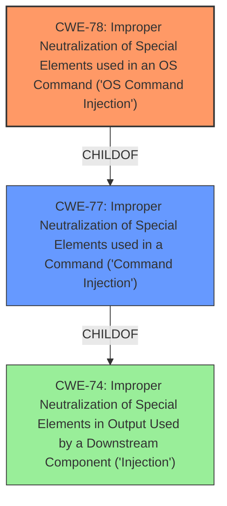

# Analysis for CVE-2022-37076

# Summary
| CWE ID | CWE Name | Confidence | CWE Abstraction Level | CWE Vulnerability Mapping Label | CWE-Vulnerability Mapping Notes |
|---|---|---|---|---|---|
| CWE-78 | Improper Neutralization of Special Elements used in an OS Command ('OS Command Injection') | 1.0 | Base | Allowed | Primary CWE |
| CWE-77 | Improper Neutralization of Special Elements used in a Command ('Command Injection') | 0.7 | Class | Allowed-with-Review | Secondary Candidate |

## Evidence and Confidence

*   **Confidence Score:** 0.9
*   **Evidence Strength:** HIGH

## Relationship Analysis
The primary CWE is CWE-78 which is a base CWE and a child of CWE-77. CWE-77 is a more general class of command injection, while CWE-78 specifically focuses on OS commands. The vulnerability description specifically mentions "command injection" without specifying a particular command language. However, given the context of firmware upload in a router, it's highly probable that the injected command is an OS command. Therefore, choosing CWE-78 is more precise.

## Vulnerability Chain
The vulnerability chain starts with the **improper neutralization** of special elements in the FileName parameter, leading to **OS command injection**. This allows an attacker to execute arbitrary commands on the system.

## Summary of Analysis
The initial analysis, based on the vulnerability description and similar CVEs, strongly suggests CWE-78 as the primary weakness.

The description states: "TOTOLINK A7000R V9.1.0u.6115_B20201022 was discovered to contain a **command injection** vulnerability via the FileName parameter in the function UploadFirmwareFile." The key phrase is "command injection," which aligns with both CWE-77 and CWE-78.

The primary CWE match for similar CVE descriptions is CWE-78. The top CWEs listed are CWE-78 (Count: 107), CWE-77 (Count: 40), and CWE-787 (Count: 9).

The retriever results also list CWE-77 and CWE-78 as top candidates.

Given that the vulnerability involves uploading a firmware file to a router, the most likely scenario is that the injected commands are OS commands. Therefore, CWE-78 is the more specific and appropriate choice.

CWE-77 was considered as a broader category of command injection, but CWE-78 provides a more precise classification in this context.

CWE-74 was considered as a parent class of both CWE-77 and CWE-78. However, it's too abstract and doesn't provide sufficient detail about the specific type of injection.

CWE-78 is at the optimal level of specificity because it directly addresses the **improper neutralization** of special elements in OS commands, which is the root cause of the vulnerability in the context of firmware upload.

Relevant CWE Information:

# Enhanced Context (25 CWEs)
The following CWEs were identified as potentially relevant to this vulnerability:

## CWE-74: Improper Neutralization of Special Elements in Output Used by a Downstream Component ('Injection')
**Abstraction Level**: Class
**Similarity Score**: 0.77
**Source**: dense

**Description**:
The product constructs all or part of a command, data structure, or record using externally-influenced input from an upstream component, but it does not neutralize or incorrectly neutralizes special elements that could modify how it is parsed or interpreted when it is sent to a downstream component.

**Mapping Guidance**:
- Usage: Discouraged
- Rationale: CWE-74 is high-level and often misused when lower-level weaknesses are more appropriate.

## CWE-77: Improper Neutralization of Special Elements used in a Command ('Command Injection')
**Abstraction Level**: Class
**Similarity Score**: 1.000
**Source**: alternate_terms

**Description**:
The product constructs all or part of a command using externally-influenced input from an upstream component, but it does not neutralize or incorrectly neutralizes special elements that could modify the intended command when it is sent to a downstream component.

**Mapping Guidance**:
- Usage: Allowed-with-Review
- Rationale: CWE-77 is often misused when OS command injection (CWE-78) was intended instead [REF-1287].
**Comments:** Ensure that the analysis focuses on the root-cause error that allows the execution of commands, as there are many weaknesses that can lead to this consequence. See Terminology Notes. If the weakness involves a command language besides OS shell invocation, then CWE-77 could be used.

## CWE-78: Improper Neutralization of Special Elements used in an OS Command ('OS Command Injection')
**Abstraction Level**: Base
**Similarity Score**: 0.700
**Source**: alternate_terms

**Description**:
The product constructs all or part of an OS command using externally-influenced input from an upstream component, but it does not neutralize or incorrectly neutralizes special elements that could modify the intended OS command when it is sent to a downstream component.

**Mapping Guidance**:
- Usage: Allowed
- Rationale: This CWE entry is at the Base level of abstraction, which is a preferred level of abstraction for mapping to the root causes of vulnerabilities.
**Comments:** Carefully read both the name and description to ensure that this mapping is an appropriate fit. Do not try to 'force' a mapping to a lower-level Base/Variant simply to comply with this preferred level of abstraction.