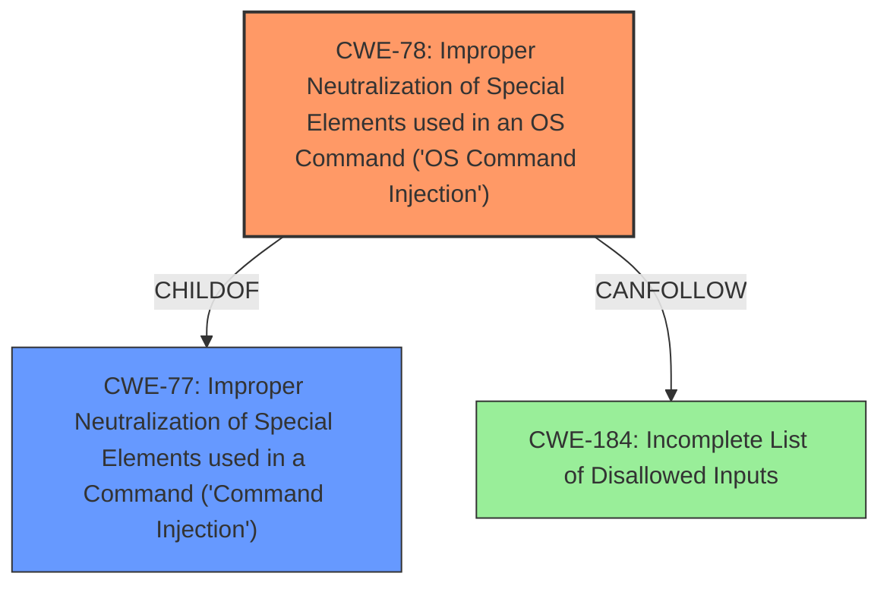

# Enhanced Analysis for CVE-2022-37079

# Summary
| CWE ID | CWE Name | Confidence | CWE Abstraction Level | CWE Vulnerability Mapping Label | CWE-Vulnerability Mapping Notes |
|---|---|---|---|---|---|
| CWE-78 | Improper Neutralization of Special Elements used in an OS Command ('OS Command Injection') | 1.0 | Base | Allowed | Primary CWE |
| CWE-77 | Improper Neutralization of Special Elements used in a Command ('Command Injection') | 0.7 | Class | Allowed-with-Review | Secondary Candidate |

## Evidence and Confidence

*   **Confidence Score:** 1.0
*   **Evidence Strength:** HIGH

## Relationship Analysis
The primary relationship is that CWE-78 is a ChildOf CWE-77, making CWE-78 more specific to OS commands, which is appropriate here. There are also CANFOLLOW relationships for CWE-78, such as CWE-184 (Incomplete List of Disallowed Inputs), which could be a secondary weakness if the application attempts to filter inputs but does so incompletely. The abstraction levels influenced the decision, favoring the Base level (CWE-78) for its specificity over the Class level (CWE-77).



## Vulnerability Chain
The chain starts with **Improper Neutralization** of the `hostName` parameter, leading directly to **OS Command Injection**.

## Summary of Analysis
The initial assessment strongly points to CWE-78 due to the **command injection** vulnerability via the `hostName` parameter, which directly leads to the execution of OS commands. The "CVE Reference Links Content Summary" confirms the **root cause** is the lack of proper input sanitization on the `hostName` parameter, passed directly to the `system` function.

The retriever results also suggest CWE-78 as a strong candidate. While CWE-77 is also a possibility, CWE-78 is more specific as it explicitly involves OS commands.

The final decision is based on the evidence indicating that the injected commands are executed at the OS level, thus making CWE-78 the most appropriate and specific choice.

Relevant CWE Information:

# Enhanced Context (25 CWEs)
The following CWEs were identified as potentially relevant to this vulnerability:

## CWE-74: Improper Neutralization of Special Elements in Output Used by a Downstream Component ('Injection')
**Abstraction Level**: Class
**Similarity Score**: 0.77
**Source**: dense

**Description**:
The product constructs all or part of a command, data structure, or record using externally-influenced input from an upstream component, but it does not neutralize or incorrectly neutralizes special elements that could modify how it is parsed or interpreted when it is sent to a downstream component.

**Mapping Guidance**:
- Usage: Discouraged
- Rationale: CWE-74 is high-level and often misused when lower-level weaknesses are more appropriate.

## CWE-78: Improper Neutralization of Special Elements used in an OS Command ('OS Command Injection')
**CWE-78**: Improper Neutralization of Special Elements used in an OS Command ('OS Command Injection') is the primary CWE because the vulnerability specifically involves injecting OS commands via the `hostName` parameter. This is supported by the vulnerability description and the "CVE Reference Links Content Summary". The injection leads to arbitrary command execution on the router's operating system, aligning perfectly with CWE-78's definition. The confidence is high (1.0) due to the direct evidence and the CWE's base level of abstraction.

## CWE-77: Improper Neutralization of Special Elements used in a Command ('Command Injection')
**CWE-77**: Improper Neutralization of Special Elements used in a Command ('Command Injection') was considered because CWE-78 is a child of CWE-77, and the initial description mentions **command injection**. However, CWE-78 is more specific because it clearly involves OS commands. Therefore, while CWE-77 is a related, more general category, CWE-78 is the better fit. Confidence is 0.7 because it's a broader category.

CWE-74, CWE-113, CWE-184, CWE-41, CWE-93, CWE-138, CWE-73, CWE-134, CWE-80, CWE-1289, CWE-88, CWE-116, CWE-434, CWE-79, CWE-94, CWE-117, CWE-22, CWE-259, CWE-321, CWE-98, CWE-426, and CWE-790 were all considered but ultimately deemed less relevant or inappropriate because they do not directly address the specific vulnerability of **OS command injection** through the `hostName` parameter. Some of these, such as CWE-184, could be part of a vulnerability chain but are not the primary weakness.


## CWE Relationship Analysis

Current CWEs represent these abstraction levels: .


### Vulnerability Chain Analysis

**Chain starting from CWE-41:**
- 41 (Improper Resolution of Path Equivalence) - ROOT


**Chain starting from CWE-259:**
- 259 (Use of Hard-coded Password) - ROOT


### CWE Relationship Diagram

```mermaid
graph TD
    classDef primary fill:#f96,stroke:#333,stroke-width:2px
    classDef secondary fill:#69f,stroke:#333
    classDef tertiary fill:#9e9,stroke:#333
```