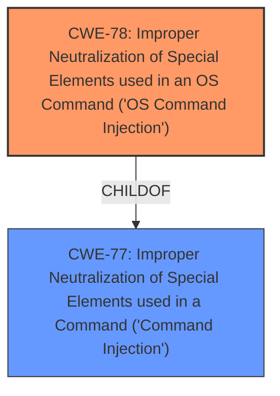

# Analysis Report for CVE-2022-37081

# Vulnerability Analysis Report: CVE-2022-37081

## Description


## Analysis (with Relationship Data)

# Summary
| CWE ID | CWE Name | Confidence | CWE Abstraction Level | CWE Vulnerability Mapping Label | CWE-Vulnerability Mapping Notes |
|---|---|---|---|---|---|
| CWE-78 | Improper Neutralization of Special Elements used in an OS Command ('OS Command Injection') | 1.0 | Base | Allowed | Primary CWE |
| CWE-77 | Improper Neutralization of Special Elements used in a Command ('Command Injection') | 0.7 | Class | Allowed-with-Review | Secondary Candidate |

## Evidence and Confidence

*   **Confidence Score:** 0.9
*   **Evidence Strength:** HIGH

## Relationship Analysis
The primary CWE is CWE-78, which is a base level weakness and a child of CWE-77. CWE-77 is a more general class. The vulnerability description clearly points to OS command injection due to the ability to execute arbitrary commands on the operating system.



## Vulnerability Chain
The vulnerability chain starts with **improper neutralization** of the `command` parameter, leading to **OS Command Injection**, which results in the ability to execute **arbitrary commands** and obtain a **root shell**.

## Summary of Analysis
The initial analysis strongly pointed to CWE-78 due to the direct execution of OS commands. The vulnerability description clearly states a "**command injection**" vulnerability. The "CVE Reference Links Content Summary" confirms that the root cause is the insecure use of `sprintf` and `dosystem` functions without proper sanitization, enabling the execution of arbitrary shell commands.

The retriever results also strongly suggested CWE-78 as a primary candidate, with a high similarity score.

The choice of CWE-78 is at the optimal level of specificity because it directly addresses the **improper neutralization** of special elements in an OS command, which is the root cause of the vulnerability.

Relevant CWE Information:

# Enhanced Context (25 CWEs)

## CWE-74: Improper Neutralization of Special Elements in Output Used by a Downstream Component ('Injection')
**Abstraction Level**: Class
**Similarity Score**: 0.76

This CWE is too high-level. The vulnerability is more specifically related to OS commands.

## CWE-184: Incomplete List of Disallowed Inputs
**Abstraction Level**: Base
**Similarity Score**: 0.74

While an incomplete list of disallowed inputs might be a contributing factor, the primary issue is the lack of any neutralization of special elements.

## CWE-80: Improper Neutralization of Script-Related HTML Tags in a Web Page (Basic XSS)
**Abstraction Level**: Variant
**Similarity Score**: 0.74

This CWE is specific to XSS, which is not relevant to the described vulnerability.

## CWE-917: Improper Neutralization of Special Elements used in an Expression Language Statement ('Expression Language Injection')
**Abstraction Level**: Base
**Similarity Score**: 0.73

This CWE is specific to expression language injection, which is not relevant to the described vulnerability.

## CWE-138: Improper Neutralization of Special Elements
**Abstraction Level**: Class
**Similarity Score**: 0.72

This CWE is too high-level and doesn't specifically address OS command injection.

## CWE-88: Improper Neutralization of Argument Delimiters in a Command ('Argument Injection')
**Abstraction Level**: Base
**Similarity Score**: 0.72

While argument injection could potentially be a contributing factor, the primary vulnerability is the direct injection of OS commands.

## CWE-96: Improper Neutralization of Directives in Statically Saved Code ('Static Code Injection')
**Abstraction Level**: Base
**Similarity Score**: 0.72

This CWE is not relevant as the code is not statically saved.

## CWE-1289: Improper Validation of Unsafe Equivalence in Input
**Abstraction Level**: Base
**Similarity Score**: 0.72

This CWE is not relevant to the described vulnerability.

## CWE-41: Improper Resolution of Path Equivalence
**Abstraction Level**: Base
**Similarity Score**: 0.72

This CWE is not relevant to the described vulnerability.

## CWE-943: Improper Neutralization of Special Elements in Data Query Logic
**Abstraction Level**: Class
**Similarity Score**: 0.72

This CWE is specific to data query logic, which is not relevant to the described vulnerability.

## CWE-78: Improper Neutralization of Special Elements used in an OS Command ('OS Command Injection')
**Abstraction Level**: base
**Similarity Score**: 5.03

This is the best fit for the described vulnerability. The vulnerability allows the attacker to inject arbitrary OS commands. The **weakness** is the **improper neutralization** of special elements used in an OS command.

## CWE-94: Improper Control of Generation of Code ('Code Injection')
**Abstraction Level**: base
**Similarity Score**: 4.33

While the vulnerability leads to code execution, the root cause is the **improper neutralization** of special elements rather than a more general code injection issue.

## CWE-79: Improper Neutralization of Input During Web Page Generation ('Cross-site Scripting')
**Abstraction Level**: base
**Similarity Score**: 4.33

This CWE is specific to Cross-site Scripting, which is not relevant to the described vulnerability.

## CWE-434: Unrestricted Upload of File with Dangerous Type
**Abstraction Level**: base
**Similarity Score**: 4.33

This CWE is not relevant as the vulnerability does not involve file uploads.

## CWE-22: Improper Limitation of a Pathname to a Restricted Directory ('Path Traversal')
**Abstraction Level**: base
**Similarity Score**: 4.33

This CWE is not relevant as the vulnerability does not involve path traversal.

## CWE-259: Use of Hard-coded Password
**Abstraction Level**: variant
**Similarity Score**: 4.01

This CWE is not relevant as the vulnerability does not involve hard-coded passwords.

## CWE-321: Use of Hard-coded Cryptographic Key
**Abstraction Level**: variant
**Similarity Score**: 4.01

This CWE is not relevant as the vulnerability does not involve cryptographic keys.

## CWE-98: Improper Control of Filename for Include/Require Statement in PHP Program ('PHP Remote File Inclusion')
**Abstraction Level**: variant
**Similarity Score**: 3.89

This CWE is not relevant as the vulnerability is not specific to PHP file inclusion.

## CWE-426: Untrusted Search Path
**Abstraction Level**: base
**Similarity Score**: 3.64

This CWE is not relevant as the vulnerability does not involve untrusted search paths.

## CWE-257: Storing Passwords in a Recoverable Format
**Abstraction Level**: base
**Similarity Score**: 3.64

This CWE is not relevant as the vulnerability does not involve password storage.

CWE-77 was considered as a secondary candidate, but CWE-78 is more specific and accurately describes the vulnerability. CWE-77 is a class-level CWE, while CWE-78 is a base-level CWE. The vulnerability involves injecting commands that are executed by the operating system, thus fitting the definition of CWE-78.


## CWE Relationship Analysis

Current CWEs represent these abstraction levels: .


### Vulnerability Chain Analysis

**Chain starting from CWE-41:**
- 41 (Improper Resolution of Path Equivalence) - ROOT


**Chain starting from CWE-259:**
- 259 (Use of Hard-coded Password) - ROOT


### CWE Relationship Diagram

```mermaid
graph TD
    classDef primary fill:#f96,stroke:#333,stroke-width:2px
    classDef secondary fill:#69f,stroke:#333
    classDef tertiary fill:#9e9,stroke:#333
```


*Report generated on 2025-03-31 10:52:35*
