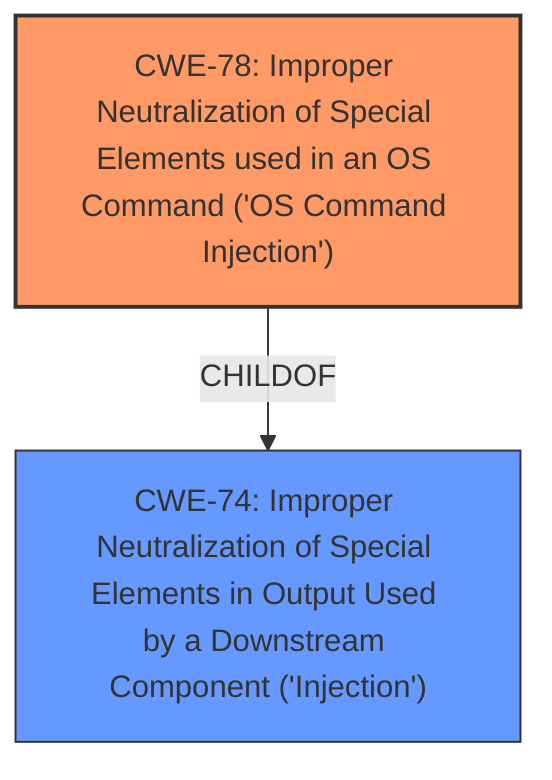

# Analysis for CVE-2022-37108

# Summary
| CWE ID | CWE Name | Confidence | CWE Abstraction Level | CWE Vulnerability Mapping Label | CWE-Vulnerability Mapping Notes |
|---|---|---|---|---|---|
| CWE-78 | Improper Neutralization of Special Elements used in an OS Command ('OS Command Injection') | 1.0 | Base | Allowed | Primary CWE |
| CWE-74 | Improper Neutralization of Special Elements in Output Used by a Downstream Component ('Injection') | 0.7 | Class | Discouraged | Secondary Candidate |

## Evidence and Confidence

*   **Confidence Score:** 0.9
*   **Evidence Strength:** HIGH

## Relationship Analysis
The primary relationship influencing the decision is the child-of relationship between CWE-78 and CWE-74, as CWE-78 is a specific type of CWE-74. The analysis determined that the specific weakness was related to OS commands, justifying the selection of CWE-78.

## Vulnerability Chain
The vulnerability chain starts with the **improper injection** of arbitrary text into the syslog-ng configuration files (CWE-78). This leads to the ability to execute arbitrary code on the remote ingesters.

## Summary of Analysis
The initial analysis identified an **injection** vulnerability leading to arbitrary code execution. The detailed analysis revealed that the **injection** occurs in the context of OS commands. Therefore, CWE-78, which is a more specific case of CWE-74, was chosen as the primary CWE.

The selection of CWE-78 is strongly supported by the vulnerability description and CVE Reference Links Content Summary, particularly the following excerpts:

*   "An **injection** vulnerability in the syslog-ng configuration wizard... allows an application user with the Manage Ingesters permission to execute arbitrary code on remote ingesters"
*   "The vulnerability stems from the Securonix Snypr console allowing users with 'Manage Ingesters' permissions to directly insert arbitrary text into the syslog-ng configuration files of Remote Ingesters (RINs)."
*   "By injecting malicious syslog-ng configurations, an attacker can achieve remote code execution on the RINs as the root user."
*   "The attacker crafts a malicious syslog-ng source expression that includes a destination to write arbitrary content to a file, such as a cronjob file or `rc.local` for command execution."

The relationship graph highlights the relationship between CWE-78 and CWE-74. The selection of CWE-78 is at the optimal level of specificity because it accurately describes the nature of the **injection** vulnerability in the context of OS commands.

Relevant CWE Information:

# Enhanced Context (25 CWEs)

## CWE-74: Improper Neutralization of Special Elements in Output Used by a Downstream Component ('Injection')
**Abstraction Level**: Class
**Similarity Score**: 0.78
**Source**: dense

**Description**:
The product constructs all or part of a command, data structure, or record using externally-influenced input from an upstream component, but it does not neutralize or incorrectly neutralizes special elements that could modify how it is parsed or interpreted when it is sent to a downstream component.

**Mapping Guidance**:
- Usage: Discouraged
- Rationale: CWE-74 is high-level and often misused when lower-level weaknesses are more appropriate.

## CWE-78: Improper Neutralization of Special Elements used in an OS Command ('OS Command Injection')
**Abstraction Level**: base
**Similarity Score**: 5.03
**Source**: graph

**Description**:
CWE-78: Improper Neutralization of Special Elements used in an OS Command ('OS Command Injection')

**Mapping Guidance**:
- Usage: Allowed
- Rationale: This CWE entry is at the Base level of abstraction, which is a preferred level of abstraction for mapping to the root causes of vulnerabilities.

**Relationships**:
- CANFOLLOW -> CWE-184
- CANALSOBE -> CWE-88
- CHILDOF -> CWE-77
- CHILDOF -> CWE-77
- CHILDOF -> CWE-74

CWE-74 was considered but not selected as the primary CWE because it is a high-level class, and the vulnerability is more specifically related to OS command **injection**, making CWE-78 a better fit.