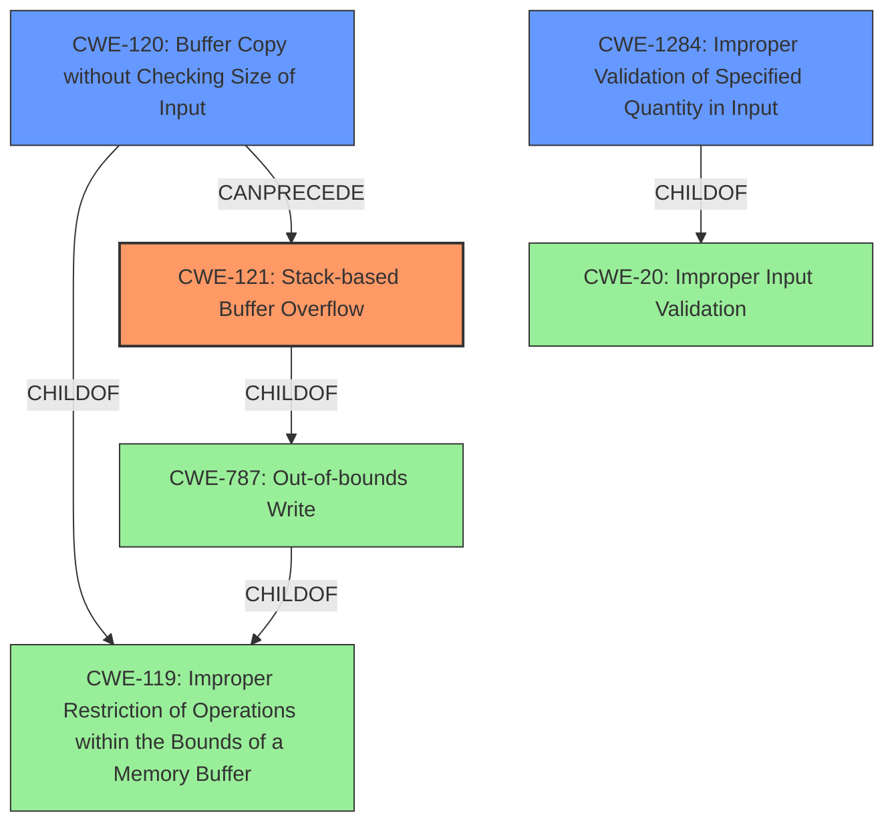

# Raw Analyzer Response for CVE-2022-37134

# Summary
| CWE ID | CWE Name | Confidence | CWE Abstraction Level | CWE Vulnerability Mapping Label | CWE-Vulnerability Mapping Notes |
|---|---|---|---|---|---|
| CWE-121 | Stack-based Buffer Overflow | 1.0 | Variant | Allowed | Primary CWE |
| CWE-120 | Buffer Copy without Checking Size of Input ('Classic Buffer Overflow') | 0.7 | Base | Allowed-with-Review | Secondary Candidate |
| CWE-1284 | Improper Validation of Specified Quantity in Input | 0.6 | Base | Allowed | Secondary Candidate |

## Evidence and Confidence

*   **Confidence Score:** 0.9
*   **Evidence Strength:** HIGH

## Relationship Analysis
The primary CWE is CWE-121 (Stack-based Buffer Overflow), which is a variant of CWE-787 (Out-of-bounds Write) and CWE-119 (Improper Restriction of Operations within the Bounds of a Memory Buffer). CWE-120 (Buffer Copy without Checking Size) is a child of CWE-119 as well. CWE-1284 (Improper Validation of Specified Quantity in Input) can precede CWE-789 (Memory Allocation with Excessive Size Value), but it's also related to the root cause here. The relationships guided selection of the most specific variant, CWE-121, while also considering the lack of input validation (CWE-1284) which makes buffer overflows possible.

## Vulnerability Chain
The vulnerability chain starts with **improper handling of the 'l2tp_usrname' parameter** in the `/goform/form2Wan.cgi` script. Specifically:
1.  **Lack of input size validation** of the 'l2tp_usrname' parameter, which is base64 decoded. This maps to **CWE-1284 (Improper Validation of Specified Quantity in Input)**.
2.  The base64 decoded value is then **copied into a fixed-size buffer 'v94' on the stack without checking the size**, leading to **CWE-121 (Stack-based Buffer Overflow)**.

The final impact is a denial of service or potentially remote code execution.

## Summary of Analysis
The initial analysis correctly identified the vulnerability as a buffer overflow. The key evidence is the description stating that "**l2tp_usrname will be decrypted by base64, and the result will be stored in v94, which does not check the size of l2tp_usrname, resulting in stack overflow**". The "CVE Reference Links Content Summary" confirms this by stating that "The vulnerability stems from a stack-based buffer overflow... Specifically, when the `wantype` parameter is set to '3', the value of the `l2tp_usrname` parameter is base64 decoded and stored in a buffer (`v94`) on the stack. The vulnerability occurs because the code **does not perform adequate size checks** on the base64 decoded `l2tp_usrname`, allowing an attacker to write past the allocated buffer."

CWE-121 (Stack-based Buffer Overflow) is the most appropriate primary CWE because the buffer `v94` is allocated on the stack, and the root cause is a buffer overflow. This is a variant level CWE, providing sufficient specificity.

CWE-120 (Buffer Copy without Checking Size of Input) was also considered, as it is very similar. However, CWE-121 is more specific because it explicitly mentions "Stack-based" buffer overflow.

CWE-1284 (Improper Validation of Specified Quantity in Input) is also relevant as the **lack of size validation on the user-controlled input 'l2tp_usrname' after base64 decoding is the weakness that triggers the vulnerability.**

The final selection of CWEs accurately reflects the vulnerability based on the available evidence and follows the recommended mapping guidance. CWE-121 is at the optimal level of specificity.

Relevant CWE Information:

# Enhanced Context (25 CWEs)

## CWE-197: Numeric Truncation Error
**Abstraction Level**: Base
**Similarity Score**: 0.80
**Source**: dense

**Description**:
Truncation errors occur when a primitive is cast to a primitive of a smaller size and data is lost in the conversion.

**Mapping Guidance**:
- Usage: Allowed
- Rationale: This CWE entry is at the Base level of abstraction, which is a preferred level of abstraction for mapping to the root causes of vulnerabilities.

## CWE-191: Integer Underflow (Wrap or Wraparound)
**Abstraction Level**: Base
**Similarity Score**: 0.80
**Source**: dense

**Description**:
The product subtracts one value from another, such that the result is less than the minimum allowable integer value, which produces a value that is not equal to the correct result.

**Mapping Guidance**:
- Usage: Allowed
- Rationale: This CWE entry is at the Base level of abstraction, which is a preferred level of abstraction for mapping to the root causes of vulnerabilities.

## CWE-131: Incorrect Calculation of Buffer Size
**Abstraction Level**: Base
**Similarity Score**: 0.78
**Source**: dense

**Description**:
The product does not correctly calculate the size to be used when allocating a buffer, which could lead to a buffer overflow.

**Mapping Guidance**:
- Usage: Allowed
- Rationale: This CWE entry is at the Base level of abstraction, which is a preferred level of abstraction for mapping to the root causes of vulnerabilities.

## CWE-681: Incorrect Conversion between Numeric Types
**Abstraction Level**: Base
**Similarity Score**: 0.77
**Source**: dense

**Description**:
When converting from one data type to another, such as long to integer, data can be omitted or translated in a way that produces unexpected values. If the resulting values are used in a sensitive context, then dangerous behaviors may occur.

**Mapping Guidance**:
- Usage: Allowed
- Rationale: This CWE entry is at the Base level of abstraction, which is a preferred level of abstraction for mapping to the root causes of vulnerabilities.

## CWE-190: Integer Overflow or Wraparound
**Abstraction Level**: Base
**Similarity Score**: 0.76
**Source**: dense

**Description**:
The product performs a calculation that can
         produce an integer overflow or wraparound when the logic
         assumes that the resulting value will always be larger than
         the original value. This occurs when an integer value is
         incremented to a value that is too large to store in the
         associated representation. When this occurs, the value may
         become a very small or negative number.

**Mapping Guidance**:
- Usage: Allowed
- Rationale: This CWE entry is at the Base level of abstraction, which is a preferred level of abstraction for mapping to the root causes of vulnerabilities.

## CWE-789: Memory Allocation with Excessive Size Value
**Abstraction Level**: Variant
**Similarity Score**: 0.76
**Source**: dense

**Description**:
The product allocates memory based on an untrusted, large size value, but it does not ensure that the size is within expected limits, allowing arbitrary amounts of memory to be allocated.

**Mapping Guidance**:
- Usage: Allowed
- Rationale: This CWE entry is at the Variant level of abstraction, which is a preferred level of abstraction for mapping to the root causes of vulnerabilities.

## CWE-193: Off-by-one Error
**Abstraction Level**: Base
**Similarity Score**: 0.76
**Source**: dense

**Description**:
A product calculates or uses an incorrect maximum or minimum value that is 1 more, or 1 less, than the correct value.

**Mapping Guidance**:
- Usage: Allowed
- Rationale: This CWE entry is at the Base level of abstraction, which is a preferred level of abstraction for mapping to the