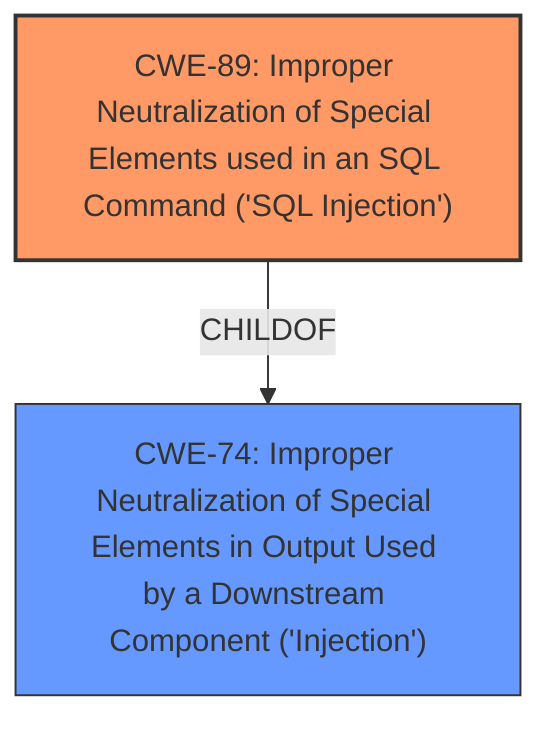

# Enhanced Analysis for CVE-2022-3714

# Summary
| CWE ID | CWE Name | Confidence | CWE Abstraction Level | CWE Vulnerability Mapping Label | CWE-Vulnerability Mapping Notes |
|---|---|---|---|---|---|
| CWE-89 | Improper Neutralization of Special Elements used in an SQL Command ('SQL Injection') | 1.0 | Base | Allowed | Primary CWE |

## Evidence and Confidence

*   **Confidence Score:** 1.0
*   **Evidence Strength:** HIGH

## Relationship Analysis
The primary relationship that influenced the decision was the ChildOf relationship between CWE-89 and CWE-74 (Improper Neutralization of Special Elements in Output Used by a Downstream Component ('Injection')). While CWE-74 is a broader class, CWE-89 is a specific base case directly addressing the **SQL Injection** **weakness**. The other CWEs considered were mostly related to input validation and neutralization, but none were as directly relevant as CWE-89.



## Vulnerability Chain
The vulnerability chain starts with the **improper neutralization** of the `id` parameter, leading directly to the **SQL Injection** **weakness**. This allows attackers to potentially access, modify, or delete data within the database.
  - **Root Cause:** Improper Neutralization of `id` parameter
  - **Weakness:** SQL Injection (CWE-89)
  - **Impact:** Confidentiality Breach, Integrity Violation, Availability Issues

## Summary of Analysis
The initial analysis clearly points to **SQL Injection** due to the **improper neutralization** of the `id` parameter in the `admin/?page=orders/view_order` file. This conclusion is strongly supported by the "CVE Reference Links Content Summary" and the "Retriever Results".
The description states: "The manipulation of the argument id leads to **sql injection**."
The CVE Reference Links Content Summary states: "**SQL Injection (CWE-89):** The primary weakness is the lack of proper input sanitization, which allows an attacker to inject malicious SQL code into the query."
The Retriever Results list CWE-89 as the top result with a score of 1.0.

The selection of CWE-89 is at the optimal level of specificity because it accurately describes the root cause of the vulnerability. While other CWEs like CWE-74 (Improper Neutralization of Special Elements in Output Used by a Downstream Component ('Injection')) are related, they are too broad and do not specifically address the **SQL Injection** **weakness**.

# Relevant CWE Information:

## CWE-89: Improper Neutralization of Special Elements used in an SQL Command ('SQL Injection')
**Abstraction:** Base
**Status:** Stable

### Description
The product constructs all or part of an SQL command using externally-influenced input from an upstream component, but it does not neutralize or incorrectly neutralizes special elements that could modify the intended SQL command when it is sent to a downstream component. Without sufficient removal or quoting of SQL syntax in user-controllable inputs, the generated SQL query can cause those inputs to be interpreted as SQL instead of ordinary user data.

### Extended Description
Not provided

### Alternative Terms
SQL injection: a common attack-oriented phrase
SQLi: a common abbreviation for "SQL injection"

### Relationships
ChildOf -> CWE-943
ChildOf -> CWE-74

### Mapping Guidance
**Usage:** Allowed
**Rationale:** This CWE entry is at the Base level of abstraction, which is a preferred level of abstraction for mapping to the root causes of vulnerabilities.
**Comments:** Carefully read both the name and description to ensure that this mapping is an appropriate fit. Do not try to 'force' a mapping to a lower-level Base/Variant simply to comply with this preferred level of abstraction.
**Reasons:**
- Acceptable-Use

### Additional Notes
**[Relationship]** SQL injection can be resultant from special character mismanagement, MAID, or denylist/allowlist problems. It can be primary to authentication errors.

### Observed Examples
- **CVE-2023-32530:** SQL injection in security product dashboard using crafted certificate fields
- **CVE-2021-42258:** SQL injection in time and billing software, as exploited in the wild per CISA KEV.
- **CVE-2021-27101:** SQL injection in file-transfer system via a crafted Host header, as exploited in the wild per CISA KEV.


## CWE Relationship Analysis

Current CWEs represent these abstraction levels: .


### Vulnerability Chain Analysis

**Chain starting from CWE-89:**
- 89 (Improper Neutralization of Special Elements used in an SQL Command ('SQL Injection')) - ROOT


**Chain starting from CWE-74:**
- 74 (Improper Neutralization of Special Elements in Output Used by a Downstream Component ('Injection')) - ROOT


### CWE Relationship Diagram

```mermaid
graph TD
    classDef primary fill:#f96,stroke:#333,stroke-width:2px
    classDef secondary fill:#69f,stroke:#333
    classDef tertiary fill:#9e9,stroke:#333
```