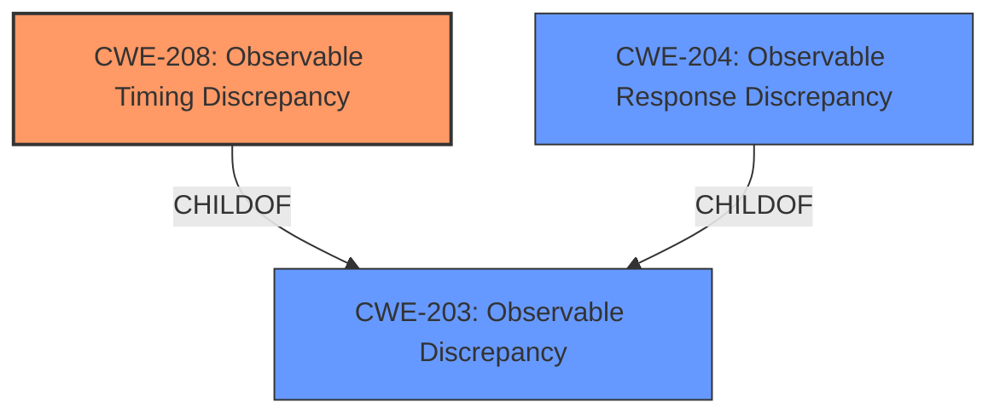

# Enhanced Analysis for CVE-2022-37146

# Summary
| CWE ID    | CWE Name                                  | Confidence | CWE Abstraction Level | CWE Vulnerability Mapping Label | CWE-Vulnerability Mapping Notes |
| :-------- | :---------------------------------------- | :--------- | :-------------------- | :------------------------------ | :------------------------------ |
| CWE-208   | Observable Timing Discrepancy             | 1          | Base                  | Allowed                       | Primary CWE                     |
| CWE-204   | Observable Response Discrepancy             | 0.75       | Base                  | Allowed                       | Secondary CWE                   |

## Evidence and Confidence

*   **Confidence Score:** 0.9
*   **Evidence Strength:** HIGH

## Relationship Analysis
The primary relationship influencing the CWE selection is the hierarchical relationship. CWE-208 "Observable Timing Discrepancy" is a specific type of CWE-203 "Observable Discrepancy", and both are relevant. Since the vulnerability description explicitly mentions timing differences, CWE-208 is the more specific and appropriate choice. CWE-204 "Observable Response Discrepancy" is another potential candidate since the timing differences lead to observable discrepancies in the response.



## Vulnerability Chain
The vulnerability chain starts with the **weakness** that the application exhibits different response times for valid and invalid users. This leads to the impact of username enumeration, allowing attackers to identify valid usernames.

## Summary of Analysis
The initial analysis identified CWE-208 as the most relevant CWE due to the explicit mention of timing discrepancies in the vulnerability description. The "CVE Reference Links Content Summary" confirms this by stating that the root cause is "The application's response times for valid and invalid users differed, allowing attackers to distinguish between them." The retriever results also list CWE-208 as the top candidate.

CWE-204 was considered as a secondary CWE because the timing difference results in an observable difference in responses.

The selected CWEs are at the optimal level of specificity because they directly address the root cause of the vulnerability as described in the provided evidence. CWE-208 is a Base level CWE which is the preferred level of abstraction.

Relevant CWE Information:

# Enhanced Context (25 CWEs)
The following CWEs were identified as potentially relevant to this vulnerability:

## CWE-204: Observable Response Discrepancy
**Abstraction Level**: Base
**Similarity Score**: 0.79
**Source**: dense

**Description**:
The product provides different responses to incoming requests in a way that reveals internal state information to an unauthorized actor outside of the intended control sphere.

**Mapping Guidance**:
- Usage: Allowed
- Rationale: This CWE entry is at the Base level of abstraction, which is a preferred level of abstraction for mapping to the root causes of vulnerabilities.

## CWE-208: Observable Timing Discrepancy
**Abstraction Level**: Base
**Similarity Score**: 0.77
**Source**: dense

**Description**:
Two separate operations in a product require different amounts of time to complete, in a way that is observable to an actor and reveals security-relevant information about the state of the product, such as whether a particular operation was successful or not.

**Mapping Guidance**:
- Usage: Allowed
- Rationale: This CWE entry is at the Base level of abstraction, which is a preferred level of abstraction for mapping to the root causes of vulnerabilities.

## CWE-203: Observable Discrepancy
**Abstraction Level**: Base
**Similarity Score**: 0.77
**Source**: dense

**Description**:
The product behaves differently or sends different responses under different circumstances in a way that is observable to an unauthorized actor, which exposes security-relevant information about the state of the product, such as whether a particular operation was successful or not.

**Mapping Guidance**:
- Usage: Allowed
- Rationale: This CWE entry is at the Base level of abstraction, which is a preferred level of abstraction for mapping to the root causes of vulnerabilities.

## CWE-208: Observable Timing Discrepancy
**Abstraction Level**: Base
**Similarity Score**: 4661.39
**Source**: sparse

**Description**:
Two separate operations in a product require different amounts of time to complete, in a way that is observable to an actor and reveals security-relevant information about the state of the product, such as whether a particular operation was successful or not.

**Mapping Guidance**:
- Usage: Allowed
- Rationale: This CWE entry is at the Base level of abstraction, which is a preferred level of abstraction for mapping to the root causes of vulnerabilities.

## CWE-203: Observable Discrepancy
**Abstraction Level**: Base
**Similarity Score**: 4605.05
**Source**: sparse

**Description**:
The product behaves differently or sends different responses under different circumstances in a way that is observable to an unauthorized actor, which exposes security-relevant information about the state of the product, such as whether a particular operation was successful or not.

**Mapping Guidance**:
- Usage: Allowed
- Rationale: This CWE entry is at the Base level of abstraction, which is a preferred level of abstraction for mapping to the root causes of vulnerabilities.

## CWE-204: Observable Response Discrepancy
**Abstraction Level**: Base
**Similarity Score**: 4394.33
**Source**: sparse

**Description**:
The product provides different responses to incoming requests in a way that reveals internal state information to an unauthorized actor outside of the intended control sphere.

**Mapping Guidance**:
- Usage: Allowed
- Rationale: This CWE entry is at the Base level of abstraction, which is a preferred level of abstraction for mapping to the root causes of vulnerabilities.

## CWE-208: Observable Timing Discrepancy
**Abstraction Level**: Base
**Similarity Score**: 2.91
**Source**: graph

**Description**:
Two separate operations in a product require different amounts of time to complete, in a way that is observable to an actor and reveals security-relevant information about the state of the product, such as whether a particular operation was successful or not.

**Mapping Guidance**:
- Usage: Allowed
- Rationale: This CWE entry is at the Base level of abstraction, which is a preferred level of abstraction for mapping to the root causes of vulnerabilities.

## CWE-208: Observable Timing Discrepancy - Primary CWE
### Technical Explanation
The vulnerability allows for username enumeration by measuring HTTP response times. Valid users take significantly longer than invalid users. This aligns perfectly with the description of CWE-208 **Observable Timing Discrepancy**: "Two separate operations in a product require different amounts of time to complete, in a way that is observable to an actor and reveals security-relevant information about the state of the product, such as whether a particular operation was successful or not."

### Security Implications
An attacker can use this timing discrepancy to determine valid usernames, which can then be used in brute-force attacks, credential stuffing, or targeted social engineering attacks.

### Relationship to Other CWEs
CWE-208 is a child of CWE-203 **Observable Discrepancy**.

### MITRE Mapping Guidance
The MITRE mapping guidance for CWE-208 states "This CWE entry is at the Base level of abstraction, which is a preferred level of abstraction for mapping to the root causes of vulnerabilities." and the Usage is "Allowed".

## CWE-204: Observable Response Discrepancy - Secondary CWE
### Technical Explanation
The vulnerability description states that login attempts for valid users take significantly longer than those for invalid users. This difference in response times is an observable discrepancy that reveals internal state information (whether a user exists or not). The description for CWE-204 **Observable Response Discrepancy** states: "The product provides different responses to incoming requests in a way that reveals internal state information to an unauthorized actor outside of the intended control sphere."

### Security Implications
The security implications are the same as for CWE-208: username enumeration leading to potential brute-force or social engineering attacks.

### Relationship to Other CWEs
CWE-204 is a child of CWE-203 **Observable Discrepancy**.

### MITRE Mapping Guidance
The MITRE mapping guidance for CWE-204 states "This CWE entry is at the Base level of abstraction, which is a preferred level of abstraction for mapping to the root causes of vulnerabilities." and the Usage is "Allowed".

## Other CWEs Considered But Not Used
- CWE-1390 **Weak Authentication**: While username enumeration can weaken authentication, the root cause is the timing discrepancy, not a fundamentally weak authentication mechanism.
- CWE-287 **


## CWE Relationship Analysis

Current CWEs represent these abstraction levels: .


### Vulnerability Chain Analysis

**Chain starting from CWE-208:**
- 208 (Observable Timing Discrepancy) - ROOT


**Chain starting from CWE-203:**
- 203 (Observable Discrepancy) - ROOT


### CWE Relationship Diagram

```mermaid
graph TD
    classDef primary fill:#f96,stroke:#333,stroke-width:2px
    classDef secondary fill:#69f,stroke:#333
    classDef tertiary fill:#9e9,stroke:#333
```