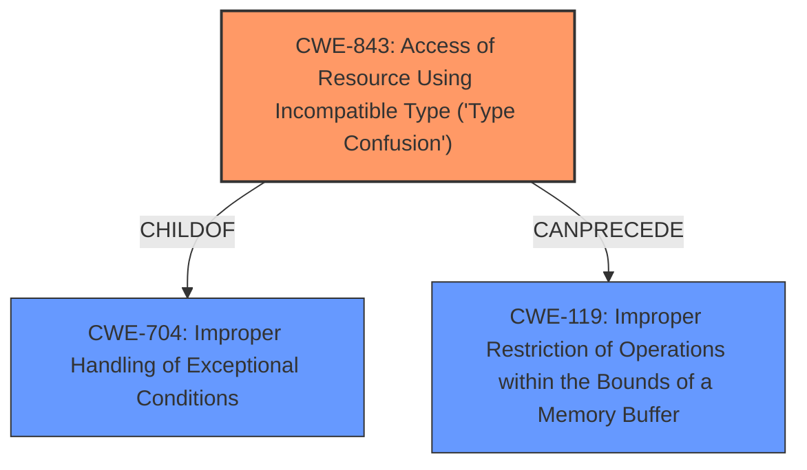

# Analysis for CVE-2022-3723

# Summary
| CWE ID | CWE Name | Confidence | CWE Abstraction Level | CWE Vulnerability Mapping Label | CWE-Vulnerability Mapping Notes |
|---|---|---|---|---|---|
| CWE-843 | Access of Resource Using Incompatible Type ('Type Confusion') | 1 | Base | Allowed | Primary CWE. The vulnerability is caused by **type confusion** in the V8 engine, which allows a remote attacker to potentially exploit heap corruption. |

## Evidence and Confidence

*   **Confidence Score:** 1
*   **Evidence Strength:** HIGH

## Relationship Analysis
The primary CWE selected is CWE-843, which is a Base level CWE. This is an appropriate level of abstraction for mapping to the root cause of the vulnerability, which is **type confusion**. CWE-843 is a child of CWE-704 (Improper Handling of Exceptional Conditions), indicating that **type confusion** is a specific type of exceptional condition that is not being properly handled. There is also a CanPrecede relationship to CWE-119 (Improper Restriction of Operations within the Bounds of a Memory Buffer), indicating that **type confusion** can lead to buffer overflows.

## Vulnerability Chain
The vulnerability chain starts with **type confusion** (CWE-843) in the V8 engine. This leads to heap corruption. This could then potentially lead to remote code execution.

## Summary of Analysis
The vulnerability description clearly states that the root cause is **type confusion** in the V8 engine.
The "Vulnerability Description Key Phrases" section confirms this, with "**rootcause:** **type confusion**".
The "CVE Reference Links Content Summary" section also supports this, with "**root_cause:** Type Confusion in V8" and "**weaknesses:** Type Confusion".
The retriever results also list CWE-843 as the top combined result.
CWE-843 (Access of Resource Using Incompatible Type ('Type Confusion')) is the most appropriate CWE for this vulnerability, and it is at the optimal level of specificity (Base).
I considered CWE-416 (Use After Free), CWE-122 (Heap-based Buffer Overflow), CWE-123 (Write-what-where Condition) and CWE-787 (Out-of-bounds Write) but these are downstream impacts and not the root cause.

Relevant CWE Information:
- CWE-843: Access of Resource Using Incompatible Type ('Type Confusion')
  - The product allocates or initializes a resource using one type, but it later accesses that resource using a type that is incompatible with the original type.
  - This can trigger logical errors because the resource does not have expected properties. In languages without memory safety, such as C and C++, **type confusion** can lead to out-of-bounds memory access.