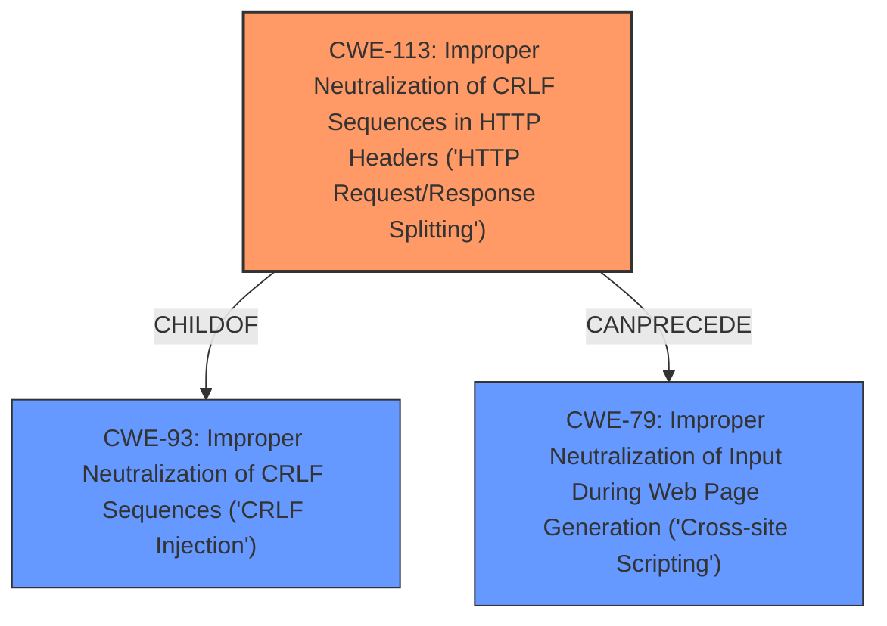

# Analysis Report for CVE-2022-37240

# Vulnerability Analysis Report: CVE-2022-37240

## Description


## Analysis (with Relationship Data)

# Summary
| CWE ID | CWE Name | Confidence | CWE Abstraction Level | CWE Vulnerability Mapping Label | CWE-Vulnerability Mapping Notes |
|---|---|---|---|---|---|
| CWE-113 | Improper Neutralization of CRLF Sequences in HTTP Headers ('HTTP Request/Response Splitting') | 1.0 | Variant | Allowed | Primary CWE |
| CWE-79 | Improper Neutralization of Input During Web Page Generation ('Cross-site Scripting') | 0.7 | Base | Allowed | Secondary Candidate |

## Evidence and Confidence

*   **Confidence Score:** 0.9
*   **Evidence Strength:** HIGH

## Relationship Analysis
The primary CWE selected is CWE-113, which is a Variant of CWE-93 (Improper Neutralization of CRLF Sequences). CWE-113 is more specific, focusing on HTTP headers, which aligns directly with the vulnerability description. CWE-79, while related in terms of potential impact (XSS), is a broader category and less directly tied to the root cause of the HTTP response splitting. The `CanPrecede` relationship between CWE-113 and CWE-79 suggests that the HTTP response splitting could lead to XSS, but the primary weakness is the improper neutralization of CRLF sequences in HTTP headers.



## Vulnerability Chain
The vulnerability chain starts with **improper input sanitization**, leading to **HTTP response splitting**. This then allows for arbitrary header injection and potentially XSS (though not directly exploitable in this case due to file downloading).

Root Cause: **Improper input sanitization** of CRLF sequences.
Weakness: **HTTP Response Splitting** (CWE-113).
Impact: Arbitrary Header Injection, Potential XSS (CWE-79).

## Summary of Analysis
The initial analysis strongly pointed towards CWE-113 due to the **improper neutralization** of CRLF sequences in HTTP headers. The vulnerability description explicitly mentions "HTTP Response splitting via the format parameter," aligning perfectly with CWE-113's focus. While CWE-79 was considered due to its prevalence in similar CVE descriptions and the potential for XSS, the primary issue is the header manipulation enabled by the CRLF injection. The final decision prioritizes CWE-113 as the root cause. The provided information confirms that the vulnerability lies in the **failure to sanitize** carriage return (CR) and line feed (LF) characters before including data in outgoing HTTP headers.
The selection of CWE-113 is at the optimal level of specificity because it directly addresses the **improper neutralization** of CRLF sequences within HTTP headers, which is the core of the vulnerability.
CWE-79 is a potential consequence, but the initial flaw is the CRLF injection.

Relevant CWE Information:

# Enhanced Context (25 CWEs)

## CWE-113: Improper Neutralization of CRLF Sequences in HTTP Headers ('HTTP Request/Response Splitting')
**Abstraction:** Variant
**Status:** Incomplete

### Description
The product receives data from an HTTP agent/component (e.g., web server, proxy, browser, etc.), but it does not neutralize or incorrectly neutralizes CR and LF characters before the data is included in outgoing HTTP headers.

### Extended Description
HTTP agents or components may include a web server, load balancer, reverse proxy, web caching proxy, application firewall, web browser, etc. Regardless of the role, they are expected to maintain coherent, consistent HTTP communication state across all components. However, including unexpected data in an HTTP header allows an attacker to specify the entirety of the HTTP message that is rendered by the client HTTP agent (e.g., web browser) or back-end HTTP agent (e.g., web server), whether the message is part of a request or a response.

When an HTTP request contains unexpected CR and LF characters, the server may respond with an output stream that is interpreted as "splitting" the stream into two different HTTP messages instead of one. CR is carriage return, also given by %0d or \r, and LF is line feed, also given by %0a or \n.

In addition to CR and LF characters, other valid/RFC compliant special characters and unique character encodings can be utilized, such as HT (horizontal tab, also given by %09 or \t) and SP (space, also given as + sign or %20).

These types of unvalidated and unexpected data in HTTP message headers allow an attacker to control the second "split" message to mount attacks such as server-side request forgery, cross-site scripting, and cache poisoning attacks.

HTTP response splitting weaknesses may be present when:

1.  Data enters a web application through an untrusted source, most frequently an HTTP request.
2.  The data is included in an HTTP response header sent to a web user without neutralizing malicious characters that can be interpreted as separator characters for headers.

### Relationships
ChildOf -> CWE-93
CanPrecede -> CWE-79

**Evidence:** The vulnerability description states that the vulnerability is an HTTP Response splitting via the format parameter. The CVE Reference Links Content Summary states that the root cause is the **failure to sanitize** carriage return (CR) and line feed (LF) characters before including data in outgoing HTTP headers.

## CWE-79: Improper Neutralization of Input During Web Page Generation ('Cross-site Scripting')
**Abstraction:** Base
**Status:** Stable

### Description
The product does not neutralize or incorrectly neutralizes user-controllable input before it is placed in output that is used as a web page that is served to other users.

**Evidence:** The CVE Reference Links Content Summary states that the HTTP Response Splitting vulnerability can be chained with XSS.


## CWE Relationship Analysis

Current CWEs represent these abstraction levels: .


### Vulnerability Chain Analysis

**Chain starting from CWE-113:**
- 113 (Improper Neutralization of CRLF Sequences in HTTP Headers ('HTTP Request/Response Splitting')) - ROOT


**Chain starting from CWE-93:**
- 93 (Improper Neutralization of CRLF Sequences ('CRLF Injection')) - ROOT


### CWE Relationship Diagram

```mermaid
graph TD
    classDef primary fill:#f96,stroke:#333,stroke-width:2px
    classDef secondary fill:#69f,stroke:#333
    classDef tertiary fill:#9e9,stroke:#333
```


*Report generated on 2025-03-31 07:49:41*
