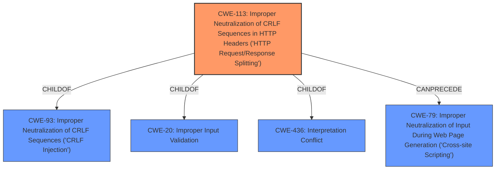

# Enhanced Analysis for CVE-2022-37242

# Summary
| CWE ID | CWE Name | Confidence | CWE Abstraction Level | CWE Vulnerability Mapping Label | CWE-Vulnerability Mapping Notes |
|---|---|---|---|---|---|
| CWE-113 | Improper Neutralization of CRLF Sequences in HTTP Headers ('HTTP Request/Response Splitting') | 1.0 | Variant | Allowed | Primary CWE |
| CWE-93 | Improper Neutralization of CRLF Sequences ('CRLF Injection') | 0.7 | Base | Allowed | Secondary Candidate |

## Evidence and Confidence

*   **Confidence Score:** 0.9
*   **Evidence Strength:** HIGH

## Relationship Analysis
The primary CWE, CWE-113, is a Variant of CWE-93, which is a Base CWE. This hierarchical relationship indicates that CWE-113 is a more specific case of **improper neutralization of CRLF sequences** than CWE-93. CWE-113 is also a child of CWE-20 (**Improper Input Validation**) and CWE-436 (**Interpretation Conflict**). The `CanPrecede` relationship from CWE-113 to CWE-79 suggests a potential path to Cross-Site Scripting.



## Vulnerability Chain
The vulnerability chain starts with the **improper neutralization of CRLF sequences** in the `data` parameter (CWE-113), which leads to HTTP response splitting. This allows an attacker to inject arbitrary HTTP headers, potentially leading to XSS, cookie injection, CORS header manipulation, CSP bypass, or cache poisoning.
  - Root Cause: CWE-113 (**Improper Neutralization of CRLF Sequences in HTTP Headers ('HTTP Request/Response Splitting')**)
  - Impact: HTTP Response Splitting, potentially leading to XSS or other header-based attacks.

## Summary of Analysis
The initial assessment, supported by the **Vulnerability Description Key Phrases** indicating "**weakness: HTTP response splitting**," and the **CVE Reference Links Content Summary** detailing the **root cause** as a failure to properly sanitize CR and LF characters, aligns well with CWE-113. The Retriever Results also strongly suggest CWE-113 as the primary candidate, with a score of 1.0 based on alternate terms.

The vulnerability description and the summary of the CVE reference link content make it clear that the **lack of sanitization of CRLF characters** in the `data` parameter allows for **HTTP response splitting**. The description explicitly mentions the ability to inject arbitrary HTTP headers. This direct evidence supports the selection of CWE-113, **Improper Neutralization of CRLF Sequences in HTTP Headers ('HTTP Request/Response Splitting')**, as the primary CWE.

CWE-93, **Improper Neutralization of CRLF Sequences ('CRLF Injection')**, was also considered, as it is a parent of CWE-113. While CWE-93 is a valid classification, CWE-113 is more specific to the context of HTTP headers, making it a more accurate representation of the vulnerability.

CWE-79, **Improper Neutralization of Input During Web Page Generation ('Cross-site Scripting')**, was listed as the primary CWE match based on similar CVE descriptions, but it is not as directly relevant as CWE-113. The researcher attempted to chain the HTTP Response Splitting with an XSS attack but was unsuccessful. This makes CWE-79 a potential secondary impact, but not the primary weakness.

The selection of CWE-113 is at the optimal level of specificity, as it is a Variant CWE that accurately captures the **root cause** of the vulnerability. The confidence in this assessment is high (0.9), given the clear evidence and the strong alignment with the CWE description.


## CWE Relationship Analysis

Current CWEs represent these abstraction levels: .


### Vulnerability Chain Analysis

**Chain starting from CWE-436:**
- 436 (Interpretation Conflict) - ROOT


**Chain starting from CWE-20:**
- 20 (Improper Input Validation) - ROOT


### CWE Relationship Diagram

```mermaid
graph TD
    classDef primary fill:#f96,stroke:#333,stroke-width:2px
    classDef secondary fill:#69f,stroke:#333
    classDef tertiary fill:#9e9,stroke:#333
```