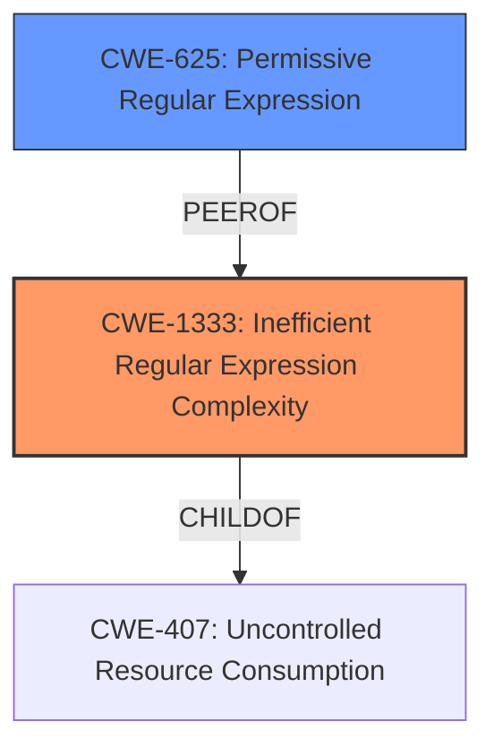

# Analysis Report for CVE-2022-37260

# Vulnerability Analysis Report: CVE-2022-37260

## Description


## Analysis (with Relationship Data)

# Summary
| CWE ID  | CWE Name                                      | Confidence | CWE Abstraction Level | CWE Vulnerability Mapping Label | CWE-Vulnerability Mapping Notes |
|---------|-----------------------------------------------|------------|-----------------------|---------------------------------|-----------------------------------|
| CWE-1333 | Inefficient Regular Expression Complexity   | 1.0        | Base                  | Allowed                         | Primary CWE                       |
| CWE-625 | Permissive Regular Expression                  | 0.7        | Base                  | Allowed                         | Secondary Candidate             |

## Evidence and Confidence

*   **Confidence Score:** 0.9
*   **Evidence Strength:** HIGH

## Relationship Analysis
The primary relationship is that CWE-1333 "Inefficient Regular Expression Complexity" is a child of CWE-407 "Uncontrolled Resource Consumption". While not directly relevant in this specific instance, understanding this parent-child relationship helps contextualize the nature of the denial-of-service vulnerability. CWE-625 "Permissive Regular Expression" is related to CWE-1333 because an overly permissive regex can, in some instances, contribute to inefficiencies.



## Vulnerability Chain
The vulnerability chain starts with the **root cause**, which is the use of an inefficient regular expression (CWE-1333). This inefficiency leads to excessive CPU consumption when processing crafted input, ultimately resulting in a denial-of-service condition.

## Summary of Analysis
The initial analysis correctly identifies the core issue as a Regular Expression Denial of Service (ReDoS). The "Vulnerability Description Key Phrases" clearly states the "**weakness: regular expression denial of service**". The "CVE Reference Links Content Summary" section confirms this, stating that the vulnerability is caused by "**a poorly constructed regular expression that can lead to catastrophic backtracking when processing a specially crafted input string**".

The "Retriever Results" further support this assessment, with CWE-1333 "Inefficient Regular Expression Complexity" being the top-ranked CWE with a score of 1.0. The description of CWE-1333 directly aligns with the vulnerability description, as it refers to regular expressions with "an inefficient, possibly exponential worst-case computational complexity that consumes excessive CPU cycles."

CWE-1333 is chosen as the primary CWE because it directly describes the root cause of the vulnerability: the use of an inefficient regular expression. The CWE description matches the vulnerability details by referring to excessive CPU consumption. The description also mentions catastrophic backtracking as an alternative term. The "Mapping Guidance" for CWE-1333 recommends its use and states that it is at the Base level of abstraction, which is preferred.

CWE-625 "Permissive Regular Expression" was considered as a secondary weakness because an overly permissive regex could contribute to ReDoS. The summary contains this phrase: "The vulnerability is caused by a poorly constructed regular expression".

Other CWEs considered but not used:

*   CWE-617 "Reachable Assertion": While a denial of service can occur, it is not directly caused by a reachable assertion.
*   CWE-674 "Uncontrolled Recursion": While recursion might be involved in the backtracking of the regex, the core issue is the regex itself, not the uncontrolled recursion.
*   CWE-185 "Incorrect Regular Expression": This is a more general case. CWE-1333 is more specific.

Based on the evidence, relationship analysis, and mapping guidance, CWE-1333 "Inefficient Regular Expression Complexity" is the most appropriate primary CWE. It is at the optimal level of specificity (Base) and directly addresses the root cause of the vulnerability. The additional mappings add further depth and context to the vulnerability analysis.


## CWE Relationship Analysis

Current CWEs represent these abstraction levels: .


### Vulnerability Chain Analysis

**Chain starting from CWE-625:**
- 625 (Permissive Regular Expression) - ROOT


**Chain starting from CWE-617:**
- 617 (Reachable Assertion) - ROOT


### CWE Relationship Diagram

```mermaid
graph TD
    classDef primary fill:#f96,stroke:#333,stroke-width:2px
    classDef secondary fill:#69f,stroke:#333
    classDef tertiary fill:#9e9,stroke:#333
```


*Report generated on 2025-03-31 12:26:17*
