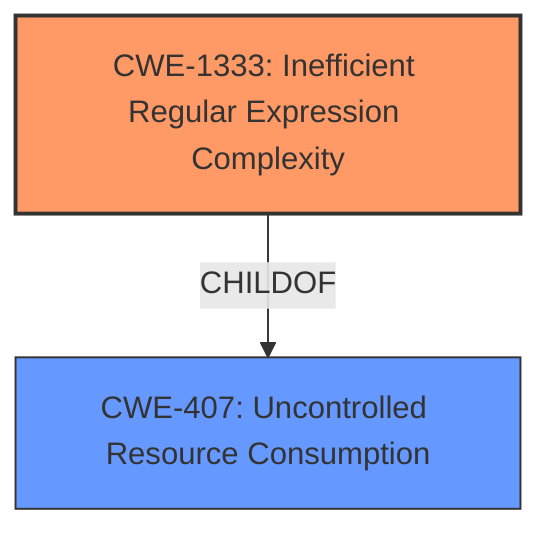

# Analysis Report for CVE-2022-37262

# Vulnerability Analysis Report: CVE-2022-37262

## Description


## Analysis (with Relationship Data)

# Summary
| CWE ID | CWE Name | Confidence | CWE Abstraction Level | CWE Vulnerability Mapping Label | CWE-Vulnerability Mapping Notes |
|---|---|---|---|---|---|
| CWE-1333 | Inefficient Regular Expression Complexity | 1.0 | Base | Allowed | Primary CWE. The vulnerability is caused by an inefficient regular expression that can lead to a denial of service. |

## Evidence and Confidence

*   **Confidence Score:** 1.0
*   **Evidence Strength:** HIGH

## Relationship Analysis
The primary CWE is CWE-1333, which is a Base level CWE. It is a child of CWE-407 (Uncontrolled Resource Consumption). No other relationships influenced the selection.



## Vulnerability Chain
The vulnerability chain consists of a single step: the use of an **inefficient regular expression** (CWE-1333) which leads to a denial of service.

## Summary of Analysis
The analysis is based on the vulnerability description and the CVE Reference Links Content Summary, which clearly state that the vulnerability is a **Regular Expression Denial of Service** (ReDoS) flaw due to an **inefficient regular expression**. The `stealjs/steal` project version 2.2.4 is vulnerable due to the `source` and `sourceWithComments` variables in `main.js`.

The primary CWE selected is CWE-1333 (Inefficient Regular Expression Complexity).

The retriever results strongly suggest CWE-1333 as the primary candidate, with a score of 1.0. The description of CWE-1333 perfectly matches the vulnerability, stating that the product uses a regular expression with an **inefficient, possibly exponential worst-case computational complexity** that consumes excessive CPU cycles. This aligns with the ReDoS vulnerability described.

Other CWEs were considered but deemed less relevant:

*   CWE-617 (Reachable Assertion): While a denial of service can sometimes result from an assertion failure, the root cause here is the inefficient regular expression, not an assertion.
*   CWE-674 (Uncontrolled Recursion): While ReDoS can involve recursion, CWE-1333 is more specific to the regular expression context.
*   CWE-185 (Incorrect Regular Expression): While the regular expression might be incorrect, the key issue is its inefficiency, which CWE-1333 captures more accurately.
*   CWE-770 (Allocation of Resources Without Limits or Throttling): This CWE is related to resource exhaustion, but CWE-1333 is more precise in identifying the root cause as an inefficient regular expression.

The selected CWE is at the optimal level of specificity, as it directly addresses the root cause of the vulnerability which is the inefficient regular expression.


## CWE Relationship Analysis

Current CWEs represent these abstraction levels: .


### Vulnerability Chain Analysis

**Chain starting from CWE-617:**
- 617 (Reachable Assertion) - ROOT


**Chain starting from CWE-407:**
- 407 (Inefficient Algorithmic Complexity) - ROOT


### CWE Relationship Diagram

```mermaid
graph TD
    classDef primary fill:#f96,stroke:#333,stroke-width:2px
    classDef secondary fill:#69f,stroke:#333
    classDef tertiary fill:#9e9,stroke:#333
```


*Report generated on 2025-03-31 02:32:20*
