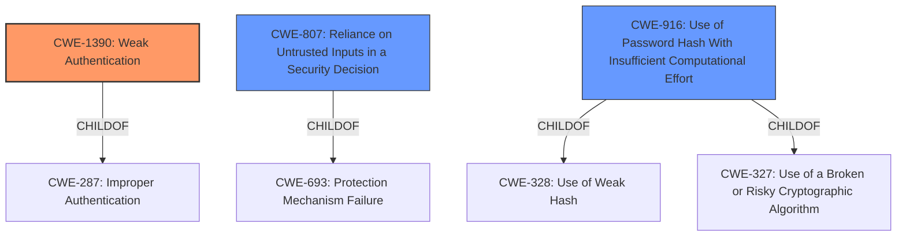

# Raw Analyzer Response for CVE-2022-37298

# Summary
| CWE ID    | CWE Name                                                        | Confidence | CWE Abstraction Level | CWE Vulnerability Mapping Label | CWE-Vulnerability Mapping Notes |
| :-------- | :-------------------------------------------------------------- | :--------- | :-------------------- | :------------------------------ | :------------------------------ |
| CWE-1390  | Weak Authentication                                             | 0.9        | Class                 | Primary                         | Allowed-with-Review           |
| CWE-807   | Reliance on Untrusted Inputs in a Security Decision            | 0.7        | Base                  | Secondary                       | Allowed                       |
| CWE-916   | Use of Password Hash With Insufficient Computational Effort   | 0.6        | Base                  | Secondary                       | Allowed                       |

## Evidence and Confidence

*   **Confidence Score:** 0.8
*   **Evidence Strength:** HIGH

## Relationship Analysis
The primary CWE is CWE-1390 (**Weak Authentication**), a Class-level CWE, which is a child of CWE-287. CWE-807 (**Reliance on Untrusted Inputs in a Security Decision**) is a Base-level CWE and a child of CWE-693, representing a potential cause. CWE-916 (**Use of Password Hash With Insufficient Computational Effort**) is a Base-level CWE and a child of CWE-328 and CWE-327, representing another potential cause. The relationships show that **Weak Authentication** can stem from **Reliance on Untrusted Inputs** or **Use of Password Hash With Insufficient Computational Effort**.

## Vulnerability Chain
The vulnerability chain starts with a **weak authentication scheme** in the `SafeUnpickler` class. This leads to **insecure deserialization** because the system trusts the data it receives. The **lack of authentication** allows attackers to send crafted pickle objects, resulting in Remote Code Execution (RCE).
  - Root Cause: **Weak Authentication Scheme**
  - Weakness: Insecure Deserialization, Lack of Authentication, Insufficient Whitelisting
  - Impact: Remote Code Execution (RCE)

## Summary of Analysis
The initial assessment, based on the vulnerability description and key phrases, points to **CWE-1390 (Weak Authentication)** as the primary weakness. The vulnerability description mentions a "**weak authentication scheme**" in the `SafeUnpickler` class, which is used to unserialize objects. The CVE Reference Links Content Summary provides more detail, stating that the `SafeUnpickler` class had a flawed implementation of input validation and lacked proper authentication for incoming pickled objects.

The Retriever results also suggest **CWE-1390 (Weak Authentication)** as a strong candidate.

The relationship graph shows that **CWE-1390 (Weak Authentication)** can be caused by issues like **CWE-807 (Reliance on Untrusted Inputs in a Security Decision)** or **CWE-916 (Use of Password Hash With Insufficient Computational Effort)**. These are considered secondary because they describe potential causes or contributing factors to the **weak authentication**.

The decision to select **CWE-1390 (Weak Authentication)** is based on the evidence that the `SafeUnpickler` class has a flawed implementation of input validation and lacks proper authentication. This is a clear indication of a **weak authentication scheme**.

The selected CWEs are at the optimal level of specificity because **CWE-1390 (Weak Authentication)** directly addresses the **weakness** described in the vulnerability. The secondary CWEs provide additional context about the potential causes of the **weak authentication**.

Relevant CWE Information:

# Enhanced Context (25 CWEs)

## CWE-1390: Weak Authentication
**Abstraction:** Class
**Status:** Incomplete

### Description
The product uses an authentication mechanism to restrict access to specific users or identities, but the mechanism does not sufficiently prove that the claimed identity is correct.
### Vulnerability Details and Justification:
The vulnerability description indicates that the `SafeUnpickler` class implements a **weak authentication scheme** when unserializing objects. This aligns perfectly with the description of **CWE-1390 (Weak Authentication)**, which states that the product uses an authentication mechanism that does not sufficiently prove the claimed identity is correct.
### Security Implications:
Attackers can bypass the authentication mechanism, potentially gaining unauthorized access to the system.
### Influence of Mapping Guidance:
The mapping guidance for **CWE-1390 (Weak Authentication)** suggests that it is a Class and might have Base-level children that would be more appropriate. However, in this case, the description of **weak authentication** directly matches the vulnerability, making it the most appropriate choice.

## CWE-807: Reliance on Untrusted Inputs in a Security Decision
**Abstraction:** Base
**Status:** Incomplete

### Description
The product uses a protection mechanism that relies on the existence or values of an input, but the input can be modified by an untrusted actor in a way that bypasses the protection mechanism.
### Vulnerability Details and Justification:
The `SafeUnpickler` class relies on the input (the pickled object) without properly authenticating or validating it. An attacker can modify the pickled object to bypass the intended protection mechanism. This aligns with **CWE-807 (Reliance on Untrusted Inputs in a Security Decision)**.
### Security Implications:
Attackers can bypass the security of the software by modifying untrusted inputs.
### Influence of Mapping Guidance:
The mapping guidance for **CWE-807 (Reliance on Untrusted Inputs in a Security Decision)** states that it is at the Base level of abstraction, which is a preferred level of abstraction. This supports the selection of this CWE.

## CWE-916: Use of Password Hash With Insufficient Computational Effort
**Abstraction:** Base
**Status:** Incomplete

### Description
The product generates a hash for a password, but it uses a scheme that does not provide a sufficient level of computational effort that would make password cracking attacks infeasible or expensive.

### Vulnerability Details and Justification:
Although not explicitly mentioned, the **weak authentication scheme** could involve a weak hashing algorithm or insufficient computational effort, making it easier to crack passwords.
### Security Implications:
Attackers can crack passwords more easily, gaining unauthorized access to the system.
### Influence of Mapping Guidance:
The mapping guidance for **CWE-916 (Use of Password Hash With Insufficient Computational Effort)** states that it is at the Base level of abstraction, which is a preferred level of abstraction.

## Considered but not used:
- **CWE-732 (Incorrect Permission Assignment for Critical Resource):** While incorrect access control is mentioned, the root cause isn't about permission assignment but rather the **weak authentication**. Therefore, this CWE is not the most appropriate.
- **CWE-639 (Authorization Bypass Through User-Controlled Key):**  Similar to CWE-732, the core issue is **weak authentication** rather than manipulating keys for authorization bypass.
- **CWE-327 (Use of a Broken or Risky Cryptographic Algorithm)** and **CWE-326 (Inadequate Encryption Strength)** These were considered as they relate to cryptographic weaknesses. However, the evidence focuses more on **weak authentication** and **insecure deserialization** than on the use of broken algorithms. While a weak cryptographic algorithm might be a contributing factor, it is not the primary weakness.