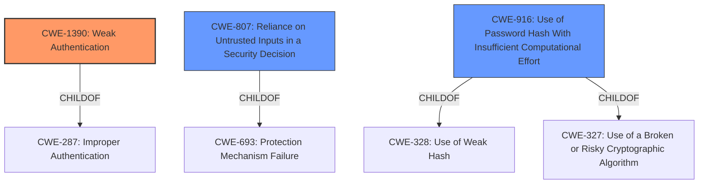

# Analysis for CVE-2022-37298

# Summary
| CWE ID    | CWE Name                                                        | Confidence | CWE Abstraction Level | CWE Vulnerability Mapping Label | CWE-Vulnerability Mapping Notes |
| :-------- | :-------------------------------------------------------------- | :--------- | :-------------------- | :------------------------------ | :------------------------------ |
| CWE-1390  | Weak Authentication                                             | 0.9        | Class                 | Primary                         | Allowed-with-Review           |
| CWE-807   | Reliance on Untrusted Inputs in a Security Decision            | 0.7        | Base                  | Secondary                       | Allowed                       |
| CWE-916   | Use of Password Hash With Insufficient Computational Effort   | 0.6        | Base                  | Secondary                       | Allowed                       |

## Evidence and Confidence

*   **Confidence Score:** 0.8
*   **Evidence Strength:** HIGH

## Relationship Analysis
The primary CWE is CWE-1390 (**Weak Authentication**), a Class-level CWE, which is a child of CWE-287. CWE-807 (**Reliance on Untrusted Inputs in a Security Decision**) is a Base-level CWE and a child of CWE-693, representing a potential cause. CWE-916 (**Use of Password Hash With Insufficient Computational Effort**) is a Base-level CWE and a child of CWE-328 and CWE-327, representing another potential cause. The relationships show that **Weak Authentication** can stem from **Reliance on Untrusted Inputs** or **Use of Password Hash With Insufficient Computational Effort**.

## Vulnerability Chain
The vulnerability chain starts with a **weak authentication scheme** in the `SafeUnpickler` class. This leads to **insecure deserialization** because the system trusts the data it receives. The **lack of authentication** allows attackers to send crafted pickle objects, resulting in Remote Code Execution (RCE).
  - Root Cause: **Weak Authentication Scheme**
  - Weakness: Insecure Deserialization, Lack of Authentication, Insufficient Whitelisting
  - Impact: Remote Code Execution (RCE)

## Summary of Analysis
The initial assessment, based on the vulnerability description and key phrases, points to **CWE-1390 (Weak Authentication)** as the primary weakness. The vulnerability description mentions a "**weak authentication scheme**" in the `SafeUnpickler` class, which is used to unserialize objects. The CVE Reference Links Content Summary provides more detail, stating that the `SafeUnpickler` class had a flawed implementation of input validation and lacked proper authentication for incoming pickled objects.

The Retriever results also suggest **CWE-1390 (Weak Authentication)** as a strong candidate.

The relationship graph shows that **CWE-1390 (Weak Authentication)** can be caused by issues like **CWE-807 (Reliance on Untrusted Inputs in a Security Decision)** or **CWE-916 (Use of Password Hash With Insufficient Computational Effort)**. These are considered secondary because they describe potential causes or contributing factors to the **weak authentication**.

The decision to select **CWE-1390 (Weak Authentication)** is based on the evidence that the `SafeUnpickler` class has a flawed implementation of input validation and lacks proper authentication. This is a clear indication of a **weak authentication scheme**.

The selected CWEs are at the optimal level of specificity because **CWE-1390 (Weak Authentication)** directly addresses the **weakness** described in the vulnerability. The secondary CWEs provide additional context about the potential causes of the **weak authentication**.

Relevant CWE Information:

# Enhanced Context (25 CWEs)

## CWE-1390: Weak Authentication
**Abstraction:** Class
**Status:** Incomplete

### Description
The product uses an authentication mechanism to restrict access to specific users or identities, but the mechanism does not sufficiently prove that the claimed identity is correct.
### Vulnerability Details and Justification:
The vulnerability description indicates that the `SafeUnpickler` class implements a **weak authentication scheme** when unserializing objects. This aligns perfectly with the description of **CWE-1390 (Weak Authentication)**, which states that the product uses an authentication mechanism that does not sufficiently prove the claimed identity is correct.
### Security Implications:
Attackers can bypass the authentication mechanism, potentially gaining unauthorized access to the system.
### Influence of Mapping Guidance:
The mapping guidance for **CWE-1390 (Weak Authentication)** suggests that it is a Class and might have Base-level children that would be more appropriate. However, in this case, the description of **weak authentication** directly matches the vulnerability, making it the most appropriate choice.

## CWE-807: Reliance on Untrusted Inputs in a Security Decision
**Abstraction:** Base
**Status:** Incomplete

### Description
The product uses a protection mechanism that relies on the existence or values of an input, but the input can be modified by an untrusted actor in a way that bypasses the protection mechanism.
### Vulnerability Details and Justification:
The `SafeUnpickler` class relies on the input (the pickled object) without properly authenticating or validating it. An attacker can modify the pickled object to bypass the intended protection mechanism. This aligns with **CWE-807 (Reliance on Untrusted Inputs in a Security Decision)**.
### Security Implications:
Attackers can bypass the security of the software by modifying untrusted inputs.
### Influence of Mapping Guidance:
The mapping guidance for **CWE-807 (Reliance on Untrusted Inputs in a Security Decision)** states that it is at the Base level of abstraction, which is a preferred level of abstraction. This supports the selection of this CWE.

## CWE-916: Use of Password Hash With Insufficient Computational Effort
**Abstraction:** Base
**Status:** Incomplete

### Description
The product generates a hash for a password, but it uses a scheme that does not provide a sufficient level of computational effort that would make password cracking attacks infeasible or expensive.

### Vulnerability Details and Justification:
Although not explicitly mentioned, the **weak authentication scheme** could involve a weak hashing algorithm or insufficient computational effort, making it easier to crack passwords.
### Security Implications:
Attackers can crack passwords more easily, gaining unauthorized access to the system.
### Influence of Mapping Guidance:
The mapping guidance for **CWE-916 (Use of Password Hash With Insufficient Computational Effort)** states that it is at the Base level of abstraction, which is a preferred level of abstraction.

## Considered but not used:
- **CWE-732 (Incorrect Permission Assignment for Critical Resource):** While incorrect access control is mentioned, the root cause isn't about permission assignment but rather the **weak authentication**. Therefore, this CWE is not the most appropriate.
- **CWE-639 (Authorization Bypass Through User-Controlled Key):**  Similar to CWE-732, the core issue is **weak authentication** rather than manipulating keys for authorization bypass.
- **CWE-327 (Use of a Broken or Risky Cryptographic Algorithm)** and **CWE-326 (Inadequate Encryption Strength)** These were considered as they relate to cryptographic weaknesses. However, the evidence focuses more on **weak authentication** and **insecure deserialization** than on the use of broken algorithms. While a weak cryptographic algorithm might be a contributing factor, it is not the primary weakness.

# Enhanced Query for CVE-2022-37298

## Vulnerability Description
Shinken Solutions Shinken Monitoring Version 2.4.3 affected is vulnerable to Incorrect Access Control. The SafeUnpickler class found in shinken/safepickle.py implements a **weak authentication scheme** when unserializing objects passed from monitoring nodes to the Shinken monitoring server.

### Vulnerability Description Key Phrases
- **rootcause:** **weak authentication scheme**
- **impact:** Incorrect Access Control
- **product:** Shinken Solutions Shinken Monitoring
- **version:** 2.4.3
- **component:** SafeUnpickler class

## CVE Reference Links Content Summary
Based on the provided content, here's an analysis of CVE-2022-37298:

**Root Cause of Vulnerability:**
The vulnerability stems from the `SafeUnpickler` class in `shinken/safepickle.py`. This class is used to unserialize (pickle.loads) objects passed between Shinken monitoring nodes and the server. The `SafeUnpickler` had a flawed implementation of input validation, and lacked proper authentication for incoming pickled objects, effectively trusting any data it receives.

**Weaknesses/Vulnerabilities Present:**
1.  **Insecure Deserialization:** The primary vulnerability is the insecure deserialization of Python objects using the `pickle` module. The `SafeUnpickler` class initially attempted to prevent arbitrary code execution by stripping `__reduce__` attributes, however, this approach was insufficient as other means to execute arbitrary code through the pickle stream were possible.
2.  **Lack of Authentication:** The `SafeUnpickler` class does not implement proper authentication or verification of the source of pickled data, allowing a malicious actor to send crafted pickle objects.
3.  **Insufficient Whitelisting:** Although the code attempts to whitelist allowed classes, the initial implementation failed to anticipate all possible methods of exploitation, as demonstrated by the Dailymotion team's findings.

**Impact of Exploitation:**
A remote attacker can exploit this vulnerability to achieve Remote Code Execution (RCE) on the Shinken monitoring server. By crafting a malicious pickle object and sending it to the vulnerable server, the attacker can execute arbitrary code with the privileges of the Shinken process.

**Attack Vectors:**
The attack vector is network-based. A remote attacker who can communicate with the Shinken server's internal port where pickled objects are exchanged can exploit this vulnerability.

**Required Attacker Capabilities/Position:**
1.  **Network Access:** The attacker needs to be able to communicate with the internal port of the Shinken server where serialized Python objects are exchanged.
2.  **Pickle Knowledge:** The attacker needs knowledge of Python's `pickle` module and the structure of Shinken objects in order to craft a malicious pickle payload.
3.  **Knowledge of Shinken Internals:** The attacker needs to know which Shinken objects to instantiate in the pickle stream to achieve code execution.

**Additional Details from Content:**
- The vulnerability affects Shinken version 2.4.3
- The provided Github commit link shows the fix which involves a strict whitelisting of allowed classes that can be unpickled. The vulnerability was identified by Nicolas Perraud from the Dailymotion team.
- A proof-of-concept (PoC) exploit code was provided, and a usage example is shown in a GIF.
- The fix involves a stricter approach by explicitly whitelisting safe classes to be unserialized and a new test case has been added for the RCE exploit to verify the vulnerability is fixed.

This information is much more detailed than the typical placeholder CVE description.

## Retriever Results

### Top Combined Results

| Rank | CWE ID | Name | Abstraction | Usage  | Retrievers | Individual Scores |
|------|--------|------|-------------|-------|------------|-------------------|
| 1 | 1390 | Weak Authentication | Class | Allowed-with-Review | sparse | 0.394 |
| 2 | 732 | Incorrect Permission Assignment for Critical Resource | Class | Allowed-with-Review | sparse | 0.196 |
| 3 | 1188 | Initialization of a Resource with an Insecure Default | Base | Allowed | sparse | 0.192 |
| 4 | 916 | Use of Password Hash With Insufficient Computational Effort | Base | Allowed | sparse | 0.190 |
| 5 | 276 | Incorrect Default Permissions | Base | Allowed | sparse | 0.186 |
| 6 | 326 | Inadequate Encryption Strength | Class | Allowed-with-Review | dense | 0.494 |
| 7 | 613 | Insufficient Session Expiration | Base | Allowed | graph | 0.002 |
| 8 | 610 | Externally Controlled Reference to a Resource in Another Sphere | Class | Discouraged | sparse | 0.183 |
| 9 | 639 | Authorization Bypass Through User-Controlled Key | Base | Allowed | sparse | 0.182 |
| 10 | 807 | Reliance on Untrusted Inputs in a Security Decision | Base | Allowed | sparse | 0.180 |

# Complete CWE Specifications

## CWE-1390: Weak Authentication
**Abstraction:** Class
**Status:** Incomplete

### Description
The product uses an authentication mechanism to restrict access to specific users or identities, but the mechanism does not sufficiently prove that the claimed identity is correct.

### Extended Description

Attackers may be able to bypass weak authentication faster and/or with less effort than expected.

### Alternative Terms
None

### Relationships
ChildOf -> CWE-287

### Mapping Guidance
**Usage:** Allowed-with-Review
**Rationale:** This CWE entry is a Class and might have Base-level children that would be more appropriate
**Comments:** Examine children of this entry to see if there is a better fit
**Reasons:**
- Abstraction

### Observed Examples
- **CVE-2022-30034:** Chain: Web UI for a Python RPC framework does not use regex anchors to validate user login emails (CWE-777), potentially allowing bypass of OAuth (CWE-1390).
- **CVE-2022-35248:** Chat application skips validation when Central Authentication Service (CAS) is enabled, effectively removing the second factor from two-factor authentication
- **CVE-2021-3116:** Chain: Python-based HTTP Proxy server uses the wrong boolean operators (CWE-480) causing an incorrect comparison (CWE-697) that identifies an authN failure if all three conditions are met instead of only one, allowing bypass of the proxy authentication (CWE-1390)

## CWE-732: Incorrect Permission Assignment for Critical Resource
**Abstraction:** Class
**Status:** Draft

### Description
The product specifies permissions for a security-critical resource in a way that allows that resource to be read or modified by unintended actors.

### Extended Description
When a resource is given a permission setting that provides access to a wider range of actors than required, it could lead to the exposure of sensitive information, or the modification of that resource by unintended parties. This is especially dangerous when the resource is related to program configuration, execution, or sensitive user data. For example, consider a misconfigured storage account for the cloud that can be read or written by a public or anonymous user.

### Alternative Terms
None

### Relationships
ChildOf -> CWE-285
ChildOf -> CWE-668

### Mapping Guidance
**Usage:** Allowed-with-Review
**Rationale:** While the name itself indicates an assignment of permissions for resources, this is often misused for vulnerabilities in which "permissions" are not checked, which is an "authorization" weakness (CWE-285 or descendants) within CWE's model [REF-1287].
**Comments:** Closely analyze the specific mistake that is allowing the resource to be exposed, and perform a CWE mapping for that mistake.
**Reasons:**
- Frequent Misuse

### Additional Notes
**[Maintenance]** The relationships between privileges, permissions, and actors (e.g. users and groups) need further refinement within the Research view. One complication is that these concepts apply to two different pillars, related to control of resources (CWE-664) and protection mechanism failures (CWE-693).

### Observed Examples
- **CVE-2022-29527:** Go application for cloud management creates a world-writable sudoers file that allows local attackers to inject sudo rules and escalate privileges to root by winning a race condition.
- **CVE-2009-3482:** Anti-virus product sets insecure "Everyone: Full Control" permissions for files under the "Program Files" folder, allowing attackers to replace executables with Trojan horses.
- **CVE-2009-3897:** Product creates directories with 0777 permissions at installation, allowing users to gain privileges and access a socket used for authentication.

## CWE-1188: Initialization of a Resource with an Insecure Default
**Abstraction:** Base
**Status:** Incomplete

### Description
The product initializes or sets a resource with a default that is intended to be changed by the administrator, but the default is not secure.

### Extended Description

Developers often choose default values that leave the product as open and easy to use as possible out-of-the-box, under the assumption that the administrator can (or should) change the default value. However, this ease-of-use comes at a cost when the default is insecure and the administrator does not change it.

### Alternative Terms
None

### Relationships
ChildOf -> CWE-1419
ChildOf -> CWE-665

### Mapping Guidance
**Usage:** Allowed
**Rationale:** This CWE entry is at the Base level of abstraction, which is a preferred level of abstraction for mapping to the root causes of vulnerabilities.
**Comments:** Carefully read both the name and description to ensure that this mapping is an appropriate fit. Do not try to 'force' a mapping to a lower-level Base/Variant simply to comply with this preferred level of abstraction.
**Reasons:**
- Acceptable-Use

### Additional Notes
**[Maintenance]** This entry improves organization of concepts under initialization. The typical CWE model is to cover "Missing" and "Incorrect" behaviors. Arguably, this entry could be named as "Incorrect" instead of "Insecure." This might be changed in the near future.

### Observed Examples
- **CVE-2022-36349:** insecure default variable initialization in BIOS firmware for a hardware board allows DoS
- **CVE-2022-42467:** A generic database browser interface has a default mode that exposes a web server to the network, allowing queries to the database.

## CWE-916: Use of Password Hash With Insufficient Computational Effort
**Abstraction:** Base
**Status:** Incomplete

### Description
The product generates a hash for a password, but it uses a scheme that does not provide a sufficient level of computational effort that would make password cracking attacks infeasible or expensive.

### Extended Description

Many password storage mechanisms compute a hash and store the hash, instead of storing the original password in plaintext. In this design, authentication involves accepting an incoming password, computing its hash, and comparing it to the stored hash.

Many hash algorithms are designed to execute quickly with minimal overhead, even cryptographic hashes. However, this efficiency is a problem for password storage, because it can reduce an attacker's workload for brute-force password cracking. If an attacker can obtain the hashes through some other method (such as SQL injection on a database that stores hashes), then the attacker can store the hashes offline and use various techniques to crack the passwords by computing hashes efficiently. Without a built-in workload, modern attacks can compute large numbers of hashes, or even exhaust the entire space of all possible passwords, within a very short amount of time, using massively-parallel computing (such as cloud computing) and GPU, ASIC, or FPGA hardware. In such a scenario, an efficient hash algorithm helps the attacker.

There are several properties of a hash scheme that are relevant to its strength against an offline, massively-parallel attack:

  - The amount of CPU time required to compute the hash ("stretching")

  - The amount of memory required to compute the hash ("memory-hard" operations)

  - Including a random value, along with the password, as input to the hash computation ("salting")

  - Given a hash, there is no known way of determining an input (e.g., a password) that produces this hash value, other than by guessing possible inputs ("one-way" hashing)

  - Relative to the number of all possible hashes that can be generated by the scheme, there is a low likelihood of producing the same hash for multiple different inputs ("collision resistance")

Note that the security requirements for the product may vary depending on the environment and the value of the passwords. Different schemes might not provide all of these properties, yet may still provide sufficient security for the environment. Conversely, a solution might be very strong in preserving one property, which still being very weak for an attack against another property, or it might not be able to significantly reduce the efficiency of a massively-parallel attack.

### Alternative Terms
None

### Relationships
ChildOf -> CWE-328
ChildOf -> CWE-327

### Mapping Guidance
**Usage:** Allowed
**Rationale:** This CWE entry is at the Base level of abstraction, which is a preferred level of abstraction for mapping to the root causes of vulnerabilities.
**Comments:** Carefully read both the name and description to ensure that this mapping is an appropriate fit. Do not try to 'force' a mapping to a lower-level Base/Variant simply to comply with this preferred level of abstraction.
**Reasons:**
- Acceptable-Use

### Observed Examples
- **CVE-2008-1526:** Router does not use a salt with a hash, making it easier to crack passwords.
- **CVE-2006-1058:** Router does not use a salt with a hash, making it easier to crack passwords.
- **CVE-2008-4905:** Blogging software uses a hard-coded salt when calculating a password hash.

## CWE-276: Incorrect Default Permissions
**Abstraction:** Base
**Status:** Draft

### Description
During installation, installed file permissions are set to allow anyone to modify those files.

### Extended Description
Not provided

### Alternative Terms
None

### Relationships
ChildOf -> CWE-732
ChildOf -> CWE-732

### Mapping Guidance
**Usage:** Allowed
**Rationale:** This CWE entry is at the Base level of abstraction, which is a preferred level of abstraction for mapping to the root causes of vulnerabilities.
**Comments:** Carefully read both the name and description to ensure that this mapping is an appropriate fit. Do not try to 'force' a mapping to a lower-level Base/Variant simply to comply with this preferred level of abstraction.
**Reasons:**
- Acceptable-Use

### Observed Examples
- **CVE-2005-1941:** Executables installed world-writable.
- **CVE-2002-1713:** Home directories installed world-readable.
- **CVE-2001-1550:** World-writable log files allow information loss; world-readable file has cleartext passwords.

## CWE-326: Inadequate Encryption Strength
**Abstraction:** Class
**Status:** Draft

### Description
The product stores or transmits sensitive data using an encryption scheme that is theoretically sound, but is not strong enough for the level of protection required.

### Extended Description
A weak encryption scheme can be subjected to brute force attacks that have a reasonable chance of succeeding using current attack methods and resources.

### Alternative Terms
None

### Relationships
ChildOf -> CWE-693

### Mapping Guidance
**Usage:** Allowed-with-Review
**Rationale:** This CWE entry is a Class and might have Base-level children that would be more appropriate
**Comments:** Examine children of this entry to see if there is a better fit
**Reasons:**
- Abstraction

### Observed Examples
- **CVE-2001-1546:** Weak encryption
- **CVE-2004-2172:** Weak encryption (chosen plaintext attack)
- **CVE-2002-1682:** Weak encryption

## CWE-613: Insufficient Session Expiration
**Abstraction:** Base
**Status:** Incomplete

### Description
According to WASC, "Insufficient Session Expiration is when a web site permits an attacker to reuse old session credentials or session IDs for authorization."

### Extended Description
Not provided

### Alternative Terms
None

### Relationships
ChildOf -> CWE-672
ChildOf -> CWE-672
CanPrecede -> CWE-287

### Mapping Guidance
**Usage:** Allowed
**Rationale:** This CWE entry is at the Base level of abstraction, which is a preferred level of abstraction for mapping to the root causes of vulnerabilities.
**Comments:** Carefully read both the name and description to ensure that this mapping is an appropriate fit. Do not try to 'force' a mapping to a lower-level Base/Variant simply to comply with this preferred level of abstraction.
**Reasons:**
- Acceptable-Use

### Additional Notes
**[Other]** The lack of proper session expiration may improve the likely success of certain attacks. For example, an attacker may intercept a session ID, possibly via a network sniffer or Cross-site Scripting attack. Although short session expiration times do not help if a stolen token is immediately used, they will protect against ongoing replaying of the session ID. In another scenario, a user might access a web site from a shared computer (such as at a library, Internet cafe, or open work environment). Insufficient Session Expiration could allow an attacker to use the browser's back button to access web pages previously accessed by the victim.

## CWE-610: Externally Controlled Reference to a Resource in Another Sphere
**Abstraction:** Class
**Status:** Draft

### Description
The product uses an externally controlled name or reference that resolves to a resource that is outside of the intended control sphere.

### Extended Description
Not provided

### Alternative Terms
None

### Relationships
ChildOf -> CWE-664

### Mapping Guidance
**Usage:** Discouraged
**Rationale:** This CWE entry is a level-1 Class (i.e., a child of a Pillar). It might have lower-level children that would be more appropriate
**Comments:** Examine children of this entry to see if there is a better fit
**Reasons:**
- Abstraction

### Additional Notes
**[Relationship]** This is a general class of weakness, but most research is focused on more specialized cases, such as path traversal (CWE-22) and symlink following (CWE-61). A symbolic link has a name; in general, it appears like any other file in the file system. However, the link includes a reference to another file, often in another directory - perhaps in another sphere of control. Many common library functions that accept filenames will "follow" a symbolic link and use the link's target instead.

**[Maintenance]** The relationship between CWE-99 and CWE-610 needs further investigation and clarification. They might be duplicates. CWE-99 "Resource Injection," as originally defined in Seven Pernicious Kingdoms taxonomy, emphasizes the "identifier used to access a system resource" such as a file name or port number, yet it explicitly states that the "resource injection" term does not apply to "path manipulation," which effectively identifies the path at which a resource can be found and could be considered to be one aspect of a resource identifier. Also, CWE-610 effectively covers any type of resource, whether that resource is at the system layer, the application layer, or the code layer.

### Observed Examples
- **CVE-2022-3032:** An email client does not block loading of remote objects in a nested document.
- **CVE-2022-45918:** Chain: a learning management tool debugger uses external input to locate previous session logs (CWE-73) and does not properly validate the given path (CWE-20), allowing for filesystem path traversal using "../" sequences (CWE-24)
- **CVE-2018-1000613:** Cryptography API uses unsafe reflection when deserializing a private key

## CWE-639: Authorization Bypass Through User-Controlled Key
**Abstraction:** Base
**Status:** Incomplete

### Description
The system's authorization functionality does not prevent one user from gaining access to another user's data or record by modifying the key value identifying the data.

### Extended Description

Retrieval of a user record occurs in the system based on some key value that is under user control. The key would typically identify a user-related record stored in the system and would be used to lookup that record for presentation to the user. It is likely that an attacker would have to be an authenticated user in the system. However, the authorization process would not properly check the data access operation to ensure that the authenticated user performing the operation has sufficient entitlements to perform the requested data access, hence bypassing any other authorization checks present in the system.

For example, attackers can look at places where user specific data is retrieved (e.g. search screens) and determine whether the key for the item being looked up is controllable externally. The key may be a hidden field in the HTML form field, might be passed as a URL parameter or as an unencrypted cookie variable, then in each of these cases it will be possible to tamper with the key value.

One manifestation of this weakness is when a system uses sequential or otherwise easily-guessable session IDs that would allow one user to easily switch to another user's session and read/modify their data.

### Alternative Terms
Insecure Direct Object Reference / IDOR: The "Insecure Direct Object Reference" term, as described in the OWASP Top Ten, is broader than this CWE because it also covers path traversal (CWE-22). Within the context of vulnerability theory, there is a similarity between the OWASP concept and CWE-706: Use of Incorrectly-Resolved Name or Reference.
Broken Object Level Authorization / BOLA: BOLA is used in the 2019 OWASP API Security Top 10 and is said to be the same as IDOR.
Horizontal Authorization: "Horizontal Authorization" is used to describe situations in which two users have the same privilege level, but must be prevented from accessing each other's resources. This is fairly common when using key-based access to resources in a multi-user context.

### Relationships
ChildOf -> CWE-863
ChildOf -> CWE-863
ChildOf -> CWE-284

### Mapping Guidance
**Usage:** Allowed
**Rationale:** This CWE entry is at the Base level of abstraction, which is a preferred level of abstraction for mapping to the root causes of vulnerabilities.
**Comments:** Carefully read both the name and description to ensure that this mapping is an appropriate fit. Do not try to 'force' a mapping to a lower-level Base/Variant simply to comply with this preferred level of abstraction.
**Reasons:**
- Acceptable-Use

### Observed Examples
- **CVE-2021-36539:** An educational application does not appropriately restrict file IDs to a particular user. The attacker can brute-force guess IDs, indicating IDOR.

## CWE-807: Reliance on Untrusted Inputs in a Security Decision
**Abstraction:** Base
**Status:** Incomplete

### Description
The product uses a protection mechanism that relies on the existence or values of an input, but the input can be modified by an untrusted actor in a way that bypasses the protection mechanism.

### Extended Description

Developers may assume that inputs such as cookies, environment variables, and hidden form fields cannot be modified. However, an attacker could change these inputs using customized clients or other attacks. This change might not be detected. When security decisions such as authentication and authorization are made based on the values of these inputs, attackers can bypass the security of the software.

Without sufficient encryption, integrity checking, or other mechanism, any input that originates from an outsider cannot be trusted.

### Alternative Terms
None

### Relationships
ChildOf -> CWE-693

### Mapping Guidance
**Usage:** Allowed
**Rationale:** This CWE entry is at the Base level of abstraction, which is a preferred level of abstraction for mapping to the root causes of vulnerabilities.
**Comments:** Carefully read both the name and description to ensure that this mapping is an appropriate fit. Do not try to 'force' a mapping to a lower-level Base/Variant simply to comply with this preferred level of abstraction.
**Reasons:**
- Acceptable-Use

### Observed Examples
- **CVE-2009-1549:** Attacker can bypass authentication by setting a cookie to a specific value.
- **CVE-2009-1619:** Attacker can bypass authentication and gain admin privileges by setting an "admin" cookie to 1.
- **CVE-2009-0864:** Content management system allows admin privileges by setting a "login" cookie to "OK."

