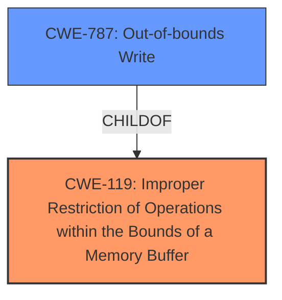

# Analysis Report for CVE-2022-37302

# Vulnerability Analysis Report: CVE-2022-37302

## Description


## Analysis (with Relationship Data)

# Summary
| CWE ID  | CWE Name                                                                  | Confidence | CWE Abstraction Level | CWE Vulnerability Mapping Label | CWE-Vulnerability Mapping Notes |
| :-------- | :------------------------------------------------------------------------ | :--------- | :---------------------- | :------------------------------ | :------------------------------ |
| CWE-119   | Improper Restriction of Operations within the Bounds of a Memory Buffer | 1          | Class                   | Primary                         | Discouraged                   |
| CWE-787   | Out-of-bounds Write                                                       | 0.7        | Base                    | Secondary                       | Allowed                         |

## Evidence and Confidence

*   **Confidence Score:** 0.8
*   **Evidence Strength:** HIGH

## Relationship Analysis
The primary CWE selected is CWE-119, which is a class-level CWE. While it's generally discouraged to map to class-level CWEs, the vulnerability description explicitly mentions CWE-119, making it the most direct match. However, based on the description and CVE reference summary, it's highly probable that the root cause involves an out-of-bounds write, which is a child of CWE-119.



## Vulnerability Chain
The vulnerability chain is as follows:
1.  **Root Cause:** **CWE-119** Improper Restriction of Operations within the Bounds of a Memory Buffer, potentially caused by an **CWE-787** Out-of-bounds Write.
2.  **Impact:** Crash of the Control Expert software.

## Summary of Analysis
The initial assessment identified **CWE-119** Improper Restriction of Operations within the Bounds of a Memory Buffer as the primary CWE due to its direct mention in the vulnerability description. The **Vulnerability Description Key Phrases** section explicitly states: "**rootcause:** **CWE-119** Improper Restriction of Operations within the Bounds of a Memory Buffer". The **CVE Reference Links Content Summary** also notes: "**Root cause of vulnerability**: Improper Restriction of Operations within the Bounds of a Memory Buffer."

However, based on the description indicating a memory buffer issue leading to a crash, **CWE-787** Out-of-bounds Write was considered as a secondary, more specific candidate. While the description does not explicitly mention an out-of-bounds write, the **CVE Reference Links Content Summary** mentions: "**Weaknesses/vulnerabilities present**: A memory buffer issue (CWE-119), which can lead to out-of-bounds access." This suggests that the **CWE-119** error is caused by writing outside the allocated buffer, leading to a crash, but lacks explicit evidence.

Although **CWE-119** is a Class-level CWE and the guidance discourages its use when more specific CWEs exist, the explicit mention in the vulnerability report makes it a necessary inclusion. **CWE-787**, a Base-level CWE and a child of **CWE-119**, is included as a probable root cause based on the memory buffer issue.

Therefore, the final decision is to include both **CWE-119** as the primary CWE (due to direct mention) and **CWE-787** as a secondary CWE (based on the likely underlying cause), with a confidence score of 0.8.


## CWE Relationship Analysis

Current CWEs represent these abstraction levels: .


### Vulnerability Chain Analysis

**Chain starting from CWE-787:**
- 787 (Out-of-bounds Write) - ROOT


**Chain starting from CWE-119:**
- 119 (Improper Restriction of Operations within the Bounds of a Memory Buffer) - ROOT


### CWE Relationship Diagram

```mermaid
graph TD
    classDef primary fill:#f96,stroke:#333,stroke-width:2px
    classDef secondary fill:#69f,stroke:#333
    classDef tertiary fill:#9e9,stroke:#333
```


*Report generated on 2025-03-31 02:17:53*
