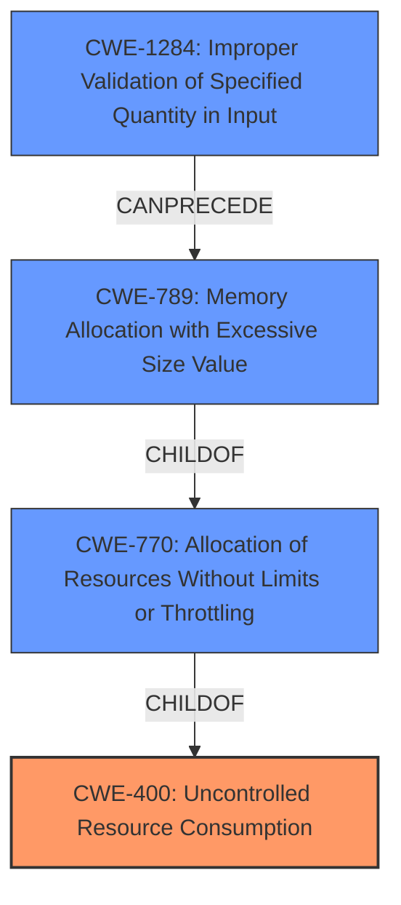

# Analysis for CVE-2022-37311

# Summary
| CWE ID | CWE Name | Confidence | CWE Abstraction Level | CWE Vulnerability Mapping Label | CWE-Vulnerability Mapping Notes |
|---|---|---|---|---|---|
| CWE-400 | Uncontrolled Resource Consumption | 0.9 | Class | Primary | Discouraged, but most appropriate based on the available evidence. |
| CWE-789 | Memory Allocation with Excessive Size Value | 0.7 | Variant | Secondary | Allowed, but less specific than CWE-400 in this context. |
| CWE-1284 | Improper Validation of Specified Quantity in Input | 0.7 | Base | Secondary | Allowed, can precede CWE-789 |
| CWE-770 | Allocation of Resources Without Limits or Throttling | 0.6 | Base | Secondary | Allowed, could be a more specific alternative to CWE-400. |

## Evidence and Confidence

*   **Confidence Score:** 0.8
*   **Evidence Strength:** MEDIUM

## Relationship Analysis
The primary relationship influencing the CWE selection is the hierarchical relationship between CWE-400 (Class) and its children like CWE-770 (Base) and CWE-789 (Variant). CWE-1284 can PRECEDE CWE-789 which shows a chain relationship where improper input validation can lead to excessive memory allocation. Given the provided information, CWE-400 is the most accurate high-level description, while CWE-789 and CWE-770 offer more specific but less directly supported details. CWE-1284 highlights the root cause of the issue.

## Vulnerability Chain
The vulnerability chain starts with the **improper validation** of the request parameter size (CWE-1284). This leads to the allocation of an **excessive amount of memory** (CWE-789) or general **allocation of resources without limits** (CWE-770). The final impact is **uncontrolled resource consumption** (CWE-400), causing a denial of service.

## Summary of Analysis
The initial analysis focused on the **Uncontrolled Resource Consumption** (**weakness**) identified in the vulnerability description. The CVE reference confirms this, stating that the **root cause of the vulnerability** is that "the size of request parameters for certain API endpoints were not sufficiently checked" and the **weakness/vulnerabilities present** is CWE-400.

The retriever results also point to CWE-400 as a top candidate, along with CWE-789, CWE-770, and CWE-1284. While CWE-400 is a Class-level CWE and generally discouraged, the evidence directly supports it, and the more specific CWEs represent contributing factors rather than the primary weakness.

The relationship graph helped visualize how these CWEs are related, with CWE-1284 potentially leading to CWE-789 and CWE-770, which in turn contribute to CWE-400.

The selected CWEs are at the optimal level of specificity given the available information. While more detailed analysis could reveal further contributing factors, the current evidence primarily supports CWE-400 as the most accurate representation of the vulnerability. The inclusion of CWE-789, CWE-770, and CWE-1284 provides additional context regarding the potential mechanisms of resource consumption.

Relevant CWE Information:

# Enhanced Context (25 CWEs)

## CWE-404: Improper Resource Shutdown or Release
**Abstraction Level**: Class
**Similarity Score**: 0.78
**Source**: dense

**Description**:
The product does not release or incorrectly releases a resource before it is made available for re-use.

**Mapping Guidance**:
- Usage: Allowed-with-Review
- Rationale: This CWE entry is a Class and might have Base-level children that would be more appropriate

**Why Not Used**: This vulnerability is about not controlling the resource consumption rather than not releasing the resource.

## CWE-789: Memory Allocation with Excessive Size Value
**Abstraction Level**: Variant
**Similarity Score**: 0.77
**Source**: dense

**Description**:
The product allocates memory based on an untrusted, large size value, but it does not ensure that the size is within expected limits, allowing arbitrary amounts of memory to be allocated.

**Mapping Guidance**:
- Usage: Allowed
- Rationale: This CWE entry is at the Variant level of abstraction, which is a preferred level of abstraction for mapping to the root causes of vulnerabilities.

**Why Selected**: As a secondary CWE since excessive memory allocation is likely happening.

## CWE-405: Asymmetric Resource Consumption (Amplification)
**Abstraction Level**: Class
**Similarity Score**: 0.77
**Source**: dense

**Description**:
The product does not properly control situations in which an adversary can cause the product to consume or produce excessive resources without requiring the adversary to invest equivalent work or otherwise prove authorization, i.e., the adversary's influence is "asymmetric."

**Mapping Guidance**:
- Usage: Allowed-with-Review
- Rationale: This CWE entry is a Class and might have Base-level children that would be more appropriate

**Why Not Used**: While amplification is a component of resource consumption, it's not the root issue.

## CWE-226: Sensitive Information in Resource Not Removed Before Reuse
**Abstraction Level**: Base
**Similarity Score**: 0.76
**Source**: dense

**Description**:
The product releases a resource such as memory or a file so that it can be made available for reuse, but it does not clear or "zeroize" the information contained in the resource before the product performs a critical state transition or makes the resource available for reuse by other entities.

**Mapping Guidance**:
- Usage: Allowed
- Rationale: This CWE entry is at the Base level of abstraction, which is a preferred level of abstraction for mapping to the root causes of vulnerabilities.

**Why Not Used**: This is about not clearing sensitive info, and not related to this vulnerability.

## CWE-664: Improper Control of a Resource Through its Lifetime
**Abstraction Level**: Pillar
**Similarity Score**: 0.76
**Source**: dense

**Description**:
The product does not maintain or incorrectly maintains control over a resource throughout its lifetime of creation, use, and release.

**Mapping Guidance**:
- Usage: Discouraged
- Rationale: This CWE entry is high-level when lower-level children are available.

**Why Not Used**: This is too high level and not the best fit.

## CWE-434: Unrestricted Upload of File with Dangerous Type
**Abstraction Level**: Base
**Similarity Score**: 0.75
**Source**: dense

**Description**:
The product allows the upload or transfer of dangerous file types that are automatically processed within its environment.

**Mapping Guidance**:
- Usage: Allowed
- Rationale: This CWE entry is at the Base level of abstraction, which is a preferred level of abstraction for mapping to the root causes of vulnerabilities.

**Why Not Used**: Not related to file uploads.

## CWE-799: Improper Control of Interaction Frequency
**Abstraction Level**: Class
**Similarity Score**: 0.75
**Source**: dense

**Description**:
The product does not properly limit the number or frequency of interactions that it has with an actor, such as the number of incoming requests.

**Mapping Guidance**:
- Usage: Allowed-with-Review
- Rationale: This CWE entry is a Class and might have Base-level children that would be more appropriate

**Why Not Used**: While frequency of interaction could exacerbate the issue, the primary issue is the size of the request.

## CWE-668: Exposure of Resource to Wrong Sphere
**Abstraction Level**: Class
**Similarity Score**: 0.75
**Source**: dense

**Description**:
The product exposes a resource to the wrong control sphere, providing unintended actors with inappropriate access to the resource.

**Mapping Guidance**:
- Usage: Discouraged
- Rationale: CWE-668 is high-level and is often misused as a catch-all when lower-level CWE IDs might be applicable. It is sometimes used for low-information vulnerability reports [REF-1287]. It is a level-1 Class (i.e., a child of a Pillar). It is not useful