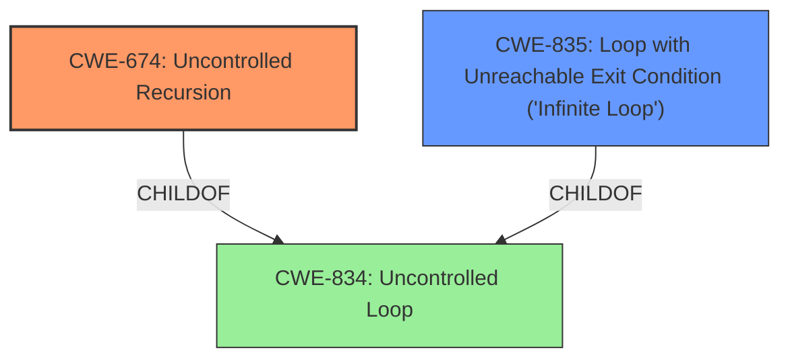

# Enhanced Analysis for CVE-2022-37315

# Summary
| CWE ID | CWE Name | Confidence | CWE Abstraction Level | CWE Vulnerability Mapping Label | CWE-Vulnerability Mapping Notes |
|---|---|---|---|---|---|
| CWE-674 | Uncontrolled Recursion | 0.9 | Class | Allowed-with-Review | Primary CWE |
| CWE-835 | Loop with Unreachable Exit Condition ('Infinite Loop') | 0.7 | Base | Allowed | Secondary Candidate |
| CWE-1287 | Improper Validation of Specified Type of Input | 0.6 | Base | Allowed | Secondary Candidate |

## Evidence and Confidence

*   **Confidence Score:** 0.8
*   **Evidence Strength:** HIGH

## Relationship Analysis
The primary CWE selected is CWE-674, "Uncontrolled Recursion," which is a Class-level CWE. It is related to CWE-834, "Uncontrolled Loop," through a ChildOf relationship. CWE-835, "Loop with Unreachable Exit Condition ('Infinite Loop')," is a Base-level CWE and is also a child of CWE-834. Since the vulnerability specifically involves recursion, CWE-674 is more appropriate. The relationship shows that infinite loops and uncontrolled recursion are both types of uncontrolled loops.



## Vulnerability Chain
The vulnerability chain begins with the lack of input validation, leading to **infinite recursion**, and culminating in a denial-of-service (DoS).

Lack of Input Validation -> **Uncontrolled Recursion** -> Denial of Service

CWE-1287 describes the lack of proper input validation. CWE-674 describes the uncontrolled recursion due to the parser not handling malformed input gracefully and CWE-835, although less applicable, could also be a resulting condition of the **uncontrolled recursion**. The denial of service is the impact of the **uncontrolled recursion**.

## Summary of Analysis
The initial assessment identified **infinite recursion** as the primary weakness. The evidence supports this, citing the `parseTypeSystemDefinition` function entering an **infinite recursion** loop when parsing malformed input. The CVE Reference Links Content Summary explicitly states, "The parser fails to handle malformed input gracefully, resulting in a recursive loop that exhausts stack memory."

The selection of CWE-674 is primarily based on the vulnerability description and the supporting evidence from the CVE Reference Links Content Summary, which both clearly indicate **uncontrolled recursion**. The retriever results also list CWE-674 as the top combined result. Although CWE-674 is a Class, the description clearly matches the vulnerability.

CWE-835 "Loop with Unreachable Exit Condition ('Infinite Loop')" was considered because **recursion** is a specific type of loop. However, since the description specifically mentions **recursion**, CWE-674 is a more precise fit.

CWE-1287 "Improper Validation of Specified Type of Input" was considered because the **recursion** is triggered by malformed input. While the lack of input validation is a contributing factor, the core issue is the **uncontrolled recursion** itself.

The final selection of CWE-674, with CWE-835 and CWE-1287 as secondary candidates, is based on the evidence of **uncontrolled recursion** when parsing malformed input. The CWEs are at the optimal level of specificity, with CWE-674 directly addressing the **recursion** issue.

Relevant CWE Information:

# Enhanced Context (25 CWEs)
The following CWEs were identified as potentially relevant to this vulnerability:

## CWE-943: Improper Neutralization of Special Elements in Data Query Logic
**Abstraction Level**: Class
**Similarity Score**: 0.77
**Source**: dense

**Description**:
The product generates a query intended to access or manipulate data in a data store such as a database, but it does not neutralize or incorrectly neutralizes special elements that can modify the intended logic of the query.

**Mapping Guidance**:
- Usage: Allowed-with-Review
- Rationale: This CWE entry is a Class and might have Base-level children that would be more appropriate

## CWE-1289: Improper Validation of Unsafe Equivalence in Input
**Abstraction Level**: Base
**Similarity Score**: 0.74
**Source**: dense

**Description**:
The product receives an input value that is used as a resource identifier or other type of reference, but it does not validate or incorrectly validates that the input is equivalent to a potentially-unsafe value.

**Mapping Guidance**:
- Usage: Allowed
- Rationale: This CWE entry is at the Base level of abstraction, which is a preferred level of abstraction for mapping to the root causes of vulnerabilities.

## CWE-407: Inefficient Algorithmic Complexity
**Abstraction Level**: Class
**Similarity Score**: 0.74
**Source**: dense

**Description**:
An algorithm in a product has an inefficient worst-case computational complexity that may be detrimental to system performance and can be triggered by an attacker, typically using crafted manipulations that ensure that the worst case is being reached.

**Mapping Guidance**:
- Usage: Allowed-with-Review
- Rationale: This CWE entry is a Class and might have Base-level children that would be more appropriate

## CWE-653: Improper Isolation or Compartmentalization
**Abstraction Level**: Class
**Similarity Score**: 0.73
**Source**: dense

**Description**:
The product does not properly compartmentalize or isolate functionality, processes, or resources that require different privilege levels, rights, or permissions.

**Mapping Guidance**:
- Usage: Allowed
- Rationale: This CWE entry is at the Base level of abstraction, which is a preferred level of abstraction for mapping to the root causes of vulnerabilities.

## CWE-74: Improper Neutralization of Special Elements in Output Used by a Downstream Component ('Injection')
**Abstraction Level**: Class
**Similarity Score**: 0.73
**Source**: dense

**Description**:
The product constructs all or part of a command, data structure, or record using externally-influenced input from an upstream component, but it does not neutralize or incorrectly neutralizes special elements that could modify how it is parsed or interpreted when it is sent to a downstream component.

**Mapping Guidance**:
- Usage: Discouraged
- Rationale: CWE-74 is high-level and often misused when lower-level weaknesses are more appropriate.

## CWE-703: Improper Check or Handling of Exceptional Conditions
**Abstraction Level**: Pillar
**Similarity Score**: 0.73
**Source**: dense

**Description**:
The product does not properly anticipate or handle exceptional conditions that rarely occur during normal operation of the product.

**Mapping Guidance**:
- Usage: Discouraged
- Rationale: This CWE entry is extremely high-level, a Pillar.

## CWE-691: Insufficient Control Flow Management
**Abstraction Level**: Pillar
**Similarity Score**: 0.73
**Source**: dense

**Description**:
The code does not sufficiently manage its control flow during execution, creating conditions in which the control flow can be modified in unexpected ways.

**Mapping Guidance**:
- Usage: Discouraged
- Rationale: This CWE entry is extremely high-level, a Pillar. However, classification research is limited for weaknesses of this type, so there can be gaps or organizational difficulties within CWE that force use of this weakness, even at such a high level of abstraction.

## CWE-754: Improper Check for Unusual or Exceptional Conditions
**Abstraction Level**: Class
**Similarity Score**: 0.73
**Source**: dense

**Description**:
The product does not check or incorrectly checks for unusual or exceptional conditions that are not expected to occur frequently during day to day operation of the product.

**Mapping Guidance**:
- Usage: Allowed-with-Review
- Rationale: This CWE entry is a Class and might have Base-level children that would be more appropriate

## CWE-668: Exposure of Resource to Wrong Sphere
**Abstraction Level**: Class
**Similarity Score**: 0.72
**Source**: dense

**Description**:
The product exposes a resource to the wrong control sphere, providing unintended actors with inappropriate access to the resource.

**Mapping Guidance**:
- Usage: Discouraged
- Rationale: CWE-668 is high-level and is often misused as a catch-all when lower-level CWE IDs might be applicable. It is sometimes used for low-information vulnerability reports [REF-1287]. It is a level-1 Class (i.e., a child of a Pillar). It is not useful for trend analysis.

## CWE-274: Improper Handling of Insufficient Privileges
**


## CWE Relationship Analysis

Current CWEs represent these abstraction levels: .


### Vulnerability Chain Analysis

**Chain starting from CWE-834:**
- 834 (Excessive Iteration) - ROOT


**Chain starting from CWE-835:**
- 835 (Loop with Unreachable Exit Condition ('Infinite Loop')) - ROOT


### CWE Relationship Diagram

```mermaid
graph TD
    classDef primary fill:#f96,stroke:#333,stroke-width:2px
    classDef secondary fill:#69f,stroke:#333
    classDef tertiary fill:#9e9,stroke:#333
```