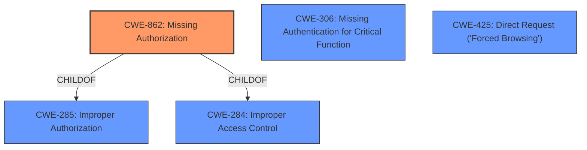

# Raw Analyzer Response for CVE-2022-37344

# Summary
| CWE ID | CWE Name | Confidence | CWE Abstraction Level | CWE Vulnerability Mapping Label | CWE-Vulnerability Mapping Notes |
|---|---|---|---|---|---|
| CWE-862 | Missing Authorization | 0.9 | Class | Allowed-with-Review | Primary CWE: There might be more specific Base-level children |
| CWE-306 | Missing Authentication for Critical Function | 0.7 | Base | Allowed | Secondary candidate: Could be the case if the functionality is critical and requires authentication |
| CWE-425 | Direct Request ('Forced Browsing') | 0.6 | Base | Allowed | Secondary candidate: Could be the case if authorization is not enforced on restricted URLs |

## Evidence and Confidence

*   **Confidence Score:** 0.9
*   **Evidence Strength:** MEDIUM

## Relationship Analysis
The analysis considered the following CWE relationships:
  - Parent-child hierarchical relationships: CWE-862 is a child of CWE-285 and CWE-284, indicating a general category of access control issues.
  - Peer relationships: CWE-425 is a peer of other authorization-related CWEs.
  - Abstraction levels: The preference for Base-level CWEs led to considering CWE-306 and CWE-425 as potential alternatives or complements to the Class-level CWE-862.

## Vulnerability Chain
The vulnerability chain appears to be:
  - **Root Cause:** **Missing Access Control** (CWE-862 or a more specific child).
  - **Potential Impact:** Unauthorized access to resources or functionalities within the PHP Crafts Accommodation System plugin.

## Summary of Analysis
The initial analysis identified **missing access control** as the primary issue in the PHP Crafts Accommodation System plugin. The provided evidence, while limited, strongly suggests that the plugin **fails to perform necessary authorization checks**, potentially allowing unauthorized users to access sensitive data or functionalities.

The selection of CWE-862 as the primary CWE is based on the **Vulnerability Description Key Phrases**, which explicitly mentions "**missing access control**". While CWE-862 is a Class-level CWE, the provided information does not offer sufficient detail to pinpoint a more specific Base or Variant. The MITRE mapping guidance for CWE-862 suggests examining child entries for a better fit, which was considered.

CWE-306 (Missing Authentication for Critical Function) was considered, as the missing access control might stem from a lack of authentication for critical functionalities. However, the description focuses more on authorization than authentication, making CWE-862 a more appropriate primary classification.

CWE-425 (Direct Request ('Forced Browsing')) was also considered, as the **missing access control** might manifest as an inadequate enforcement of authorization on restricted URLs. However, without more information, it is difficult to determine if this is the case.

The final decision to prioritize CWE-862 is based on the explicit mention of "**missing access control**" in the vulnerability description, aligning with the CWE's description of a product not performing an authorization check. The confidence score reflects the limited information provided, which prevents a more specific classification.

Relevant CWE Information:

# Enhanced Context (25 CWEs)

## CWE-552: Files or Directories Accessible to External Parties
**Abstraction Level**: Base
**Similarity Score**: 0.78
**Source**: dense

**Description**:
The product makes files or directories accessible to unauthorized actors, even though they should not be.

**Mapping Guidance**:
- Usage: Allowed
- Rationale: This CWE entry is at the Base level of abstraction, which is a preferred level of abstraction for mapping to the root causes of vulnerabilities.

## CWE-639: Authorization Bypass Through User-Controlled Key
**Abstraction Level**: Base
**Similarity Score**: 0.78
**Source**: dense

**Description**:
The system's authorization functionality does not prevent one user from gaining access to another user's data or record by modifying the key value identifying the data.

**Mapping Guidance**:
- Usage: Allowed
- Rationale: This CWE entry is at the Base level of abstraction, which is a preferred level of abstraction for mapping to the root causes of vulnerabilities.

## CWE-434: Unrestricted Upload of File with Dangerous Type
**Abstraction Level**: Base
**Similarity Score**: 0.77
**Source**: dense

**Description**:
The product allows the upload or transfer of dangerous file types that are automatically processed within its environment.

**Mapping Guidance**:
- Usage: Allowed
- Rationale: This CWE entry is at the Base level of abstraction, which is a preferred level of abstraction for mapping to the root causes of vulnerabilities.

## CWE-184: Incomplete List of Disallowed Inputs
**Abstraction Level**: Base
**Similarity Score**: 0.77
**Source**: dense

**Description**:
The product implements a protection mechanism that relies on a list of inputs (or properties of inputs) that are not allowed by policy or otherwise require other action to neutralize before additional processing takes place, but the list is incomplete.

**Mapping Guidance**:
- Usage: Allowed
- Rationale: This CWE entry is at the Base level of abstraction, which is a preferred level of abstraction for mapping to the root causes of vulnerabilities.

## CWE-472: External Control of Assumed-Immutable Web Parameter
**Abstraction Level**: Base
**Similarity Score**: 0.77
**Source**: dense

**Description**:
The web application does not sufficiently verify inputs that are assumed to be immutable but are actually externally controllable, such as hidden form fields.

**Mapping Guidance**:
- Usage: Allowed
- Rationale: This CWE entry is at the Base level of abstraction, which is a preferred level of abstraction for mapping to the root causes of vulnerabilities.

## CWE-1289: Improper Validation of Unsafe Equivalence in Input
**Abstraction Level**: Base
**Similarity Score**: 0.76
**Source**: dense

**Description**:
The product receives an input value that is used as a resource identifier or other type of reference, but it does not validate or incorrectly validates that the input is equivalent to a potentially-unsafe value.

**Mapping Guidance**:
- Usage: Allowed
- Rationale: This CWE entry is at the Base level of abstraction, which is a preferred level of abstraction for mapping to the root causes of vulnerabilities.

## CWE-425: Direct Request ('Forced Browsing')
**Abstraction Level**: Base
**Similarity Score**: 0.76
**Source**: dense

**Description**:
The web application does not adequately enforce appropriate authorization on all restricted URLs, scripts, or files.

**Mapping Guidance**:
- Usage: Allowed
- Rationale: This CWE entry is at the Base level of abstraction, which is a preferred level of abstraction for mapping to the root causes of vulnerabilities.

## CWE-41: Improper Resolution of Path Equivalence
**Abstraction Level**: Base
**Similarity Score**: 0.76
**Source**: dense

**Description**:
The product is vulnerable to file system contents disclosure through path equivalence. Path equivalence involves the use of special characters in file and directory names. The associated manipulations are intended to generate multiple names for the same object.

**Mapping Guidance**:
- Usage: Allowed
- Rationale: This CWE entry is at the Base level of abstraction, which is a preferred level of abstraction for mapping to the root causes of vulnerabilities.

## CWE-807: Reliance on Untrusted Inputs in a Security Decision
**Abstraction Level**: Base
**Similarity Score**: 0.76
**Source**: dense

**Description**:
The product uses a protection mechanism that relies on the existence or values of an input, but the input can be modified by an untrusted actor in a way that bypasses the protection mechanism.

**Mapping Guidance**:
- Usage: Allowed
- Rationale: This CWE entry is at the Base level of abstraction, which is a preferred level of abstraction for mapping to the root causes of vulnerabilities.

## CWE-183: Permissive List of Allowed Inputs
**Abstraction Level**: Base
**Similarity Score**: 0.76
**Source**: dense

**Description**:
The product implements a protection mechanism that relies on a list of inputs (or properties of inputs) that are explicitly allowed by policy because the inputs are assumed to be safe, but the list is too permissive - that is, it allows an input that