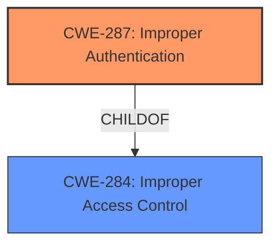

# Analysis for CVE-2022-37345

# Summary
| CWE ID  | CWE Name                                                                   | Confidence | CWE Abstraction Level | CWE Vulnerability Mapping Label | CWE-Vulnerability Mapping Notes |
| :-------- | :------------------------------------------------------------------------- | :--------- | :---------------------- | :------------------------------ | :------------------------------ |
| CWE-287   | Improper Authentication                                                      | 0.9        | Class                   | Primary                         | Discouraged                   |

## Evidence and Confidence

*   **Confidence Score:** 0.9
*   **Evidence Strength:** HIGH

## Relationship Analysis
The analysis centers around **CWE-287 (Improper Authentication)**, a class-level CWE. While it's generally discouraged to map to such a high level, in this case, the provided information doesn't offer sufficient detail to pinpoint a more specific variant. **CWE-287** is a child of **CWE-284 (Improper Access Control)**, indicating a broader category of access-related issues. No specific chain relationships are relevant here. The decision to use **CWE-287** is based on the root cause being specifically related to authentication, even if the exact mechanism is unclear.

## Vulnerability Chain
The vulnerability chain is relatively simple:
1.  **Root Cause:** **Improper authentication** (**CWE-287**) in the BIOS firmware.
2.  **Impact:** Potential escalation of privilege.

The provided information is limited and doesn't describe lower level chains.

## Summary of Analysis
The initial assessment strongly points to **CWE-287 (Improper Authentication)** as the primary weakness. The **root cause** explicitly mentions **"Improper authentication in BIOS firmware."** The CVE reference summary reinforces this by stating that "The BIOS firmware for some Intel NUC Kits does not properly handle authentication, allowing an attacker to bypass security checks." This direct evidence makes a strong case for **CWE-287**.

The Retriever Results list **CWE-287 (Improper Authentication)** as a candidate. However, the mapping guidance for **CWE-287** discourages its use, suggesting lower-level CWEs might be more applicable. The suggested alternatives are **CWE-1390 (Weak Authentication)** or **CWE-306 (Missing Authentication for Critical Function)**. Unfortunately, the available evidence doesn't provide enough detail to differentiate between these options. We don't know *how* the authentication is improper; it could be a weak algorithm (**CWE-1390**) or a complete absence of authentication in a critical function (**CWE-306**).

Given the lack of specifics, **CWE-287** remains the most appropriate choice, although it's acknowledged that a more detailed analysis could lead to a more precise mapping. The abstraction level (Class) is higher than ideal, but it accurately reflects the available information.

The decision to map to **CWE-287** is based on the explicit mention of "improper authentication" in both the vulnerability description and the CVE reference summary. This direct evidence outweighs the general discouragement against using the class-level **CWE-287**.

Relevant CWE Information:

# Enhanced Context (25 CWEs)
The following CWEs were identified as potentially relevant to this vulnerability:

## CWE-453: Insecure Default Variable Initialization
**Abstraction Level**: Variant
**Similarity Score**: 0.28
**Source**: sparse
This CWE is not selected because the vulnerability is about **improper authentication** and not related to variable initialization.

## CWE-691: Insufficient Control Flow Management
**Abstraction Level**: Pillar
**Similarity Score**: 0.255
**Source**: sparse
This CWE is not selected because the vulnerability is about **improper authentication** and not related to control flow management.

## CWE-119: Improper Restriction of Operations within the Bounds of a Memory Buffer
**Abstraction Level**: Class
**Similarity Score**: 0.254
**Source**: sparse
This CWE is not selected because the vulnerability is about **improper authentication** and not related to memory buffers.

## CWE-287: Improper Authentication
**Abstraction Level**: Class
**Similarity Score**: 0.238
**Source**: sparse
This CWE is selected as the primary CWE.

## CWE-284: Improper Access Control
**Abstraction Level**: Pillar
**Similarity Score**: 0.227
**Source**: sparse
This CWE is not selected because it is too high level and **CWE-287** is a better match.

## CWE-1193: Power-On of Untrusted Execution Core Before Enabling Fabric Access Control
**Abstraction Level**: Base
**Similarity Score**: 0.591
**Source**: dense
This CWE is not selected because the vulnerability is about **improper authentication** and not related to powering on untrusted cores.

## CWE-1257: Improper Access Control Applied to Mirrored or Aliased Memory Regions
**Abstraction Level**: Base
**Similarity Score**: 0.003
**Source**: graph
This CWE is not selected because the vulnerability is about **improper authentication** and not related to memory regions.

## CWE-248: Uncaught Exception
**Abstraction Level**: Base
**Similarity Score**: 0.215
**Source**: sparse
This CWE is not selected because the vulnerability is about **improper authentication** and not related to exceptions.

## CWE-277: Insecure Inherited Permissions
**Abstraction Level**: Variant
**Similarity Score**: 0.213
**Source**: sparse
This CWE is not selected because the vulnerability is about **improper authentication** and not related to insecure inherited permissions.

## CWE-693: Protection Mechanism Failure
**Abstraction Level**: Pillar
**Similarity Score**: 0.205
**Source**: sparse
This CWE is not selected because it is too high level and **CWE-287** is a better match.