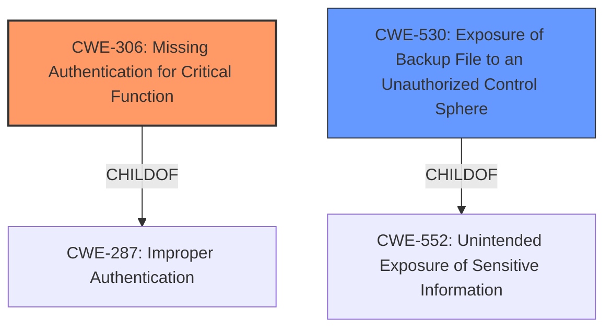

# Analysis Report for CVE-2022-3738

# Vulnerability Analysis Report: CVE-2022-3738

## Description


## Analysis (with Relationship Data)

# Summary
| CWE ID | CWE Name | Confidence | CWE Abstraction Level | CWE Vulnerability Mapping Label | CWE-Vulnerability Mapping Notes |
|---|---|---|---|---|---|
| CWE-306 | Missing Authentication for Critical Function | 1.0 | Base | Allowed | Primary CWE |
| CWE-530 | Exposure of Backup File to an Unauthorized Control Sphere | 0.8 | Variant | Allowed | Secondary Candidate |

## Evidence and Confidence

*   **Confidence Score:** 0.9
*   **Evidence Strength:** HIGH

## Relationship Analysis
The primary relationship influencing the CWE selection is the parent-child relationship between CWE-287 (Improper Authentication) and CWE-306 (Missing Authentication for Critical Function). CWE-306 is a more specific case of CWE-287, directly addressing the lack of authentication for a critical function. CWE-530 is related to CWE-552 (Unintended Exposure of Sensitive Information), focusing specifically on the exposure of backup files. The analysis also considered chain relationships where missing authentication could lead to other vulnerabilities, but the description primarily focuses on the immediate impact of unauthorized access to backup files. The abstraction levels guided the choice of base and variant CWEs for accuracy.



## Vulnerability Chain
The vulnerability chain starts with the **missing authentication** for the configuration export function (critical function). This leads directly to the impact of a remote unauthenticated attacker being able to download a backup file. The backup file then contains sensitive information such as credentials and cryptographic material, resulting in potential compromise of the system.

## Summary of Analysis
The initial analysis strongly points to **CWE-306 (Missing Authentication for Critical Function)** as the primary weakness. The "CVE Reference Links Content Summary" explicitly states "**Root cause of vulnerability:** Missing authentication for a critical function (configuration export)..." and "**Weaknesses/vulnerabilities present:** Unauthenticated access to download backup files." This directly aligns with the description of CWE-306, where a product lacks authentication for functionality requiring a provable user identity or consuming significant resources.

CWE-530 (Exposure of Backup File to an Unauthorized Control Sphere) is a secondary candidate because the vulnerability allows an attacker to download a backup file, but the **root cause** is the **missing authentication** rather than the exposure itself. The exposure is a consequence of the missing authentication.

The selection of CWE-306 is at the optimal level of specificity because it precisely describes the **root cause** of the vulnerability. It is a base-level CWE, which is a preferred level of abstraction for mapping to the root causes of vulnerabilities, as per MITRE's mapping guidance.
The "Retriever Results" also list CWE-306 as the top combined result.

Other CWEs considered but not used:

*   CWE-798 (Use of Hard-coded Credentials): While the backup file *could* contain hard-coded credentials, this is not the **root cause** of the vulnerability. The attacker is not *using* hard-coded credentials; they are gaining access to a file that *might* contain them due to **missing authentication**.
*   CWE-312 (Cleartext Storage of Sensitive Information): Similar to CWE-798, this is a potential consequence of the vulnerability, but not the **root cause**. The information might be stored in cleartext, but the primary issue is unauthorized access due to **missing authentication**.
*   CWE-425 (Direct Request ('Forced Browsing')): This is a possibility, as the attacker might be directly requesting the backup file. However, the **missing authentication** is the more fundamental issue, as proper authentication would prevent the direct request from succeeding.
*   CWE-259 (Use of Hard-coded Password) and CWE-321 (Use of Hard-coded Cryptographic Key): These are similar to CWE-798. The backup file *could* contain these, but this is not the **root cause**.


## CWE Relationship Analysis

Current CWEs represent these abstraction levels: .


### Vulnerability Chain Analysis

**Chain starting from CWE-552:**
- 552 (Files or Directories Accessible to External Parties) - ROOT


**Chain starting from CWE-425:**
- 425 (Direct Request ('Forced Browsing')) - ROOT


### CWE Relationship Diagram

```mermaid
graph TD
    classDef primary fill:#f96,stroke:#333,stroke-width:2px
    classDef secondary fill:#69f,stroke:#333
    classDef tertiary fill:#9e9,stroke:#333
```


*Report generated on 2025-03-30 13:29:22*
