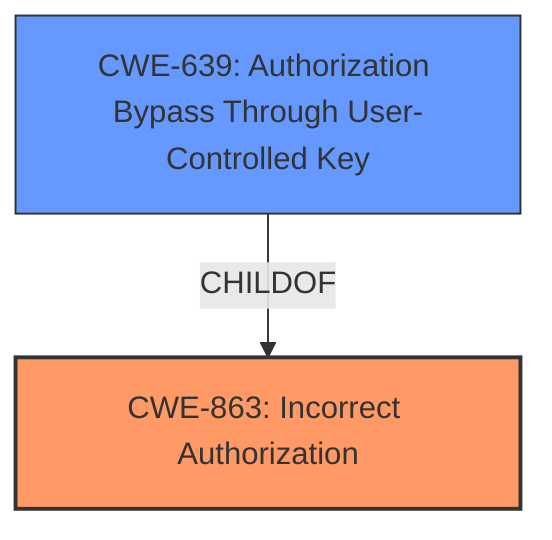

# Analysis for CVE-2022-3740

# Summary
| CWE ID | CWE Name | Confidence | CWE Abstraction Level | CWE Vulnerability Mapping Label | CWE-Vulnerability Mapping Notes |
|---|---|---|---|---|---|
| CWE-863 | Incorrect Authorization | 0.8 | Class | Primary | Allowed-with-Review |
| CWE-639 | Authorization Bypass Through User-Controlled Key | 0.6 | Base | Secondary | Allowed |

## Evidence and Confidence

*   **Confidence Score:** 0.7
*   **Evidence Strength:** MEDIUM

## Relationship Analysis
The primary CWE selected is CWE-863 (Incorrect Authorization), a Class-level CWE. CWE-639 (Authorization Bypass Through User-Controlled Key) is a Base-level CWE and a child of CWE-863. While CWE-639 seems more specific, the provided vulnerability description does not give any details on how the authorization bypass occurs other than that it involves Deploy tokens or Deploy keys. Therefore, the higher-level CWE-863 is a more appropriate fit as the primary classification, with CWE-639 as a secondary consideration.

## Vulnerability Chain
The vulnerability chain involves an **incorrect authorization** mechanism (CWE-863), potentially leading to an authorization bypass through the use of deploy tokens or deploy keys.

## Summary of Analysis
The initial assessment focused on the **impact** of the vulnerability, which is the ability to **bypass External Authorization checks**. The provided evidence indicates that a group owner can access Git repositories and package registries using Deploy tokens or Deploy keys, **bypassing** the intended authorization mechanism.

The retriever results suggested several CWEs, including CWE-863 (Incorrect Authorization), CWE-285 (Improper Authorization), CWE-1390 (Weak Authentication), and CWE-639 (Authorization Bypass Through User-Controlled Key). After reviewing the CWE specifications, CWE-863 aligns best with the vulnerability description, as it describes a scenario where an authorization check is performed but done incorrectly. CWE-639 is also relevant as it describes a bypass using user-controlled keys, which deploy tokens/keys could be considered as.

CWE-285 was considered but ultimately deemed less suitable as it is discouraged, and CWE-863 is a more specific child. CWE-1390 relates to weak authentication mechanisms, which is not the core issue here; the issue is with the authorization process after authentication.

The selection of CWE-863 is justified by the **Vulnerability Description Key Phrases**, specifically "bypass External Authorization check," which directly indicates an issue with authorization. The evidence is somewhat limited, but it is sufficient to map to CWE-863 with reasonable confidence.

The final decision prioritizes the root cause **incorrect authorization** over the specific method of **bypassing** using tokens/keys, as the description lacks detailed information on the exact bypass mechanism. The selected CWE is at an appropriate level of specificity given the available information.

Relevant CWE Information:

# Enhanced Context (25 CWEs)

## CWE-538: Insertion of Sensitive Information into Externally-Accessible File or Directory
**Abstraction Level**: Base
**Similarity Score**: 0.76
**Source**: dense

**Description**:
The product places sensitive information into files or directories that are accessible to actors who are allowed to have access to the files, but not to the sensitive information.

**Mapping Guidance**:
- Usage: Allowed
- Rationale: This CWE entry is at the Base level of abstraction, which is a preferred level of abstraction for mapping to the root causes of vulnerabilities.

This CWE is not relevant because the vulnerability isn't about inserting sensitive information into accessible files or directories. It is about bypassing authorization checks.

## CWE-212: Improper Removal of Sensitive Information Before Storage or Transfer
**Abstraction Level**: Base
**Similarity Score**: 0.75
**Source**: dense

**Description**:
The product stores, transfers, or shares a resource that contains sensitive information, but it does not properly remove that information before the product makes the resource available to unauthorized actors.

**Mapping Guidance**:
- Usage: Allowed
- Rationale: This CWE entry is at the Base level of abstraction, which is a preferred level of abstraction for mapping to the root causes of vulnerabilities.

This CWE is not relevant because the vulnerability isn't about improper removal of sensitive information. It is about bypassing authorization checks.

## CWE-668: Exposure of Resource to Wrong Sphere
**Abstraction Level**: Class
**Similarity Score**: 0.75
**Source**: dense

**Description**:
The product exposes a resource to the wrong control sphere, providing unintended actors with inappropriate access to the resource.

**Mapping Guidance**:
- Usage: Discouraged
- Rationale: CWE-668 is high-level and is often misused as a catch-all when lower-level CWE IDs might be applicable. It is sometimes used for low-information vulnerability reports [REF-1287]. It is a level-1 Class (i.e., a child of a Pillar). It is not useful for trend analysis.

This CWE is not the best fit. While the vulnerability does result in a resource being exposed to the wrong sphere, the root cause is an authorization **bypass**, so a more specific authorization-related CWE is more appropriate.

## CWE-639: Authorization Bypass Through User-Controlled Key
**Abstraction Level**: Base
**Similarity Score**: 0.74
**Source**: dense

**Description**:
The system's authorization functionality does not prevent one user from gaining access to another user's data or record by modifying the key value identifying the data.

**Mapping Guidance**:
- Usage: Allowed
- Rationale: This CWE entry is at the Base level of abstraction, which is a preferred level of abstraction for mapping to the root causes of vulnerabilities.

This is a possible secondary CWE since deploy tokens and deploy keys could be considered "user-controlled keys". The description does not provide details on how the tokens/keys are used to bypass authorization. So it is added as a secondary candidate.

## CWE-226: Sensitive Information in Resource Not Removed Before Reuse
**Abstraction Level**: Base
**Similarity Score**: 0.74
**Source**: dense

**Description**:
The product releases a resource such as memory or a file so that it can be made available for reuse, but it does not clear or "zeroize" the information contained in the resource before the product performs a critical state transition or makes the resource available for reuse by other entities.

**Mapping Guidance**:
- Usage: Allowed
- Rationale: This CWE entry is at the Base level of abstraction, which is a preferred level of abstraction for mapping to the root causes of vulnerabilities.

This CWE is not relevant because the vulnerability isn't about sensitive information not being removed before reuse. It is about bypassing authorization checks.

## CWE-552: Files or Directories Accessible to External Parties
**Abstraction Level**: Base
**Similarity Score**: 0.74
**Source**: dense

**Description**:
The product makes files or directories accessible to unauthorized actors, even though they should not be.

**Mapping Guidance**:
- Usage: Allowed
- Rationale: This CWE entry is at the Base level of abstraction, which is a preferred level of abstraction for mapping to the root causes of vulnerabilities.

This CWE is not the best fit. While the vulnerability does result in unauthorized access, the root cause is an authorization **bypass**, so a more specific authorization-related CWE is more appropriate.

## CWE-532: Insertion of Sensitive Information into Log File
**Abstraction Level**: Base
**Similarity Score**: 0.73
**Source**: dense

**Description**:
The product writes sensitive information to a log file.

**Mapping Guidance**:
- Usage: Allowed
- Rationale: This CWE entry is at the Base level of abstraction, which is a preferred level of abstraction for mapping to the root causes of vulnerabilities.

This CWE is not relevant because the vulnerability isn't about logging sensitive information. It is about bypassing authorization checks.

## CWE-23: Relative Path Traversal
**Abstraction Level**: Base
**Similarity Score**: 0.73
**Source**: dense

**Description**:
The product uses external input to construct a pathname that should be within a restricted directory, but it does not properly neutralize sequences such as ".." that can resolve to a location that is outside of that directory.

**Mapping Guidance**:
- Usage: Allowed
- Rationale: This CWE entry is at the Base level of abstraction, which is a preferred level of abstraction for mapping to the root causes of vulnerabilities.

This CWE is not relevant because the vulnerability isn't about path traversal. It is about bypassing authorization checks.

## CWE-778: Insufficient Logging
**Abstraction Level**: Base
**Similarity Score**: 0.73
**Source**: dense

**Description**:
When a security-critical event occurs, the product either does not record the event or omits important