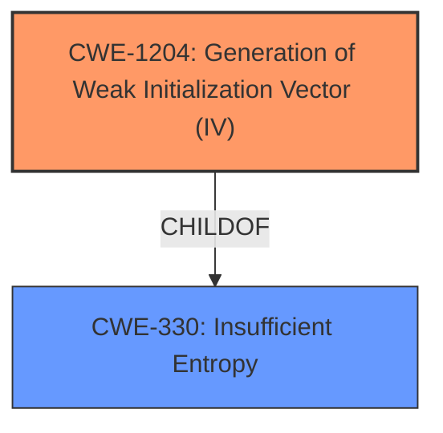

# Enhanced Analysis for CVE-2022-37400

# Summary
| CWE ID    | CWE Name                                          | Confidence | CWE Abstraction Level | CWE Vulnerability Mapping Label | CWE-Vulnerability Mapping Notes |
| --------- | ------------------------------------------------- | ---------- | --------------------- | ------------------------------- | ------------------------------- |
| CWE-1204  | Generation of Weak Initialization Vector (IV)     | 1          | Base                  | Primary                         | Allowed                       |

## Evidence and Confidence

*   **Confidence Score:** 1
*   **Evidence Strength:** HIGH

## Relationship Analysis
The primary relationship considered was the ChildOf relationship between CWE-1204 and CWE-330 (Insufficient Entropy). While insufficient entropy could be a contributing factor to weak IV generation, the description specifically mentions the static nature of the IV, making CWE-1204 a more direct and accurate classification. The other potential CWEs like CWE-321 (Use of Hard-coded Cryptographic Key) and CWE-327 (Use of a Broken or Risky Cryptographic Algorithm) were also considered but deemed less relevant because the core issue is the IV generation, not necessarily the key or algorithm itself.



## Vulnerability Chain
The vulnerability chain starts with the **flaw in the encryption initialization vector**, specifically the use of a static IV. This **weakness** leads to the potential decryption of stored passwords if an attacker gains access to the user's configuration data.

## Summary of Analysis
The initial analysis focused on the **rootcause**, which is the **flaw in encryption initialization vector** because the required initialization vector for encryption was always the same. The retriever results clearly indicated CWE-1204 as the most relevant CWE, supported by a high score. The evidence from the vulnerability description and CVE reference summary directly aligns with CWE-1204's description of using a cryptographic primitive with an IV that is not sufficiently unpredictable or unique. The impact is the potential decryption of stored passwords, but the root cause is the weak IV generation.

Relevant CWE Information:

# Enhanced Context (25 CWEs)

## CWE-1204: Generation of Weak Initialization Vector (IV)
**Abstraction:** Base
**Similarity Score**: 0.896

**Description**:
The product uses a cryptographic primitive that uses an Initialization Vector (IV), but the product does not generate IVs that are sufficiently unpredictable or unique according to the expected cryptographic requirements for that primitive.

**Mapping Guidance**:
- Usage: Allowed

## CWE-331: Insufficient Entropy
**Abstraction:** Base
**Similarity Score**: 0.667

**Description**:
The product uses an algorithm or scheme that produces insufficient entropy, leaving patterns or clusters of values that are more likely to occur than others.

**Mapping Guidance**:
- Usage: Allowed

## CWE-321: Use of Hard-coded Cryptographic Key
**Abstraction:** Variant
**Similarity Score**: 0.510

**Description**:
The use of a hard-coded cryptographic key significantly increases the possibility that encrypted data may be recovered.

**Mapping Guidance**:
- Usage: Allowed

### Detailed Analysis and Justification for CWE-1204:

*   **How the Vulnerability Matches the CWE**: The vulnerability description states, "A flaw in OpenOffice existed where the required initialization vector for encryption was always the same which weakens the security of the encryption making them vulnerable if an attacker has access to the users configuration data." This directly reflects the core characteristic of CWE-1204, where the IV is not sufficiently unpredictable or unique.
*   **Security Implications and Potential Impact**: The use of a static IV weakens the encryption, allowing attackers with access to the configuration data to decrypt stored passwords. This could lead to unauthorized access to online accounts and services.
*   **Parent-Child Relationships**: CWE-1204 is a child of CWE-330 (Insufficient Entropy). While the description doesn't explicitly mention entropy, the use of a static IV inherently implies a lack of entropy. However, CWE-1204 is more specific and therefore a better fit.
*   **MITRE Mapping Guidance**: The mapping guidance for CWE-1204 indicates "Usage: Allowed" and "Rationale: This CWE entry is at the Base level of abstraction, which is a preferred level of abstraction for mapping to the root causes of vulnerabilities." This confirms that CWE-1204 is an appropriate choice.
*   **Confidence**: The evidence is strong, and the description aligns almost perfectly with the CWE definition, resulting in high confidence.

### Other CWEs Considered and Rejected:

*   **CWE-331 (Insufficient Entropy)**: While related, the core issue is the static IV, not necessarily the overall entropy of the random number generation. CWE-1204 is more precise.
*   **CWE-321 (Use of Hard-coded Cryptographic Key)**: The vulnerability doesn't mention hard-coded keys; it focuses on the IV.
*   **CWE-327 (Use of a Broken or Risky Cryptographic Algorithm)**: The algorithm itself might be fine, but the way it's being used with a static IV is the problem.
*   **CWE-798 (Use of Hard-coded Credentials)**: Similar to CWE-321, the problem is not the credentials themselves, but the use of static IVs during encryption.


## CWE Relationship Analysis

Current CWEs represent these abstraction levels: .


### Vulnerability Chain Analysis

**Chain starting from CWE-327:**
- 327 (Use of a Broken or Risky Cryptographic Algorithm) - ROOT


**Chain starting from CWE-330:**
- 330 (Use of Insufficiently Random Values) - ROOT


### CWE Relationship Diagram

```mermaid
graph TD
    classDef primary fill:#f96,stroke:#333,stroke-width:2px
    classDef secondary fill:#69f,stroke:#333
    classDef tertiary fill:#9e9,stroke:#333
```