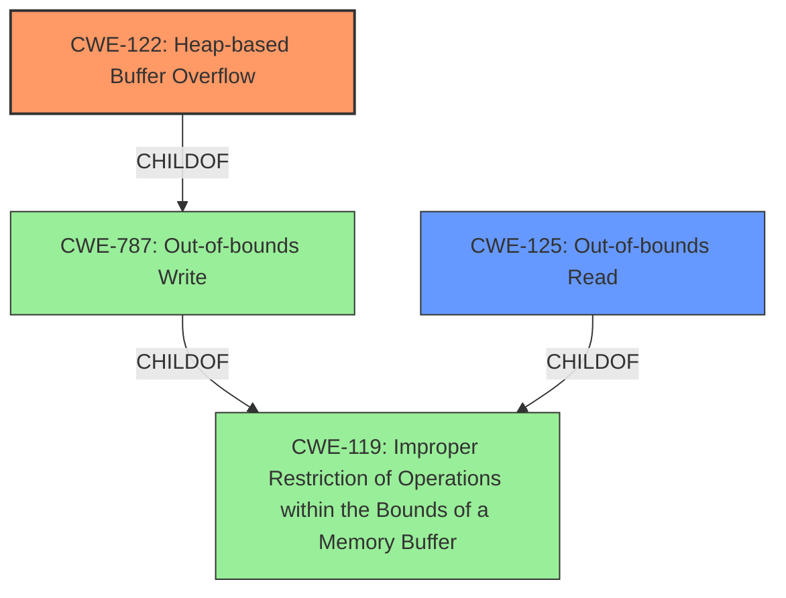

# Analysis for CVE-2022-37434

# Summary
| CWE ID | CWE Name | Confidence | CWE Abstraction Level | CWE Vulnerability Mapping Label | CWE-Vulnerability Mapping Notes |
|---|---|---|---|---|---|
| CWE-122 | Heap-based Buffer Overflow | 1.0 | Variant | Primary | Allowed |
| CWE-125 | Out-of-bounds Read | 0.75 | Base | Secondary | Allowed |

## Evidence and Confidence

*   **Confidence Score:** 1.0
*   **Evidence Strength:** HIGH

## Relationship Analysis
The primary CWE is CWE-122 (Heap-based Buffer Overflow), which is a variant of CWE-787 (Out-of-bounds Write). CWE-125 (Out-of-bounds Read) is related as the vulnerability description mentions both buffer over-read and buffer overflow. CWE-119 (Improper Restriction of Operations within the Bounds of a Memory Buffer) serves as a more general Class for both CWE-122 and CWE-125.


## Vulnerability Chain
The vulnerability chain involves an input (large gzip header extra field) leading to a **heap-based buffer over-read or buffer overflow** (CWE-122 and CWE-125) during the inflate operation. The root cause is the **improper** handling of the gzip header extra field within the inflate function.

## Summary of Analysis
The analysis is based on the vulnerability description and CVE Reference Links Content Summary, which clearly indicate a **heap-based buffer over-read or buffer overflow** in zlib's inflate function when handling a gzip header extra field. The evidence is strong, with multiple sources confirming this weakness.

The primary CWE selected is CWE-122 (Heap-based Buffer Overflow) as it directly reflects the **heap-based buffer overflow** condition described in the vulnerability. CWE-125 (Out-of-bounds Read) is included as a secondary CWE because the description also mentions **heap-based buffer over-read**.

The selected CWEs are at the optimal level of specificity, with CWE-122 being a Variant and CWE-125 being a Base. This provides a detailed and accurate representation of the vulnerability.

Relevant CWE Information:

# Enhanced Context (25 CWEs)
The following CWEs were identified as potentially relevant to this vulnerability:

## CWE-805: Buffer Access with Incorrect Length Value
**Abstraction Level**: Base
**Similarity Score**: 0.78
**Source**: dense

**Description**:
The product uses a sequential operation to read or write a buffer, but it uses an incorrect length value that causes it to access memory that is outside of the bounds of the buffer.

**Mapping Guidance**:
- Usage: Allowed
- Rationale: This CWE entry is at the Base level of abstraction, which is a preferred level of abstraction for mapping to the root causes of vulnerabilities.

## CWE-191: Integer Underflow (Wrap or Wraparound)
**Abstraction Level**: Base
**Similarity Score**: 0.77
**Source**: dense

**Description**:
The product subtracts one value from another, such that the result is less than the minimum allowable integer value, which produces a value that is not equal to the correct result.

**Mapping Guidance**:
- Usage: Allowed
- Rationale: This CWE entry is at the Base level of abstraction, which is a preferred level of abstraction for mapping to the root causes of vulnerabilities.

## CWE-124: Buffer Underwrite ('Buffer Underflow')
**Abstraction Level**: Base
**Similarity Score**: 0.77
**Source**: dense

**Description**:
The product writes to a buffer using an index or pointer that references a memory location prior to the beginning of the buffer.

**Mapping Guidance**:
- Usage: Allowed
- Rationale: This CWE entry is at the Base level of abstraction, which is a preferred level of abstraction for mapping to the root causes of vulnerabilities.

## CWE-126: Buffer Over-read
**Abstraction Level**: Variant
**Similarity Score**: 0.77
**Source**: dense

**Description**:
The product reads from a buffer using buffer access mechanisms such as indexes or pointers that reference memory locations after the targeted buffer.

**Mapping Guidance**:
- Usage: Allowed
- Rationale: This CWE entry is at the Variant level of abstraction, which is a preferred level of abstraction for mapping to the root causes of vulnerabilities.

## CWE-131: Incorrect Calculation of Buffer Size
**Abstraction Level**: Base
**Similarity Score**: 0.76
**Source**: dense

**Description**:
The product does not correctly calculate the size to be used when allocating a buffer, which could lead to a buffer overflow.

**Mapping Guidance**:
- Usage: Allowed
- Rationale: This CWE entry is at the Base level of abstraction, which is a preferred level of abstraction for mapping to the root causes of vulnerabilities.

## CWE-127: Buffer Under-read
**Abstraction Level**: Variant
**Similarity Score**: 0.75
**Source**: dense

**Description**:
The product reads from a buffer using buffer access mechanisms such as indexes or pointers that reference memory locations prior to the targeted buffer.

**Mapping Guidance**:
- Usage: Allowed
- Rationale: This CWE entry is at the Variant level of abstraction, which is a preferred level of abstraction for mapping to the root causes of vulnerabilities.

## CWE-125: Out-of-bounds Read
**Abstraction Level**: Base
**Similarity Score**: 0.75
**Source**: dense

**Description**:
The product reads data past the end, or before the beginning, of the intended buffer.

**Mapping Guidance**:
- Usage: Allowed
- Rationale: This CWE entry is at the Base level of abstraction, which is a preferred level of abstraction for mapping to the root causes of vulnerabilities.

## CWE-786: Access of Memory Location Before Start of Buffer
**Abstraction Level**: Base
**Similarity Score**: 0.75
**Source**: dense

**Description**:
The product reads or writes to a buffer using an index or pointer that references a memory location prior to the beginning of the buffer.

**Mapping Guidance**:
- Usage: Discouraged
- Rationale: The CWE entry might be misused when lower-level CWE entries might be available. It also overlaps existing CWE entries and might be deprecated in the future.

## CWE-190: Integer Overflow or Wraparound
**Abstraction Level**: Base
**Similarity Score**: 0.74
**Source**: dense

**Description**:
The product performs a calculation that can
         produce an integer overflow or wraparound when the logic
         assumes that the resulting value will always be larger than
         the original value. This occurs when an integer value is
         incremented to a value that is too large to store in the
         associated representation. When this occurs, the value may
         become a very small or negative number.

**Mapping Guidance**:
- Usage: Allowed
- Rationale: This CWE entry is at the Base level of abstraction, which is a preferred level of abstraction for mapping to the root causes of vulnerabilities.

## CWE-197: Numeric Truncation Error
**Abstraction Level**: Base
**Similarity Score**: 0.74
**Source**: dense

**Description**:
Truncation errors occur when a primitive is cast to a primitive of a smaller size and data is lost in the conversion.

**Mapping Guidance**:
- Usage: Allowed
- Rationale: This CWE entry is at the Base level of abstraction, which is a preferred level of abstraction for mapping to the root causes of vulnerabilities.

## CWE-190: Integer Overflow or Wraparound
**Abstraction Level**: Base
**Similarity Score**: 9021.82
**Source**: sparse

**Description**:
The product performs a calculation that can
         produce an integer overflow or wraparound when the logic
         assumes that the resulting value will always be larger than
         the original value. This occurs when an integer value is
         incremented to a value that is too large to store in the
         associated representation. When this occurs, the value may
         become a very small or negative number.

**Mapping Guidance**:
- Usage: Allowed
- Rationale: This CWE entry is at the Base level of abstraction, which is a preferred level of abstraction for mapping to the root causes

# Enhanced Query for CVE-2022-37434

## Vulnerability Description
zlib through 1.2.12 has a **heap-based buffer over-read or buffer overflow** in inflate in inflate.c via a large gzip header extra field. NOTE only applications that call inflateGetHeader are affected. Some common applications bundle the affected zlib source code but may be unable to call inflateGetHeader (e.g., see the nodejs/node reference).

### Vulnerability Description Key Phrases
- **weakness:** **heap-based buffer over-read or buffer overflow**
- **vector:** large gzip header extra field
- **product:** zlib
- **version:** through 1.2.12
- **component:** inflate in inflate.c

## CVE Reference Links Content Summary
```
{
  "CVE-2022-37434": [
    {
      "source": "support.apple.com_d894d8c9_20250108_134343.html",
      "root_cause": "A heap-based buffer over-read or buffer overflow in inflate in zlib.",
      "weaknesses": [
        "Heap-based buffer over-read",
        "Heap-based buffer overflow"
      ],
      "impact": "A user may be able to cause unexpected app termination or arbitrary code execution.",
      "attack_vectors": [
        "Processing of specially crafted input"
      ],
       "required_capabilities": [
        "Ability to provide specially crafted input to an application using zlib"
      ]
    },
    {
       "source": "lists.fedoraproject.org_5a24ebd0_20250108_134340.html",
        "root_cause": "A heap-based buffer over-read or buffer overflow in inflate in inflate.c via a large gzip header extra field",
       "weaknesses": [
         "Heap-based buffer over-read",
          "Heap-based buffer overflow"
        ],
      "impact": "Arbitrary code execution",
      "attack_vectors": [
        "Malicious gzip header extra field"
      ],
      "required_capabilities": [
         "Ability to provide specially crafted gzip files with large header extra fields to a zlib enabled application"
        ]
    },
    {
      "source": "lists.fedoraproject.org_499bb6f7_20250108_134340.html",
        "root_cause": "A heap-based buffer over-read or buffer overflow in inflate in inflate.c via a large gzip header extra field",
        "weaknesses": [
          "Heap-based buffer over-read",
           "Heap-based buffer overflow"
        ],
       "impact": "Arbitrary code execution",
       "attack_vectors": [
        "Malicious gzip header extra field"
      ],
      "required_capabilities": [
         "Ability to provide specially crafted gzip files with large header extra fields to a zlib enabled application"
      ]
    },
        {
      "source": "github.com_156d7949_20250108_160723.html",
      "root_cause": "A bug in zlib's inflate() function when handling a gzip header extra field. If the extra field is larger than the provided space and multiple calls to inflate deliver header data, a buffer overflow can occur.",
      "weaknesses": [
        "Buffer overflow"
      ],
       "impact": "Segmentation fault, crash.",
       "attack_vectors": [
        "A crafted gzip file with a large header extra field causing zlib:inflate() to segfault"
      ],
        "required_capabilities": [
        "Ability to provide crafted gzip files to a zlib enabled application"
      ]
    },
    {
      "source": "support.apple.com_c3bcab23_20250108_134343.html",
       "root_cause": "A heap-based buffer over-read or buffer overflow in inflate in zlib.",
       "weaknesses": [
          "Heap-based buffer over-read",
         "Heap-based buffer overflow"
      ],
        "impact": "A user may be able to cause unexpected app termination or arbitrary code execution.",
        "attack_vectors": [
          "Processing of specially crafted input"
       ],
        "required_capabilities": [
        "Ability to provide specially crafted input to an application using zlib"
      ]
    },
    {
       "source": "lists.fedoraproject.org_072d7cef_20250108_134339.html",
        "root_cause": "A heap-based buffer over-read or buffer overflow in inflate in inflate.c via a large gzip header extra field",
       "weaknesses": [
          "Heap-based buffer over-read",
          "Heap-based buffer overflow"
      ],
       "impact": "Arbitrary code execution",
      "attack_vectors": [
        "Malicious gzip header extra field"
      ],
      "required_capabilities": [
         "Ability to provide specially crafted gzip files with large header extra fields to a zlib enabled application"
      ]
    },
        {
      "source": "lists.debian.org_9f6143d6_20250108_134338.html",
      "root_cause": "Heap-based buffer overflow in the inflate operation in zlib.",
       "weaknesses": [
          "Heap-based buffer overflow"
      ],
      "impact": "Denial of service or potentially the execution of arbitrary code.",
        "attack_vectors": [
         "Specially crafted input"
      ],
        "required_capabilities": [
        "Ability to provide specially crafted input to a zlib enabled application"
      ]
    },
    {
       "source": "lists.fedoraproject.org_428653d0_20250108_134341.html",
        "root_cause": "A heap-based buffer over-read or buffer overflow in inflate in inflate.c via a large gzip header extra field",
       "weaknesses": [
          "Heap-based buffer over-read",
           "Heap-based buffer overflow"
        ],
       "impact": "Arbitrary code execution",
        "attack_vectors": [
        "Malicious gzip header extra field"
      ],
         "required_capabilities": [
         "Ability to provide specially crafted gzip files with large header extra fields to a zlib enabled application"
      ]
    },
      {
      "source": "github.com_156d7949_20250108_134334.html",
      "root_cause": "A bug in zlib's inflate() when handling a gzip header extra field. If the extra field is larger than provided space and multiple calls to inflate deliver the data, then a buffer overflow could occur.",
     "weaknesses": [
        "Buffer overflow"
      ],
       "impact": "Crash",
        "attack_vectors": [
         "Crafted gzip file"
      ],
       "required_capabilities": [
          "Ability to provide crafted gzip files to a zlib enabled application"
        ]
    },
    {
        "source": "support.apple.com_7a90827c_20250108_134342.html",
      "root_cause": "A heap-based buffer over-read or buffer overflow in inflate in zlib.",
        "weaknesses": [
        "Heap-based buffer over-read",
          "Heap-based buffer overflow"
        ],
         "impact": "A user may be able to cause unexpected app termination or arbitrary code execution.",
         "attack_vectors": [
           "Processing of specially crafted input"
      ],
         "required_capabilities": [
         "Ability to provide specially crafted input to an application using zlib"
        ]
    },
  {
        "source": "github.com_dc962f95_20250108_160721.html",
        "root_cause": "Heap-based buffer over-read or buffer overflow in inflate in inflate.c via a large gzip header extra field, affecting applications that call inflateGetHeader.",
        "weaknesses": [
         "Heap-based buffer over-read",
          "Heap-based buffer overflow"
        ],
         "impact": "Disclosure of sensitive information, addition or modification of data, or Denial of Service (DoS).",
        "attack_vectors": [
          "Malicious gzip header extra field"
         ],
       "required_capabilities": [
        "Ability to provide specially crafted gzip files with large header extra fields to a zlib enabled application"
      ]
     },
    {
        "source": "github.com_f891c1e1_20250108_134335.html",
        "root_cause": "A bug when getting a gzip header extra field with inflate().  If the extra field was larger than the space the user provided with inflateGetHeader(), and if multiple calls of inflate() delivered the extra header data, then there could be a buffer overflow of the provided space.",
       "weaknesses": [
        "Buffer overflow"
      ],
       "impact": "A buffer overflow of provided space",
       "attack_vectors": [
        "Malicious gzip header extra field"
      ],
         "required_capabilities": [
        "Ability to provide specially crafted gzip files with large header extra fields to a zlib enabled application"
      ]
    },
      {
        "source": "seclists.org_5504fe01_20250108_134330.html",
        "root_cause": "A heap-based buffer over-read or buffer overflow in inflate in zlib when parsing a gzip header extra field.",
         "weaknesses": [
          "Heap-based buffer over-read",
         "Heap-based buffer overflow"
        ],
         "impact": "A user may be able to cause unexpected app termination or arbitrary code execution",
        "attack_vectors": [
          "Processing of specially crafted input"
      ],
        "required_capabilities": [
         "Ability to provide specially crafted input to an application using zlib"
        ]
     },
    {
        "source": "support.apple.com_9f06eedf_20250108_134343.html",
      "root_cause": "A heap-based buffer over-read or buffer overflow in inflate in zlib.",
         "weaknesses": [
          "Heap-based buffer over-read",
         "Heap-based buffer overflow"
        ],
      "impact": "A user may be able to cause unexpected app termination or arbitrary code execution",
        "attack_vectors": [
          "Processing of specially crafted input"
        ],
       "required_capabilities": [
          "Ability to provide specially crafted input to an application using zlib"
        ]
    },
   {
    "source": "lists.fedoraproject.org_a5810baf_20250108_134339.html",
    "root_cause": "A heap-based buffer over-read or buffer overflow in inflate in inflate.c via a large gzip header extra field",
     "weaknesses": [
       "Heap-based buffer over-read",
          "Heap-based buffer overflow"
      ],
      "impact": "Arbitrary code execution",
     "attack_vectors": [
        "Malicious gzip header extra field"
      ],
      "required_capabilities": [
        "Ability to provide specially crafted gzip files with large header extra fields to a zlib enabled application"
      ]
    },
       {
        "source": "www.debian.org_20e9432e_20250108_134343.html",
        "root_cause": "Heap-based buffer overflow vulnerability in the inflate operation in zlib.",
        "weaknesses": [
         "Heap-based buffer overflow"
        ],
       "impact": "Denial of service or potentially the execution of arbitrary code.",
      "attack_vectors": [
        "Specially crafted input"
      ],
         "required_capabilities": [
         "Ability to provide specially crafted input to a zlib enabled application"
      ]
    },
   {
        "source": "seclists.org_a74b06bd_20250108_134331.html",
         "root_cause": "A heap-based buffer over-read or buffer overflow in inflate in zlib when parsing a gzip header extra field.",
         "weaknesses": [
          "Heap-based buffer over-read",
            "Heap-based buffer overflow"
        ],
      "impact": "A user may be able to cause unexpected app termination or arbitrary code execution",
       "attack_vectors": [
          "Processing of specially crafted input"
      ],
        "required_capabilities": [
          "Ability to provide specially crafted input to an application using zlib"
       ]
   },
    {
       "source": "security.netapp.com_dae0cf66_20250108_134341.html",
       "root_cause": "zlib versions through 1.2.12 are susceptible to a vulnerability",
         "weaknesses": [
          "Heap-based buffer over-read",
           "Heap-based buffer overflow"
          ],
      "impact": "Disclosure of sensitive information, addition or modification of data, or Denial of Service (DoS).",
      "attack_vectors": [
         "Specially crafted gzip input"
       ],
      "required_capabilities": [
        "Ability to provide specially crafted gzip files to a zlib enabled application"
      ]
    },
    {
       "source": "github.com_305d834f_20250108_134336.html",
        "root_cause": "A bug in zlib's inflate() when handling a gzip header extra field.",
       "weaknesses": [
         "Buffer overflow"
       ],
      "impact": "If the extra field is larger than the provided space and multiple calls to inflate deliver the data, then a buffer overflow could occur",
       "attack_vectors": [
          "Malicious gzip header extra field"
        ],
       "required_capabilities": [
        "Ability to provide crafted gzip files to a zlib enabled application"
       ]
     },
    {
      "source":"github.com_7f2b6fbc_20250108_134338.html",
      "root_cause":"zlib through 1.2.12 has a heap-based buffer over-read or buffer overflow in inflate in inflate.c via a large gzip header extra field.",
      "weaknesses": [
       "Heap-based buffer over-read",
       "Heap-based buffer overflow"
        ],
      "impact":"If the extra field was larger than the space the user provided with inflateGetHeader(), and if multiple calls of inflate() delivered the extra header data, then there could be a buffer overflow of the provided space.",
      "attack_vectors":[
        "A large gzip header extra field."
        ],
        "required_capabilities":[
          "Ability to provide crafted gzip files with large header extra fields to a zlib enabled application"
          ]
      },
  {
     "source": "security.netapp.com_2d42b8f4_20250108_134341.html",
       "root_cause": "Certain MySQL versions are susceptible to a vulnerability which when successfully exploited could lead to disclosure of sensitive information, addition or modification of data, or Denial of Service (DoS). This is due to an underlying issue with zlib.",
       "weaknesses": [
          "Heap-based buffer over-read",
         "Heap-based buffer overflow"
        ],
         "impact": "Successful exploitation of this vulnerability could lead to unauthorized takeover of MySQL Server, unauthorized read or modification access to a subset or all of the MySQL Server accessible data, or to a hang or frequently repeatable crash (partial or complete DoS) of MySQL Server.",
       "attack_vectors": [
          "Maliciously crafted zlib input to MySQL"
      ],
        "required_capabilities":[
        "Ability to provide maliciously crafted zlib input to a MySQL server"
        ]
     }
  ]
}
```

## Retriever Results

### Top Combined Results

| Rank | CWE ID | Name | Abstraction | Usage  | Retrievers | Individual Scores |
|------|--------|------|-------------|-------|------------|-------------------|
| 1 | 119 | Improper Restriction of Operations within the Bounds of a Memory Buffer | Class | Discouraged | alternate_terms | 1.000 |
| 2 | 190 | Integer Overflow or Wraparound | Base | Allowed | alternate_terms | 0.800 |
| 3 | 120 | Buffer Copy without Checking Size of Input ('Classic Buffer Overflow') | Base | Allowed-with-Review | alternate_terms | 0.700 |
| 4 | 122 | Heap-based Buffer Overflow | Variant | Allowed | sparse | 0.331 |
| 5 | 1284 | Improper Validation of Specified Quantity in Input | Base | Allowed | sparse | 0.306 |
| 6 | 409 | Improper Handling of Highly Compressed Data (Data Amplification) | Base | Allowed | dense | 0.565 |
| 7 | 128 | Wrap-around Error | Base | Allowed | graph | 0.003 |
| 8 | 126 | Buffer Over-read | Variant | Allowed | sparse | 0.305 |
| 9 | 193 | Off-by-one Error | Base | Allowed | sparse | 0.297 |
| 10 | 125 | Out-of-bounds Read | Base | Allowed | sparse | 0.272 |


# Complete CWE Specifications


## CWE-119: Improper Restriction of Operations within the Bounds of a Memory Buffer
**Abstraction:** Class
**Status:** Stable

### Description
The product performs operations on a memory buffer, but it reads from or writes to a memory location outside the buffer's intended boundary. This may result in read or write operations on unexpected memory locations that could be linked to other variables, data structures, or internal program data.

### Extended Description
Not provided

### Alternative Terms
Buffer Overflow: This term has many different meanings to different audiences. From a CWE mapping perspective, this term should be avoided where possible. Some researchers, developers, and tools intend for it to mean "write past the end of a buffer," whereas others use the same term to mean "any read or write outside the boundaries of a buffer, whether before the beginning of the buffer or after the end of the buffer." Others could mean "any action after the end of a buffer, whether it is a read or write." Since the term is commonly used for exploitation and for vulnerabilities, it further confuses things.
buffer overrun: Some prominent vendors and researchers use the term "buffer overrun," but most people use "buffer overflow." See the alternate term for "buffer overflow" for context.
memory safety: Generally used for techniques that avoid weaknesses related to memory access, such as those identified by CWE-119 and its descendants. However, the term is not formal, and there is likely disagreement between practitioners as to which weaknesses are implicitly covered by the "memory safety" term.

### Relationships
ChildOf -> CWE-118
ChildOf -> CWE-20

### Mapping Guidance
**Usage:** Discouraged
**Rationale:** CWE-119 is commonly misused in low-information vulnerability reports when lower-level CWEs could be used instead, or when more details about the vulnerability are available.
**Comments:** Look at CWE-119's children and consider mapping to CWEs such as CWE-787: Out-of-bounds Write, CWE-125: Out-of-bounds Read, or others.
**Reasons:**
- Frequent Misuse


### Additional Notes
**[Applicable Platform]** 

It is possible in any programming languages without memory management support to attempt an operation outside of the bounds of a memory buffer, but the consequences will vary widely depending on the language, platform, and chip architecture.


### Observed Examples
- **CVE-2021-22991:** Incorrect URI normalization in application traffic product leads to buffer overflow, as exploited in the wild per CISA KEV.
- **CVE-2020-29557:** Buffer overflow in Wi-Fi router web interface, as exploited in the wild per CISA KEV.
- **CVE-2009-2550:** Classic stack-based buffer overflow in media player using a long entry in a playlist


## CWE-190: Integer Overflow or Wraparound
**Abstraction:** Base
**Status:** Stable

### Description
The product performs a calculation that can
         produce an integer overflow or wraparound when the logic
         assumes that the resulting value will always be larger than
         the original value. This occurs when an integer value is
         incremented to a value that is too large to store in the
         associated representation. When this occurs, the value may
         become a very small or negative number.

### Extended Description
Not provided

### Alternative Terms
Overflow: The terms "overflow" and "wraparound" are used interchangeably by some people, but they can have more precise distinctions by others. See Terminology Notes.
Wraparound: The terms "overflow" and "wraparound" are used interchangeably by some people, but they can have more precise distinctions by others. See Terminology Notes.
wrap, wrap-around, wrap around: Alternate spellings of "wraparound"

### Relationships
ChildOf -> CWE-682
ChildOf -> CWE-682
ChildOf -> CWE-20
CanPrecede -> CWE-119

### Mapping Guidance
**Usage:** Allowed
**Rationale:** This CWE entry is at the Base level of abstraction, which is a preferred level of abstraction for mapping to the root causes of vulnerabilities.
**Comments:** Be careful of terminology problems with "overflow," "underflow," and "wraparound" - see Terminology Notes. Carefully read both the name and description to ensure that this mapping is an appropriate fit. Do not try to 'force' a mapping to a lower-level Base/Variant simply to comply with this preferred level of abstraction.
**Reasons:**
- Acceptable-Use
**Suggested Alternatives:**
- CWE-191: Integer Underflow (Wrap or Wraparound). Consider CWE-191 when the result is less than the minimum value that can be represented (sometimes called "underflows").


### Additional Notes
**[Relationship]** Integer overflows can be primary to buffer overflows when they cause less memory to be allocated than expected.

**[Terminology]** 

"Integer overflow" is sometimes used to cover several types of errors, including signedness errors, or buffer overflows that involve manipulation of integer data types instead of characters. Part of the confusion results from the fact that 0xffffffff is -1 in a signed context. Other confusion also arises because of the role that integer overflows have in chains.


A "wraparound" is a well-defined, standard behavior that follows specific rules for how to handle situations when the intended numeric value is too large or too small to be represented, as specified in standards such as C11.


"Overflow" is sometimes conflated with "wraparound" but typically indicates a non-standard or undefined behavior.


The "overflow" term is sometimes used to indicate cases where either the maximum or the minimum is exceeded, but others might only use "overflow" to indicate exceeding the maximum while using "underflow" for exceeding the minimum.


Some people use "overflow" to mean any value outside the representable range - whether greater than the maximum, or less than the minimum - but CWE uses "underflow" for cases in which the intended result is less than the minimum.


See [REF-1440] for additional explanation of the ambiguity of terminology.


**[Other]** While there may be circumstances in which the logic intentionally relies on wrapping - such as with modular arithmetic in timers or counters - it can have security consequences if the wrap is unexpected. This is especially the case if the integer overflow can be triggered using user-supplied inputs.


### Observed Examples
- **CVE-2021-43537:** Chain: in a web browser, an unsigned 64-bit integer is forcibly cast to a 32-bit integer (CWE-681) and potentially leading to an integer overflow (CWE-190). If an integer overflow occurs, this can cause heap memory corruption (CWE-122)
- **CVE-2022-21668:** Chain: Python library does not limit the resources used to process images that specify a very large number of bands (CWE-1284), leading to excessive memory consumption (CWE-789) or an integer overflow (CWE-190).
- **CVE-2022-0545:** Chain: 3D renderer has an integer overflow (CWE-190) leading to write-what-where condition (CWE-123) using a crafted image.


## CWE-120: Buffer Copy without Checking Size of Input ('Classic Buffer Overflow')
**Abstraction:** Base
**Status:** Incomplete

### Description
The product copies an input buffer to an output buffer without verifying that the size of the input buffer is less than the size of the output buffer, leading to a buffer overflow.

### Extended Description
A buffer overflow condition exists when a product attempts to put more data in a buffer than it can hold, or when it attempts to put data in a memory area outside of the boundaries of a buffer. The simplest type of error, and the most common cause of buffer overflows, is the "classic" case in which the product copies the buffer without restricting how much is copied. Other variants exist, but the existence of a classic overflow strongly suggests that the programmer is not considering even the most basic of security protections.

### Alternative Terms
Classic Buffer Overflow: This term was frequently used by vulnerability researchers during approximately 1995 to 2005 to differentiate buffer copies without length checks (which had been known about for decades) from other emerging weaknesses that still involved invalid accesses of buffers, as vulnerability researchers began to develop advanced exploitation techniques.
Unbounded Transfer

### Relationships
ChildOf -> CWE-119
ChildOf -> CWE-119
ChildOf -> CWE-119
ChildOf -> CWE-119
CanPrecede -> CWE-123
ChildOf -> CWE-20

### Mapping Guidance
**Usage:** Allowed-with-Review
**Rationale:** There are some indications that this CWE ID might be misused and selected simply because it mentions "buffer overflow" - an increasingly vague term. This CWE entry is only appropriate for "Buffer Copy" operations (not buffer reads), in which where there is no "Checking [the] Size of Input", and (by implication of the copy) writing past the end of the buffer.
**Comments:** If the vulnerability being analyzed involves out-of-bounds reads, then consider CWE-125 or descendants. For root cause analysis: if there is any input validation, consider children of CWE-20 such as CWE-1284. If there is a calculation error for buffer sizes, consider CWE-131 or similar.
**Reasons:**
- Frequent Misuse


### Additional Notes
**[Relationship]** At the code level, stack-based and heap-based overflows do not differ significantly, so there usually is not a need to distinguish them. From the attacker perspective, they can be quite different, since different techniques are required to exploit them.

**[Terminology]** Many issues that are now called "buffer overflows" are substantively different than the "classic" overflow, including entirely different bug types that rely on overflow exploit techniques, such as integer signedness errors, integer overflows, and format string bugs. This imprecise terminology can make it difficult to determine which variant is being reported.


### Observed Examples
- **CVE-2000-1094:** buffer overflow using command with long argument
- **CVE-1999-0046:** buffer overflow in local program using long environment variable
- **CVE-2002-1337:** buffer overflow in comment characters, when product increments a counter for a ">" but does not decrement for "<"


## CWE-122: Heap-based Buffer Overflow
**Abstraction:** Variant
**Status:** Draft

### Description
A heap overflow condition is a buffer overflow, where the buffer that can be overwritten is allocated in the heap portion of memory, generally meaning that the buffer was allocated using a routine such as malloc().

### Extended Description
Not provided

### Alternative Terms
None

### Relationships
ChildOf -> CWE-788
ChildOf -> CWE-787

### Mapping Guidance
**Usage:** Allowed
**Rationale:** This CWE entry is at the Variant level of abstraction, which is a preferred level of abstraction for mapping to the root causes of vulnerabilities.
**Comments:** Carefully read both the name and description to ensure that this mapping is an appropriate fit. Do not try to 'force' a mapping to a lower-level Base/Variant simply to comply with this preferred level of abstraction.
**Reasons:**
- Acceptable-Use


### Additional Notes
**[Relationship]** Heap-based buffer overflows are usually just as dangerous as stack-based buffer overflows.


### Observed Examples
- **CVE-2021-43537:** Chain: in a web browser, an unsigned 64-bit integer is forcibly cast to a 32-bit integer (CWE-681) and potentially leading to an integer overflow (CWE-190). If an integer overflow occurs, this can cause heap memory corruption (CWE-122)
- **CVE-2007-4268:** Chain: integer signedness error (CWE-195) passes signed comparison, leading to heap overflow (CWE-122)
- **CVE-2009-2523:** Chain: product does not handle when an input string is not NULL terminated (CWE-170), leading to buffer over-read (CWE-125) or heap-based buffer overflow (CWE-122).


## CWE-1284: Improper Validation of Specified Quantity in Input
**Abstraction:** Base
**Status:** Incomplete

### Description
The product receives input that is expected to specify a quantity (such as size or length), but it does not validate or incorrectly validates that the quantity has the required properties.

### Extended Description


Specified quantities include size, length, frequency, price, rate, number of operations, time, and others. Code may rely on specified quantities to allocate resources, perform calculations, control iteration, etc. When the quantity is not properly validated, then attackers can specify malicious quantities to cause excessive resource allocation, trigger unexpected failures, enable buffer overflows, etc.


### Alternative Terms
None

### Relationships
ChildOf -> CWE-20
ChildOf -> CWE-20
CanPrecede -> CWE-789

### Mapping Guidance
**Usage:** Allowed
**Rationale:** This CWE entry is at the Base level of abstraction, which is a preferred level of abstraction for mapping to the root causes of vulnerabilities.
**Comments:** Carefully read both the name and description to ensure that this mapping is an appropriate fit. Do not try to 'force' a mapping to a lower-level Base/Variant simply to comply with this preferred level of abstraction.
**Reasons:**
- Acceptable-Use


### Additional Notes
**[Maintenance]** This entry is still under development and will continue to see updates and content improvements.


### Observed Examples
- **CVE-2022-21668:** Chain: Python library does not limit the resources used to process images that specify a very large number of bands (CWE-1284), leading to excessive memory consumption (CWE-789) or an integer overflow (CWE-190).
- **CVE-2008-1440:** lack of validation of length field leads to infinite loop
- **CVE-2008-2374:** lack of validation of string length fields allows memory consumption or buffer over-read


## CWE-409: Improper Handling of Highly Compressed Data (Data Amplification)
**Abstraction:** Base
**Status:** Incomplete

### Description
The product does not handle or incorrectly handles a compressed input with a very high compression ratio that produces a large output.

### Extended Description
An example of data amplification is a "decompression bomb," a small ZIP file that can produce a large amount of data when it is decompressed.

### Alternative Terms
None

### Relationships
ChildOf -> CWE-405

### Mapping Guidance
**Usage:** Allowed
**Rationale:** This CWE entry is at the Base level of abstraction, which is a preferred level of abstraction for mapping to the root causes of vulnerabilities.
**Comments:** Carefully read both the name and description to ensure that this mapping is an appropriate fit. Do not try to 'force' a mapping to a lower-level Base/Variant simply to comply with this preferred level of abstraction.
**Reasons:**
- Acceptable-Use


### Observed Examples
- **CVE-2009-1955:** XML bomb in web server module
- **CVE-2003-1564:** Parsing library allows XML bomb


## CWE-128: Wrap-around Error
**Abstraction:** Base
**Status:** Incomplete

### Description
Wrap around errors occur whenever a value is incremented past the maximum value for its type and therefore "wraps around" to a very small, negative, or undefined value.

### Extended Description
Not provided

### Alternative Terms
None

### Relationships
ChildOf -> CWE-682
CanPrecede -> CWE-119
PeerOf -> CWE-190

### Mapping Guidance
**Usage:** Allowed
**Rationale:** This CWE entry is at the Base level of abstraction, which is a preferred level of abstraction for mapping to the root causes of vulnerabilities.
**Comments:** Carefully read both the name and description to ensure that this mapping is an appropriate fit. Do not try to 'force' a mapping to a lower-level Base/Variant simply to comply with this preferred level of abstraction.
**Reasons:**
- Acceptable-Use


### Additional Notes
**[Relationship]** The relationship between overflow and wrap-around needs to be examined more closely, since several entries (including CWE-190) are closely related.


## CWE-126: Buffer Over-read
**Abstraction:** Variant
**Status:** Draft

### Description
The product reads from a buffer using buffer access mechanisms such as indexes or pointers that reference memory locations after the targeted buffer.

### Extended Description
This typically occurs when the pointer or its index is incremented to a position beyond the bounds of the buffer or when pointer arithmetic results in a position outside of the valid memory location to name a few. This may result in exposure of sensitive information or possibly a crash.

### Alternative Terms
None

### Relationships
ChildOf -> CWE-125
ChildOf -> CWE-788

### Mapping Guidance
**Usage:** Allowed
**Rationale:** This CWE entry is at the Variant level of abstraction, which is a preferred level of abstraction for mapping to the root causes of vulnerabilities.
**Comments:** Carefully read both the name and description to ensure that this mapping is an appropriate fit. Do not try to 'force' a mapping to a lower-level Base/Variant simply to comply with this preferred level of abstraction.
**Reasons:**
- Acceptable-Use


### Additional Notes
**[Relationship]** These problems may be resultant from missing sentinel values (CWE-463) or trusting a user-influenced input length variable.


### Observed Examples
- **CVE-2022-1733:** Text editor has out-of-bounds read past end of line while indenting C code
- **CVE-2014-0160:** Chain: "Heartbleed" bug receives an inconsistent length parameter (CWE-130) enabling an out-of-bounds read (CWE-126), returning memory that could include private cryptographic keys and other sensitive data.
- **CVE-2009-2523:** Chain: product does not handle when an input string is not NULL terminated, leading to buffer over-read or heap-based buffer overflow.


## CWE-193: Off-by-one Error
**Abstraction:** Base
**Status:** Draft

### Description
A product calculates or uses an incorrect maximum or minimum value that is 1 more, or 1 less, than the correct value.

### Extended Description
Not provided

### Alternative Terms
off-by-five: An "off-by-five" error was reported for sudo in 2002 (CVE-2002-0184), but that is more like a "length calculation" error.

### Relationships
ChildOf -> CWE-682
ChildOf -> CWE-682
CanPrecede -> CWE-617
CanPrecede -> CWE-170
CanPrecede -> CWE-119

### Mapping Guidance
**Usage:** Allowed
**Rationale:** This CWE entry is at the Base level of abstraction, which is a preferred level of abstraction for mapping to the root causes of vulnerabilities.
**Comments:** Carefully read both the name and description to ensure that this mapping is an appropriate fit. Do not try to 'force' a mapping to a lower-level Base/Variant simply to comply with this preferred level of abstraction.
**Reasons:**
- Acceptable-Use


### Additional Notes
**[Relationship]** This is not always a buffer overflow. For example, an off-by-one error could be a factor in a partial comparison, a read from the wrong memory location, an incorrect conditional, etc.


### Observed Examples
- **CVE-2003-0252:** Off-by-one error allows remote attackers to cause a denial of service and possibly execute arbitrary code via requests that do not contain newlines.
- **CVE-2001-1391:** Off-by-one vulnerability in driver allows users to modify kernel memory.
- **CVE-2002-0083:** Off-by-one error allows local users or remote malicious servers to gain privileges.


## CWE-125: Out-of-bounds Read
**Abstraction:** Base
**Status:** Draft

### Description
The product reads data past the end, or before the beginning, of the intended buffer.

### Extended Description
Not provided

### Alternative Terms
OOB read: Shorthand for "Out of bounds" read

### Relationships
ChildOf -> CWE-119
ChildOf -> CWE-119
ChildOf -> CWE-119
ChildOf -> CWE-119

### Mapping Guidance
**Usage:** Allowed
**Rationale:** This CWE entry is at the Base level of abstraction, which is a preferred level of abstraction for mapping to the root causes of vulnerabilities.
**Comments:** Carefully read both the name and description to ensure that this mapping is an appropriate fit. Do not try to 'force' a mapping to a lower-level Base/Variant simply to comply with this preferred level of abstraction.
**Reasons:**
- Acceptable-Use


### Observed Examples
- **CVE-2023-1018:** The reference implementation code for a Trusted Platform Module does not implement length checks on data, allowing for an attacker to read 2 bytes past the end of a buffer.
- **CVE-2020-11899:** Out-of-bounds read in IP stack used in embedded systems, as exploited in the wild per CISA KEV.
- **CVE-2014-0160:** Chain: "Heartbleed" bug receives an inconsistent length parameter (CWE-130) enabling an out-of-bounds read (CWE-126), returning memory that could include private cryptographic keys and other sensitive data.

