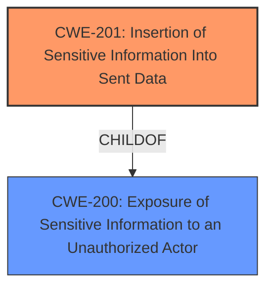

# Analysis for CVE-2022-37438

# Summary
| CWE ID | CWE Name | Confidence | CWE Abstraction Level | CWE Vulnerability Mapping Label | CWE-Vulnerability Mapping Notes |
|---|---|---|---|---|---|
| CWE-201 | Insertion of Sensitive Information Into Sent Data | 0.9 | Base | Primary | Allowed |
| CWE-200 | Exposure of Sensitive Information to an Unauthorized Actor | 0.7 | Class | Secondary | Discouraged |

## Evidence and Confidence

*   **Confidence Score:** 0.8
*   **Evidence Strength:** HIGH

## Relationship Analysis
The primary relationship that impacted my decision was the ChildOf relationship between CWE-201 and CWE-200. While CWE-200 is a broader classification, CWE-201 specifically addresses the insertion of sensitive information into data being sent, which aligns closely with the vulnerability description. Since the vulnerability specifically involves the **insertion** of sensitive user information (username, email, real name) into dashboard drilldown URLs, CWE-201 is more appropriate.

## Vulnerability Chain
The chain of events leading to the vulnerability is as follows:

1.  **Root Cause:** The application **inserts** sensitive information into the drilldown URLs of dashboards. This is the **weakness**.
2.  This leads to **Exposure** of that sensitive information to unauthorized actors when those URLs are visited.
    
The root cause is the **insertion** of the sensitive information into the sent data (the URL). The impact is the exposure of the sensitive information.

## Summary of Analysis
Initial analysis focused on identifying the root cause of the vulnerability, which lies in the Splunk Enterprise's handling of environment variables within dashboard drilldown URLs. The vulnerability description highlights how an authenticated user can craft a dashboard that **leaks information** (username, email, real name) when another user interacts with it. The **CVE Reference Links Content Summary** section specifically notes that the vulnerability stems from how Splunk Enterprise handles environment variables and the **insufficient input sanitization/validation** of these variables.

The retriever results suggested several potential CWEs, including CWE-200 (Exposure of Sensitive Information to an Unauthorized Actor), CWE-61 (UNIX Symbolic Link (Symlink) Following), and CWE-201 (Insertion of Sensitive Information Into Sent Data).

CWE-200 was initially considered due to the information exposure aspect. However, the MITRE mapping guidance **discourages** its use as it is a high-level impact rather than a root cause. The guidance recommends considering more specific children.

CWE-61 was ruled out because it deals with symlink vulnerabilities, which are not relevant to this vulnerability.

CWE-201, "Insertion of Sensitive Information Into Sent Data", was ultimately selected as the primary CWE because it accurately describes the root cause: the application **inserts** sensitive information (username, email, real name) into the drilldown URLs. This is supported by the **Vulnerability Description Key Phrases** which highlight the **impact** as a **leak information** about Splunk users. The **CVE Reference Links Content Summary** also supports this by noting that environment variables are being used in drilldown URLs. The description of CWE-201 states: "The code transmits data to another actor, but a portion of the data includes sensitive information that should not be accessible to that actor." This aligns directly with the vulnerability.

CWE-200 is included as a secondary CWE, because even though it is discouraged, it does represent the high-level impact, namely the fact that sensitive information is **exposed**.

The selection of CWE-201 is at the optimal level of specificity because it directly addresses the root cause of the vulnerability - the **insertion** of sensitive data. It is a Base level CWE, which is preferred for mapping to root causes.

Relevant CWE Information:

# Enhanced Context (25 CWEs)

## CWE-538: Insertion of Sensitive Information into Externally-Accessible File or Directory
**Abstraction Level**: Base
**Similarity Score**: 0.79
**Source**: dense

**Description**:
The product places sensitive information into files or directories that are accessible to actors who are allowed to have access to the files, but not to the sensitive information.

**Mapping Guidance**:
- Usage: Allowed
- Rationale: This CWE entry is at the Base level of abstraction, which is a preferred level of abstraction for mapping to the root causes of vulnerabilities.

## CWE-472: External Control of Assumed-Immutable Web Parameter
**Abstraction Level**: Base
**Similarity Score**: 0.78
**Source**: dense

**Description**:
The web application does not sufficiently verify inputs that are assumed to be immutable but are actually externally controllable, such as hidden form fields.

**Mapping Guidance**:
- Usage: Allowed
- Rationale: This CWE entry is at the Base level of abstraction, which is a preferred level of abstraction for mapping to the root causes of vulnerabilities.

## CWE-74: Improper Neutralization of Special Elements in Output Used by a Downstream Component ('Injection')
**Abstraction Level**: Class
**Similarity Score**: 0.78
**Source**: dense

**Description**:
The product constructs all or part of a command, data structure, or record using externally-influenced input from an upstream component, but it does not neutralize or incorrectly neutralizes special elements that could modify how it is parsed or interpreted when it is sent to a downstream component.

**Mapping Guidance**:
- Usage: Discouraged
- Rationale: CWE-74 is high-level and often misused when lower-level weaknesses are more appropriate.

## CWE-807: Reliance on Untrusted Inputs in a Security Decision
**Abstraction Level**: Base
**Similarity Score**: 0.77
**Source**: dense

**Description**:
The product uses a protection mechanism that relies on the existence or values of an input, but the input can be modified by an untrusted actor in a way that bypasses the protection mechanism.

**Mapping Guidance**:
- Usage: Allowed
- Rationale: This CWE entry is at the Base level of abstraction, which is a preferred level of abstraction for mapping to the root causes of vulnerabilities.

## CWE-212: Improper Removal of Sensitive Information Before Storage or Transfer
**Abstraction Level**: Base
**Similarity Score**: 0.77
**Source**: dense

**Description**:
The product stores, transfers, or shares a resource that contains sensitive information, but it does not properly remove that information before the product makes the resource available to unauthorized actors.

**Mapping Guidance**:
- Usage: Allowed
- Rationale: This CWE entry is at the Base level of abstraction, which is a preferred level of abstraction for mapping to the root causes of vulnerabilities.

## CWE-668: Exposure of Resource to Wrong Sphere
**Abstraction Level**: Class
**Similarity Score**: 0.77
**Source**: dense

**Description**:
The product exposes a resource to the wrong control sphere, providing unintended actors with inappropriate access to the resource.

**Mapping Guidance**:
- Usage: Discouraged
- Rationale: CWE-668 is high-level and is often misused as a catch-all when lower-level CWE IDs might be applicable. It is sometimes used for low-information vulnerability reports [REF-1287]. It is a level-1 Class (i.e., a child of a Pillar). It is not useful for trend analysis.

## CWE-226: Sensitive Information in Resource Not Removed Before Reuse
**Abstraction Level**: Base
**Similarity Score**: 0.76
**Source**: dense

**Description**:
The product releases a resource such as memory or a file so that it can be made available for reuse, but it does not clear or "zeroize" the information contained in the resource before the product performs a critical state transition or makes the resource available for reuse by other entities.

**Mapping Guidance**:
- Usage: Allowed
- Rationale: This CWE entry is at the Base level of abstraction, which is a preferred level of abstraction for mapping to the root causes of vulnerabilities.

## CWE-497: Exposure of Sensitive System Information to an Unauthorized Control Sphere
**Abstraction Level**: Base
**Similarity Score**: 0.76
**Source**: dense

**Description**:
The product does not properly prevent sensitive system-level information from being accessed by unauthorized actors who do not have the same level of access to the underlying system as the product does.

**Mapping Guidance**:
- Usage: Allowed
- Rationale: This CWE entry is at the Base level of abstraction, which is a preferred level of abstraction for mapping to the root causes of vulnerabilities.

## CWE-41: Improper Resolution of Path Equivalence
**Abstraction Level**: Base
**Similarity Score**: 0.76
**Source**: dense

**Description**:
The product is vulnerable to file system contents disclosure through path equivalence. Path equivalence involves the use of special characters in file and directory names. The associated manipulations are intended