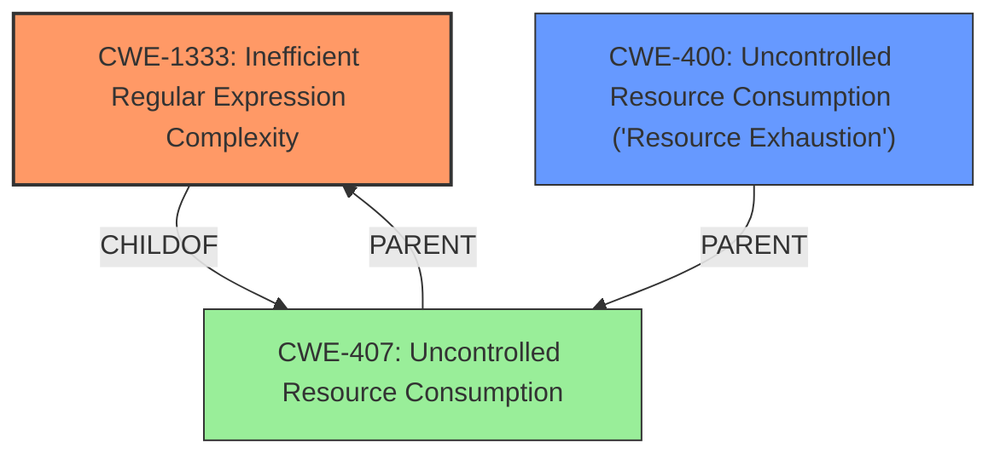

# Raw Analyzer Response for CVE-2022-37620

# Summary
| CWE ID    | CWE Name                                        | Confidence | CWE Abstraction Level | CWE Vulnerability Mapping Label | CWE-Vulnerability Mapping Notes |
| :-------- | :---------------------------------------------- | :--------- | :-------------------- | :------------------------------ | :------------------------------ |
| CWE-1333 | Inefficient Regular Expression Complexity       | 1          | Base                  | Allowed                         | Primary CWE                     |
| CWE-400 | Uncontrolled Resource Consumption ('Resource Exhaustion') | 0.7          | Class                  | Allowed-with-Review                         | Secondary CWE                     |

## Evidence and Confidence

*   **Confidence Score:** 1
*   **Evidence Strength:** HIGH

## Relationship Analysis
The primary relationship influencing the selection is that CWE-1333 is a child of CWE-407 which represents Uncontrolled Resource Consumption. While the description clearly indicates the root cause is an inefficient regular expression, the impact is resource consumption, which makes CWE-400 also relevant, even though it's a more general category.

## Vulnerability Chain
The vulnerability chain starts with the use of an inefficient regular expression (**CWE-1333**), which leads to excessive CPU consumption, resulting in a denial-of-service (**CWE-400**).

## Summary of Analysis
The initial assessment strongly points to **CWE-1333 (Inefficient Regular Expression Complexity)** as the primary weakness. The **Vulnerability Description Key Phrases** section highlights "Regular Expression Denial of Service" as the **weakness**, and the **CVE Reference Links Content Summary** confirms that the root cause is a vulnerable regular expression leading to catastrophic backtracking. The retriever results also lists CWE-1333 as the top candidate.

The **CVE Reference Links Content Summary** states: "The vulnerability is caused by a regular expression used to handle custom fragments within the html-minifier library... The unbounded quantifiers `*` and `+` in this regular expression, used with the alternation `(?:...|...)`, can lead to catastrophic backtracking when processing specially crafted input strings."

The **Complete CWE Specifications** for CWE-1333 further solidify this choice, as it explicitly mentions "attackers can create crafted inputs that intentionally cause the regular expression to use excessive backtracking in a way that causes the CPU consumption to spike."

While **CWE-1333** is the root cause, the resulting impact is **CWE-400 (Uncontrolled Resource Consumption)**. This is because the inefficient regular expression leads to excessive CPU consumption, effectively causing a denial-of-service.

**CWE-1333** is at the optimal level of specificity, as it directly addresses the coding error (inefficient regular expression).
**CWE-400** is included as a secondary weakness to represent the resulting impact of the vulnerability.

Relevant CWE Information:

# Enhanced Context (25 CWEs)
The following CWEs were identified as potentially relevant to this vulnerability:

## CWE-1289: Improper Validation of Unsafe Equivalence in Input
**Abstraction Level**: Base
**Similarity Score**: 0.75
**Source**: dense

**Description**:
The product receives an input value that is used as a resource identifier or other type of reference, but it does not validate or incorrectly validates that the input is equivalent to a potentially-unsafe value.

**Mapping Guidance**:
- Usage: Allowed
- Rationale: This CWE entry is at the Base level of abstraction, which is a preferred level of abstraction for mapping to the root causes of vulnerabilities.

*This CWE was not selected because the issue is not related to validation of input equivalence.*

## CWE-703: Improper Check or Handling of Exceptional Conditions
**Abstraction Level**: Pillar
**Similarity Score**: 0.75
**Source**: dense

**Description**:
The product does not properly anticipate or handle exceptional conditions that rarely occur during normal operation of the product.

**Mapping Guidance**:
- Usage: Discouraged
- Rationale: This CWE entry is extremely high-level, a Pillar.

*This CWE was not selected because it is too high-level.*

## CWE-392: Missing Report of Error Condition
**Abstraction Level**: Base
**Similarity Score**: 0.75
**Source**: dense

**Description**:
The product encounters an error but does not provide a status code or return value to indicate that an error has occurred.

**Mapping Guidance**:
- Usage: Allowed
- Rationale: This CWE entry is at the Base level of abstraction, which is a preferred level of abstraction for mapping to the root causes of vulnerabilities.

*This CWE was not selected because the primary issue is not related to error reporting.*

## CWE-754: Improper Check for Unusual or Exceptional Conditions
**Abstraction Level**: Class
**Similarity Score**: 0.74
**Source**: dense

**Description**:
The product does not check or incorrectly checks for unusual or exceptional conditions that are not expected to occur frequently during day to day operation of the product.

**Mapping Guidance**:
- Usage: Allowed-with-Review
- Rationale: This CWE entry is a Class and might have Base-level children that would be more appropriate

*This CWE was not selected because the primary issue is not related to the improper handling of exceptional conditions.*

## CWE-617: Reachable Assertion
**Abstraction Level**: Base
**Similarity Score**: 0.74
**Source**: dense

**Description**:
The product contains an assert() or similar statement that can be triggered by an attacker, which leads to an application exit or other behavior that is more severe than necessary.

**Mapping Guidance**:
- Usage: Allowed
- Rationale: This CWE entry is at the Base level of abstraction, which is a preferred level of abstraction for mapping to the root causes of vulnerabilities.

*This CWE was not selected because it does not involve a reachable assertion.*

## CWE-668: Exposure of Resource to Wrong Sphere
**Abstraction Level**: Class
**Similarity Score**: 0.74
**Source**: dense

**Description**:
The product exposes a resource to the wrong control sphere, providing unintended actors with inappropriate access to the resource.

**Mapping Guidance**:
- Usage: Discouraged
- Rationale: CWE-668 is high-level and is often misused as a catch-all when lower-level CWE IDs might be applicable. It is sometimes used for low-information vulnerability reports [REF-1287]. It is a level-1 Class (i.e., a child of a Pillar). It is not useful for trend analysis.

*This CWE was not selected because it does not involve the exposure of resources to the wrong sphere.*

## CWE-184: Incomplete List of Disallowed Inputs
**Abstraction Level**: Base
**Similarity Score**: 0.74
**Source**: dense

**Description**:
The product implements a protection mechanism that relies on a list of inputs (or properties of inputs) that are not allowed by policy or otherwise require other action to neutralize before additional processing takes place, but the list is incomplete.

**Mapping Guidance**:
- Usage: Allowed
- Rationale: This CWE entry is at the Base level of abstraction, which is a preferred level of abstraction for mapping to the root causes of vulnerabilities.

*This CWE was not selected because it is not related to an incomplete list of disallowed inputs.*

## CWE-252: Unchecked Return Value
**Abstraction Level**: Base
**Similarity Score**: 0.73
**Source**: dense

**Description**:
The product does not check the return value from a method or function, which can prevent it from detecting unexpected states and conditions.

**Mapping Guidance**:
- Usage: Allowed
- Rationale: This CWE entry is at the Base level of abstraction, which is a preferred level of abstraction for mapping to the root causes of vulnerabilities.

*This CWE was not selected because it does not involve an unchecked return value.*

## CWE-404: Improper Resource Shutdown or Release
**Abstraction Level**: Class
**Similarity Score**: 0.73
**Source**: dense

**Description**:
The product does not release or incorrectly releases a resource before it is made available for re-use.

**Mapping Guidance**:
- Usage: Allowed-with-Review
- Rationale: This CWE entry is a Class and might have Base-level children that would be more appropriate

*This CWE was not selected because it does not involve improper resource shutdown or release.*

## CWE-129: Improper Validation of Array Index
**Abstraction Level**: Variant