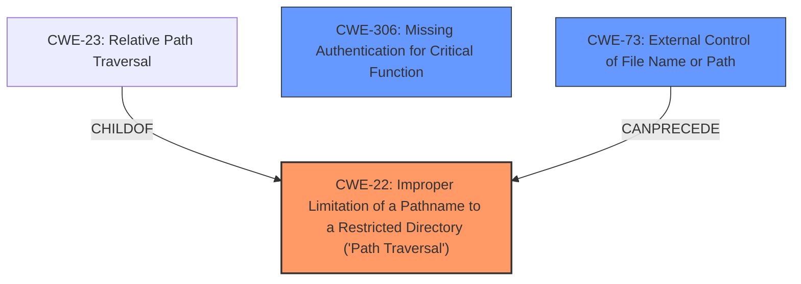

# Analysis for CVE-2022-37703

# Summary
| CWE ID | CWE Name | Confidence | CWE Abstraction Level | CWE Vulnerability Mapping Label | CWE-Vulnerability Mapping Notes |
|---|---|---|---|---|---|
| CWE-22 | Improper Limitation of a Pathname to a Restricted Directory ('Path Traversal') | 0.9 | Base | Primary | Allowed |
| CWE-73 | External Control of File Name or Path | 0.7 | Base | Secondary | Allowed |
| CWE-306 | Missing Authentication for Critical Function | 0.6 | Base | Secondary | Allowed |

## Evidence and Confidence

*   **Confidence Score:** 0.8
*   **Evidence Strength:** HIGH

## Relationship Analysis
The primary CWE selected is CWE-22, which describes the **improper** limitation of a pathname to a restricted directory. This CWE has child CWEs like CWE-23, which specifies relative path traversal. CWE-73 is a related weakness where the file name or path is externally controlled. CWE-306 relates to the missing authentication. The selection of CWE-22 is at the Base level of abstraction, which is appropriate for mapping to the root cause.

## Vulnerability Chain
The vulnerability chain starts with the `calcsize` SUID binary **not checking the path** provided by the attacker. This leads to the `opendir()` function being called with root privileges on an arbitrary path, resulting in an information leak by revealing whether a directory exists or not.

## Summary of Analysis
The initial analysis focused on the **lack of path validation** in the `calcsize` SUID binary, which allows an attacker to provide an arbitrary path to the `opendir()` function. The primary CWE mapping is CWE-22, which directly addresses the **improper** limitation of a pathname to a restricted directory. This is supported by the vulnerability description stating the binary "will use `opendir()` as root directly without checking the path, letting the attacker provide an arbitrary path."

CWE-73, External Control of File Name or Path, is considered as a secondary CWE since the attacker can control the path.

CWE-306, Missing Authentication for Critical Function, is also a secondary candidate since the `calcsize` binary doesn't authenticate the user before calling `opendir()` with root privileges. This is implied since the binary has SUID permissions.

The final selection of CWE-22, CWE-73, and CWE-306 is based on the evidence provided and their relevance to the root cause and contributing factors of the vulnerability. They are at the optimal level of specificity (Base level) for this vulnerability.

Relevant CWE Information:
- CWE-22: Improper Limitation of a Pathname to a Restricted Directory ('Path Traversal')
- CWE-73: External Control of File Name or Path
- CWE-306: Missing Authentication for Critical Function

CWEs considered but not used:
- CWE-23: Relative Path Traversal - While relative path traversal could be used to exploit CWE-22, the description doesn't explicitly state that relative paths are used.
- CWE-427: Uncontrolled Search Path Element - Not applicable because the vulnerability doesn't involve a search path.
- CWE-59: Improper Link Resolution Before File Access ('Link Following') - Not applicable because the vulnerability doesn't involve symbolic links.
- CWE-363: Race Condition Enabling Link Following - Not applicable because the vulnerability doesn't involve race conditions.
- CWE-426: Untrusted Search Path - Not applicable because the vulnerability doesn't involve a search path.
- CWE-321: Use of Hard-coded Cryptographic Key - Not applicable because the vulnerability doesn't involve cryptographic keys.
- CWE-125: Out-of-bounds Read - Not applicable because the vulnerability doesn't involve reading beyond buffer bounds.