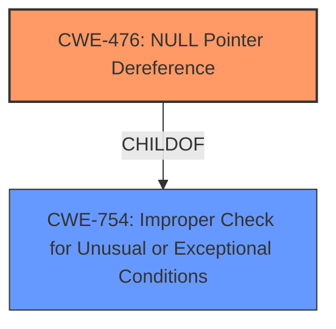

# Raw Analyzer Response for CVE-2022-37769

# Summary
| CWE ID  | CWE Name                        | Confidence | CWE Abstraction Level | CWE Vulnerability Mapping Label | CWE-Vulnerability Mapping Notes |
| :------- | :------------------------------ | :--------- | :-------------------- | :------------------------------ | :------------------------------ |
| CWE-476 | NULL Pointer Dereference        | 1.0        | Base                  | Allowed                       | Primary CWE                    |
| CWE-754 | Improper Check for Unusual or Exceptional Conditions | 0.7        | Class                  | Allowed                       | Secondary CWE                    |

## Evidence and Confidence

*   **Confidence Score:** 1.0
*   **Evidence Strength:** HIGH

## Relationship Analysis
The primary CWE identified is CWE-476 (NULL Pointer Dereference), which is a Base-level CWE. This aligns with the detailed description of the vulnerability, where the `this` pointer is null when `HuffmanDecoder::Get` is called, leading to a segmentation fault.

CWE-476 is a child of CWE-754 (Improper Check for Unusual or Exceptional Conditions). The vulnerability occurs because the code does not properly check if the pointer is valid before dereferencing it.

## Vulnerability Chain
The vulnerability chain begins with a crafted JPEG file being processed. This leads to a call to `LosslessScan::ParseMCU`, which subsequently calls `HuffmanDecoder::Get` with a null `this` pointer. The final impact is a segmentation fault, resulting in a denial of service.

## Summary of Analysis
The analysis is based on the provided vulnerability description and the CVE Reference Links Content Summary. The root cause of the vulnerability is a **null pointer dereference** in `HuffmanDecoder::Get`, which occurs because the `this` pointer is `0x0`. This is clearly stated in the CVE Reference Links Content Summary: "The issue arises because the `this` pointer is `0x0`, indicating that the method is being called on a null object."

The Retriever Results also list CWE-476 (NULL Pointer Dereference) as the top candidate.

The CWE-476 is the optimal level of specificity as it directly describes the root cause of the vulnerability, which is dereferencing a null pointer. The relationship analysis indicates that CWE-476 is a child of CWE-754, which is also relevant because the code doesn't properly check for the null pointer condition.

Relevant CWE Information:

# Enhanced Context (25 CWEs)
The following CWEs were identified as potentially relevant to this vulnerability:

## CWE-191: Integer Underflow (Wrap or Wraparound)
**Abstraction Level**: Base
**Similarity Score**: 0.77
**Source**: dense
## CWE-131: Incorrect Calculation of Buffer Size
**Abstraction Level**: Base
**Similarity Score**: 0.77
**Source**: dense
## CWE-789: Memory Allocation with Excessive Size Value
**Abstraction Level**: Variant
**Similarity Score**: 0.76
**Source**: dense
## CWE-674: Uncontrolled Recursion
**Abstraction Level**: Class
**Similarity Score**: 0.76
**Source**: dense
## CWE-125: Out-of-bounds Read
**Abstraction Level**: Base
**Similarity Score**: 0.75
**Source**: dense
## CWE-126: Buffer Over-read
**Abstraction Level**: Variant
**Similarity Score**: 0.75
**Source**: dense
## CWE-190: Integer Overflow or Wraparound
**Abstraction Level**: Base
**Similarity Score**: 0.75
**Source**: dense
## CWE-129: Improper Validation of Array Index
**Abstraction Level**: Variant
**Similarity Score**: 0.75
**Source**: dense
## CWE-1325: Improperly Controlled Sequential Memory Allocation
**Abstraction Level**: Base
**Similarity Score**: 0.75
**Source**: dense
## CWE-404: Improper Resource Shutdown or Release
**Abstraction Level**: Class
**Similarity Score**: 0.74
**Source**: dense
## CWE-190: Integer Overflow or Wraparound
**Abstraction Level**: Base
**Similarity Score**: 6121.77
**Source**: sparse
## CWE-125: Out-of-bounds Read
**Abstraction Level**: Base
**Similarity Score**: 5780.48
**Source**: sparse
## CWE-119: Improper Restriction of Operations within the Bounds of a Memory Buffer
**Abstraction Level**: Class
**Similarity Score**: 5566.05
**Source**: sparse
## CWE-1284: Improper Validation of Specified Quantity in Input
**Abstraction Level**: Base
**Similarity Score**: 5520.28
**Source**: sparse
## CWE-193: Off-by-one Error
**Abstraction Level**: Base
**Similarity Score**: 5507.35
**Source**: sparse
## CWE-128: Wrap-around Error
**Abstraction Level**: base
**Similarity Score**: 5.03
**Source**: graph
## CWE-1284: Improper Validation of Specified Quantity in Input
**Abstraction Level**: base
**Similarity Score**: 4.33
**Source**: graph
## CWE-770: Allocation of Resources Without Limits or Throttling
**Abstraction Level**: base
**Similarity Score**: 4.33
**Source**: graph
## CWE-170: Improper Null Termination
**Abstraction Level**: base
**Similarity Score**: 4.33
**Source**: graph
## CWE-681: Incorrect Conversion between Numeric Types
**Abstraction Level**: base
**Similarity Score**: 4.33
**Source**: graph
## CWE-123: Write-what-where Condition
**Abstraction Level**: base
**Similarity Score**: 3.89
**Source**: graph
## CWE-195: Signed to Unsigned Conversion Error
**Abstraction Level**: variant
**Similarity Score**: 3.88
**Source**: graph
## CWE-1339: Insufficient Precision or Accuracy of a Real Number
**Abstraction Level**: base
**Similarity Score**: 3.57
**Source**: graph
## CWE-190: Integer Overflow or Wraparound
**Abstraction Level**: Base
**Similarity Score**: 3.32
**Source**: graph
## CWE-787: Out-of-bounds Write
**Abstraction Level**: base
**Similarity Score**: 3.30
**Source**: graph

CWEs Considered but Not Used:

- CWE-119 (Improper Restriction of Operations within the Bounds of a Memory Buffer): While this is related to memory safety, it's too broad. The specific issue is a null pointer dereference, making CWE-476 a more precise fit. The mapping guidance discourages using CWE-119 when lower-level CWEs are available.
- CWE-125 (Out-of-bounds Read): This CWE is not applicable as the issue is not about reading out of bounds, but about dereferencing a null pointer.
- CWE-122 (Heap-based Buffer Overflow) and CWE-121 (Stack-based Buffer Overflow): These are not applicable because the vulnerability isn't a buffer overflow.
- CWE-674 (Uncontrolled Recursion): This is not related to the described vulnerability.
- CWE-190 (Integer Overflow or Wraparound): This is not applicable to the described vulnerability.
- CWE-770 (Allocation of Resources Without Limits or Throttling): While the vulnerability leads to a denial of service, the root cause is not related to resource allocation limits.
- CWE-754 (Improper Check for Unusual or Exceptional Conditions): This is a parent to CWE-476, and describes a broader class of errors. While the vulnerability can be described by this CWE, it is better to be more specific and choose CWE-476. CWE-754 is chosen as a secondary candidate to represent the broader issue.