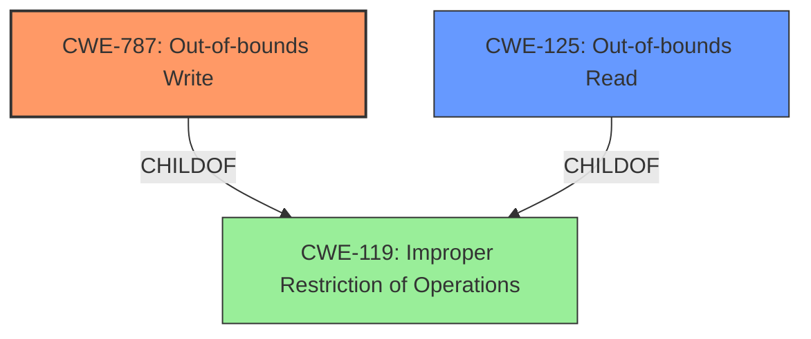

# Analysis Report for CVE-2022-37770

# Vulnerability Analysis Report: CVE-2022-37770

## Description


## Analysis (with Relationship Data)

# Summary
| CWE ID  | CWE Name                                                                    | Confidence | CWE Abstraction Level | CWE Vulnerability Mapping Label | CWE-Vulnerability Mapping Notes |
| :-------- | :-------------------------------------------------------------------------- | :--------- | :-------------------- | :------------------------------ | :------------------------------ |
| CWE-787 | Out-of-bounds Write                                                       | 0.9        | Base                  | Primary                         | Allowed                       |
| CWE-125 | Out-of-bounds Read                                                       | 0.7        | Base                  | Secondary                       | Allowed                       |

## Evidence and Confidence

*   **Confidence Score:** 0.8
*   **Evidence Strength:** HIGH

## Relationship Analysis
The primary weakness is CWE-787 (**CWE-787: Out-of-bounds Write**) because the vulnerability description and CVE Reference Links Content Summary both explicitly state that the vulnerability results in a segmentation fault due to a likely out-of-bounds access or use of an invalid pointer when processing a crafted file. Segmentation faults are often caused by writing to memory locations that are outside the intended boundaries of a buffer.

CWE-125 (**CWE-125: Out-of-bounds Read**) is a related weakness, as an out-of-bounds read could also lead to a segmentation fault, but the evidence more strongly points to a write.

Both CWE-787 and CWE-125 are children of CWE-119 (**CWE-119: Improper Restriction of Operations within the Bounds of a Memory Buffer**), which is a more general class of weakness. However, since we can identify the specific type of out-of-bounds access, we choose the more specific Base CWEs.



## Vulnerability Chain
The vulnerability chain starts with a crafted file being processed by libjpeg. This leads to an **out-of-bounds write** (CWE-787) or read (CWE-125) in the `LineMerger::GetNextLowpassLine` function, resulting in a segmentation fault and a denial of service.

## Summary of Analysis
The analysis is primarily based on the provided evidence, specifically the CVE Reference Links Content Summary, which states: "The root cause is a segmentation fault occurring within the `LineMerger::GetNextLowpassLine` function, which is triggered by a specific crafted input file. The backtrace shows the crash originating in `libc.so.6`, but the call chain indicates the issue is within libjpeg's line merging logic."

The summary also indicates that there is "a memory safety issue, specifically a segmentation fault due to a likely **out-of-bounds access** or use of an invalid pointer." This statement directly supports the selection of CWE-787 and/or CWE-125.

The relationship analysis shows that CWE-787 and CWE-125 are more specific than their parent CWE-119, making them more appropriate choices. The retriever results also list CWE-125 as a potential candidate.

The selected CWEs are at the optimal level of specificity because they accurately describe the **root cause** of the vulnerability, which is an out-of-bounds write or read, rather than a more general memory safety issue.

CWE-476 (NULL Pointer Dereference) was considered because segmentation faults can also be caused by dereferencing a null pointer, but the description of the vulnerability specifically mentions out-of-bounds access as a likely cause.

CWE-789 (**CWE-789: Memory Allocation with Excessive Size Value**) and CWE-770 (**CWE-770: Allocation of Resources Without Limits or Throttling**) were considered because they relate to memory allocation issues. However, the vulnerability description doesn't provide enough information to suggest that the root cause is related to excessive memory allocation. The **root cause** seems to be an access violation due to improper handling of buffer boundaries.


## CWE Relationship Analysis

Current CWEs represent these abstraction levels: .


### Vulnerability Chain Analysis

**Chain starting from CWE-476:**
- 476 (NULL Pointer Dereference) - ROOT


**Chain starting from CWE-119:**
- 119 (Improper Restriction of Operations within the Bounds of a Memory Buffer) - ROOT


### CWE Relationship Diagram

```mermaid
graph TD
    classDef primary fill:#f96,stroke:#333,stroke-width:2px
    classDef secondary fill:#69f,stroke:#333
    classDef tertiary fill:#9e9,stroke:#333
```


*Report generated on 2025-03-30 18:55:01*
