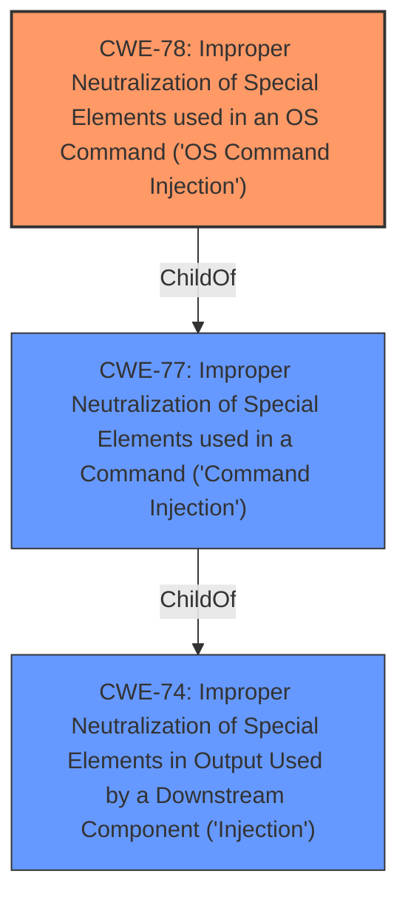

# Enhanced Analysis for CVE-2022-37810

# Summary
| CWE ID | CWE Name | Confidence | CWE Abstraction Level | CWE Vulnerability Mapping Label | CWE-Vulnerability Mapping Notes |
|---|---|---|---|---|---|
| CWE-78 | Improper Neutralization of Special Elements used in an OS Command ('OS Command Injection') | 1.0 | Base | Allowed | Primary CWE |

## Evidence and Confidence

*   **Confidence Score:** 1.0
*   **Evidence Strength:** HIGH

## Relationship Analysis
The primary relationship that influenced the decision was the ChildOf relationship between CWE-78 and CWE-77. While the initial description pointed to CWE-77, the more specific CWE-78 was chosen because the command injection occurred in the context of an OS command.



## Vulnerability Chain
The vulnerability chain consists of a **command injection** weakness, specifically within the mac parameter of the formWriteFacMac function. This allows an attacker to inject arbitrary OS commands.

## Summary of Analysis
The initial assessment strongly indicates a **command injection** vulnerability in the Tenda AC1206 router. The "Vulnerability Description Key Phrases" clearly state "weakness: **command injection**". The primary CWE match suggested by similar CVE descriptions is CWE-77. However, given the context of the vulnerability being in an OS command, CWE-78 is a more precise classification. The retriever results also list CWE-78 as a highly relevant option.

The selection of CWE-78 is based on the following evidence:

*   The vulnerability description explicitly mentions **command injection** via the mac parameter.
*   The vulnerability occurs in the function formWriteFacMac, implying a command construction context.
*   CWE-78's description aligns with the vulnerability: "The product constructs all or part of an OS command using externally-influenced input...".

The relationships between CWEs, particularly the ChildOf relationship where CWE-78 is a child of CWE-77, were crucial in determining the most appropriate CWE. While CWE-77 could be considered, CWE-78 offers a more specific and accurate representation of the vulnerability.

CWE-78 is at the Base level of abstraction, which is the preferred level for mapping vulnerabilities.

Relevant CWE Information:

# Enhanced Context (25 CWEs)
The following CWEs were identified as potentially relevant to this vulnerability:

## CWE-77: Improper Neutralization of Special Elements used in a Command ('Command Injection')
**Abstraction Level**: Class
**Similarity Score**: 1.000
**Source**: alternate_terms

**Description**:
The product constructs all or part of a command using externally-influenced input from an upstream component, but it does not neutralize or incorrectly neutralizes special elements that could modify the intended command when it is sent to a downstream component.

**Mapping Guidance**:
**Usage:** Allowed-with-Review
**Rationale:** CWE-77 is often misused when OS command injection (CWE-78) was intended instead [REF-1287].

## CWE-78: Improper Neutralization of Special Elements used in an OS Command ('OS Command Injection')
**Abstraction Level**: Base
**Similarity Score**: 0.700
**Source**: alternate_terms

**Description**:
The product constructs all or part of an OS command using externally-influenced input from an upstream component, but it does not neutralize or incorrectly neutralizes special elements that could modify the intended OS command when it is sent to a downstream component.

**Mapping Guidance**:
**Usage:** Allowed
**Rationale:** This CWE entry is at the Base level of abstraction, which is a preferred level of abstraction for mapping to the root causes of vulnerabilities.


## CWE Relationship Analysis

Current CWEs represent these abstraction levels: .


### Vulnerability Chain Analysis

**Chain starting from CWE-78:**
- 78 (Improper Neutralization of Special Elements used in an OS Command ('OS Command Injection')) - ROOT


**Chain starting from CWE-77:**
- 77 (Improper Neutralization of Special Elements used in a Command ('Command Injection')) - ROOT


### CWE Relationship Diagram

```mermaid
graph TD
    classDef primary fill:#f96,stroke:#333,stroke-width:2px
    classDef secondary fill:#69f,stroke:#333
    classDef tertiary fill:#9e9,stroke:#333
```