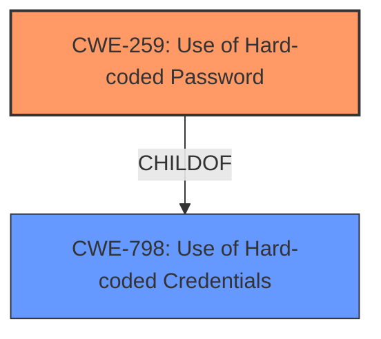

# Analysis Report for CVE-2022-37841

# Vulnerability Analysis Report: CVE-2022-37841

## Description


## Analysis (with Relationship Data)

# Summary
| CWE ID | CWE Name | Confidence | CWE Abstraction Level | CWE Vulnerability Mapping Label | CWE-Vulnerability Mapping Notes |
|---|---|---|---|---|---|
| CWE-259 | Use of Hard-coded Password | 1.0 | Variant | Allowed | Primary CWE |
| CWE-798 | Use of Hard-coded Credentials | 0.7 | Base | Allowed | Secondary Candidate |

## Evidence and Confidence

*   **Confidence Score:** 0.9
*   **Evidence Strength:** HIGH

## Relationship Analysis
The primary CWE is CWE-259, which is a Variant of CWE-798. CWE-798 is a Base CWE. Choosing CWE-259 provides a more specific classification as the vulnerability involves a hard-coded password, rather than just any hard-coded credential.



## Vulnerability Chain
The chain of events is as follows:
1.  Root Cause: The `/etc/shadow.sample` file contains a **hard-coded password** for the root user.
2.  Weakness: The presence of this **hard-coded password** allows potential attackers to gain root access.
3.  Impact: Full control of the device can be obtained by exploiting this vulnerability.

## Summary of Analysis
The initial analysis focused on identifying the root cause of the vulnerability, which is the **hard-coded password**. The evidence from the vulnerability description, especially the key phrases and CVE reference links, clearly points to this. The retriever results also highlight CWE-259 and CWE-798 as top candidates.

The final decision to classify this vulnerability as CWE-259 is based on the following evidence:

*   The vulnerability description states, "In TOTOLINK A860R V4.1.2cu.5182_B20201027 there is a **hard coded password** for root in /etc/shadow.sample."
*   The CVE Reference Links Content Summary specifies that "The `/etc/shadow.sample` file in the TOTOLINK A860R router firmware contains a hardcoded password for the root user."

CWE-259, "Use of Hard-coded Password," is a Variant of CWE-798, "Use of Hard-coded Credentials." Since the vulnerability specifically involves a hard-coded password, CWE-259 is the more specific and appropriate choice. Both CWEs have a Usage of "Allowed."

Other CWEs considered but not used:

*   CWE-321: Use of Hard-coded Cryptographic Key - While related to hard-coded values, this is specific to cryptographic keys, not passwords.
*   CWE-1391: Use of Weak Credentials - This is a broader Class that includes hard-coded passwords, but CWE-259 provides a more precise classification.
*   CWE-1393: Use of Default Password - While related, the identified vulnerability is specifically a hard-coded password, not necessarily a default one.
*   CWE-656: Reliance on Security Through Obscurity - While the hardcoded password might be considered a form of obscurity, it's more directly a problem of using a fixed, insecure credential.
*   CWE-306: Missing Authentication for Critical Function - The vulnerability isn't about missing authentication, but about **incorrect** authentication due to the **hard-coded password**.

The choice of CWE-259 is at the optimal level of specificity because it directly addresses the root cause of the vulnerability, which is the presence of a **hard-coded password**.


## CWE Relationship Analysis

Current CWEs represent these abstraction levels: .


### Vulnerability Chain Analysis

**Chain starting from CWE-321:**
- 321 (Use of Hard-coded Cryptographic Key) - ROOT


**Chain starting from CWE-259:**
- 259 (Use of Hard-coded Password) - ROOT


### CWE Relationship Diagram

```mermaid
graph TD
    classDef primary fill:#f96,stroke:#333,stroke-width:2px
    classDef secondary fill:#69f,stroke:#333
    classDef tertiary fill:#9e9,stroke:#333
```


*Report generated on 2025-03-30 15:57:31*
