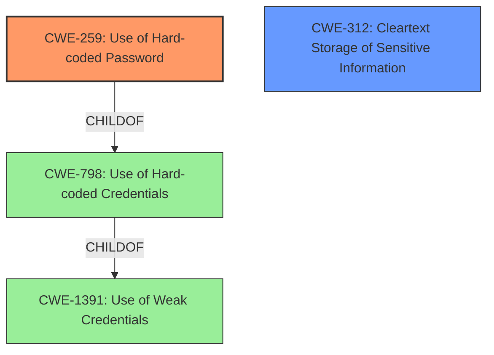

# Enhanced Analysis for CVE-2022-37857

# Summary
| CWE ID | CWE Name | Confidence | CWE Abstraction Level | CWE Vulnerability Mapping Label | CWE-Vulnerability Mapping Notes |
|---|---|---|---|---|---|
| CWE-259 | Use of Hard-coded Password | 1.0 | Variant | Allowed | Primary CWE |
| CWE-312 | Cleartext Storage of Sensitive Information | 0.8 | Base | Allowed | Secondary CWE |

## Evidence and Confidence

*   **Confidence Score:** 0.9
*   **Evidence Strength:** HIGH

## Relationship Analysis
The primary relationship that influenced the CWE selection was the parent-child relationship between CWE-798 (Use of Hard-coded Credentials) and its variants, particularly CWE-259 (Use of Hard-coded Password) and CWE-321 (Use of Hard-coded Cryptographic Key). Given that the vulnerability explicitly involves a **hardcoded password**, CWE-259 was chosen as the most specific and appropriate variant. CWE-312 was included due to the password being stored in cleartext on the client device.



## Vulnerability Chain
The vulnerability chain starts with the **hardcoded password**, leading to potential unauthorized access and data compromise. The chain is as follows:

1.  **Root Cause:** CWE-259 (Use of Hard-coded Password)
2.  CWE-312 (Cleartext Storage of Sensitive Information)
3.  Impact: Unauthorized Access, Data Breach/Compromise

## Summary of Analysis
The initial analysis focused on identifying the root cause of the vulnerability based on the provided description and CVE reference. The description clearly states that the Hauk application uses a **hardcoded password**, which is stored in the `config.php` file and in cleartext on the Android client device.

The primary CWE selected is CWE-259 (Use of Hard-coded Password), a variant of CWE-798 (Use of Hard-coded Credentials). This is because the vulnerability involves a **hardcoded password**, making CWE-259 the most specific and accurate representation of the weakness. The "Vulnerability Description Key Phrases" section explicitly identifies "**hardcoded password**" as the **rootcause**. The "CVE Reference Links Content Summary" confirms the **root cause of the vulnerability** as the Hauk application requiring a **hardcoded password**, which is stored in the `config.php` file server-side and in clear text on the Android client device.

Additionally, the fact that the password is stored in cleartext on the client device led to the inclusion of CWE-312 (Cleartext Storage of Sensitive Information).

The selection of CWE-259 is further supported by the "Retriever Results," where it is ranked as the top combined result. The mapping guidance for CWE-259 allows its use and states that it is at the Variant level of abstraction, which is preferred.

CWE-798 was considered but not used as the primary CWE because CWE-259 is a more specific variant that directly addresses the use of a **hardcoded password**.

Relevant CWE Information:

# Enhanced Context (25 CWEs)

## CWE-259: Use of Hard-coded Password
**Abstraction:** Variant
**Status:** Draft

### Description
The product contains a **hard-coded password**, which it uses for its own inbound authentication or for outbound communication to external components.

### Extended Description


A **hard-coded password** typically leads to a significant authentication failure that can be difficult for the system administrator to detect. Once detected, it can be difficult to fix, so the administrator may be forced into disabling the product entirely. There are two main variations:

```
		Inbound: the product contains an authentication mechanism that checks for a hard-coded password.
		Outbound: the product connects to another system or component, and it contains hard-coded password for connecting to that component.
```
In the Inbound variant, a default administration account is created, and a simple password is **hard-coded** into the product and associated with that account. This **hard-coded password** is the same for each installation of the product, and it usually cannot be changed or disabled by system administrators without manually modifying the program, or otherwise patching the product. If the password is ever discovered or published (a common occurrence on the Internet), then anybody with knowledge of this password can access the product. Finally, since all installations of the product will have the same password, even across different organizations, this enables massive attacks such as worms to take place.

The Outbound variant applies to front-end systems that authenticate with a back-end service. The back-end service may require a fixed password which can be easily discovered. The programmer may simply **hard-code** those back-end credentials into the front-end product. Any user of that program may be able to extract the password. Client-side systems with **hard-coded** passwords pose even more of a threat, since the extraction of a password from a binary is usually very simple.


### Alternative Terms
None

### Relationships
ChildOf -> CWE-798
ChildOf -> CWE-798
ChildOf -> CWE-798
PeerOf -> CWE-321
PeerOf -> CWE-257

### Mapping Guidance
**Usage:** Allowed
**Rationale:** This CWE entry is at the Variant level of abstraction, which is a preferred level of abstraction for mapping to the **root causes** of vulnerabilities.
**Comments:** Carefully read both the name and description to ensure that this mapping is an appropriate fit. Do not try to 'force' a mapping to a lower-level Base/Variant simply to comply with this preferred level of abstraction.
**Reasons:**
- Acceptable-Use


### Additional Notes
**[Maintenance]** This entry could be split into multiple variants: an inbound variant (as seen in the second demonstrative example) and an outbound variant (as seen in the first demonstrative example). These variants are likely to have different consequences, detectability, etc. More importantly, from a vulnerability theory perspective, they could be characterized as different behaviors.


### Observed Examples
- **CVE-2022-29964:** Distributed Control System (DCS) has **hard-coded passwords** for local shell access
- **CVE-2021-37555:** Telnet service for IoT feeder for dogs and cats has **hard-coded password** [REF-1288]
- **CVE-2021-35033:** Firmware for a WiFi router uses a **hard-coded password** for a BusyBox shell, allowing bypass of authentication through the UART port

## CWE-312: Cleartext Storage of Sensitive Information
**Abstraction:** Base
**Status:** Draft

### Description
The product stores sensitive information in cleartext within a resource that might be accessible to another control sphere.

### Extended Description


Because the information is stored in cleartext (i.e., unencrypted), attackers could potentially read it. Even if the information is encoded in a way that is not human-readable, certain techniques could determine which encoding is being used, then decode the information.


When organizations adopt cloud services, it can be easier for attackers to access the data from anywhere on the Internet.


In some systems/environments such as cloud, the use of "double encryption" (at both the software and hardware layer) might be required, and the developer might be solely responsible for both layers, instead of shared responsibility with the administrator of the broader system/environment.


### Alternative Terms
None

### Relationships
ChildOf -> CWE-311
ChildOf -> CWE-311
ChildOf -> CWE-922

### Mapping Guidance
**Usage:** Allowed
**Rationale:** This CWE entry is at the Base level of abstraction, which is a preferred level of abstraction for mapping to the **root causes** of vulnerabilities.
**Comments:** Carefully read both the name and description to ensure that this mapping is an appropriate fit. Do not try to 'force' a mapping to a lower-level Base/Variant simply to comply with this preferred level of abstraction.
**Reasons:**
- Acceptable-Use


## CWE Relationship Analysis

Current CWEs represent these abstraction levels: .


### Vulnerability Chain Analysis

**Chain starting from CWE-321:**
- 321 (Use of Hard-coded Cryptographic Key) - ROOT


**Chain starting from CWE-922:**
- 922 (Insecure Storage of Sensitive Information) - ROOT


### CWE Relationship Diagram

```mermaid
graph TD
    classDef primary fill:#f96,stroke:#333,stroke-width:2px
    classDef secondary fill:#69f,stroke:#333
    classDef tertiary fill:#9e9,stroke:#333
```