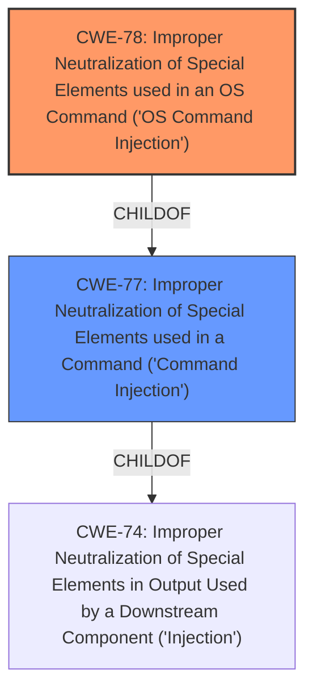

# Analysis Report for CVE-2022-37901

# Vulnerability Analysis Report: CVE-2022-37901

## Description


## Analysis (with Relationship Data)

# Summary
| CWE ID | CWE Name | Confidence | CWE Abstraction Level | CWE Vulnerability Mapping Label | CWE-Vulnerability Mapping Notes |
|---|---|---|---|---|---|
| CWE-78 | Improper Neutralization of Special Elements used in an OS Command ('OS Command Injection') | 1.0 | Base | Allowed | Primary CWE |
| CWE-77 | Improper Neutralization of Special Elements used in a Command ('Command Injection') | 0.7 | Class | Allowed-with-Review | Secondary Candidate |

## Evidence and Confidence

*   **Confidence Score:** 0.9
*   **Evidence Strength:** HIGH

## Relationship Analysis
The primary CWE identified is CWE-78 (Base), which is a child of CWE-77 (Class). CWE-77 is a more general form of command injection, while CWE-78 specifically refers to OS command injection. The vulnerability description explicitly mentions the ability to execute arbitrary commands on the underlying operating system, providing strong evidence for the more specific CWE-78. Therefore, it's appropriate to select the more specific CWE-78 over its parent CWE-77.



## Vulnerability Chain
The vulnerability chain starts with the **improper neutralization** of special elements within a command string. This leads to the ability to execute arbitrary commands as a privileged user, demonstrating a clear path from root cause to impact.

## Summary of Analysis
The initial assessment strongly points towards **CWE-78 (Improper Neutralization of Special Elements used in an OS Command ('OS Command Injection'))** as the primary weakness. The vulnerability description explicitly states that the vulnerability allows for the execution of arbitrary commands on the underlying operating system. The description includes "**command injection** vulnerabilities exist in the ArubaOS command line interface. Successful exploitation of these vulnerabilities results in the ability to execute arbitrary commands as a privileged user on the underlying operating system."

The Retriever Results also support this conclusion. CWE-78 has a high relevance score and is at the Base level of abstraction, which is preferred. The suggested usage for CWE-78 is "Allowed", reinforcing its suitability.

While CWE-77 is a parent CWE and represents a more general form of **command injection**, the specificity of the vulnerability description supports the selection of CWE-78. The **command injection** allows arbitrary commands to be run at the OS level.

CWE-20 (Improper Input Validation) was considered but deemed less appropriate as it is a high-level Class CWE. The root cause here is not simply a lack of input validation but a failure to neutralize special elements in OS commands.

Therefore, **CWE-78** is the most accurate and specific representation of the vulnerability. The confidence in this assessment is high, supported by the vulnerability description, retriever results, and CWE specifications.


## CWE Relationship Analysis

Current CWEs represent these abstraction levels: .


### Vulnerability Chain Analysis

**Chain starting from CWE-78:**
- 78 (Improper Neutralization of Special Elements used in an OS Command ('OS Command Injection')) - ROOT


**Chain starting from CWE-77:**
- 77 (Improper Neutralization of Special Elements used in a Command ('Command Injection')) - ROOT


### CWE Relationship Diagram

```mermaid
graph TD
    classDef primary fill:#f96,stroke:#333,stroke-width:2px
    classDef secondary fill:#69f,stroke:#333
    classDef tertiary fill:#9e9,stroke:#333
```


*Report generated on 2025-03-30 14:47:47*
