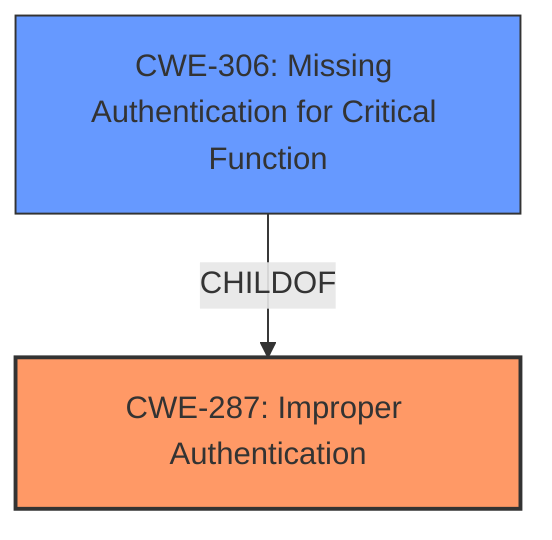

# Analysis Report for CVE-2022-37931

# Vulnerability Analysis Report: CVE-2022-37931

## Description


## Analysis (with Relationship Data)

# Summary
| CWE ID | CWE Name | Confidence | CWE Abstraction Level | CWE Vulnerability Mapping Label | CWE-Vulnerability Mapping Notes |
|---|---|---|---|---|---|
| CWE-287 | Improper Authentication | 0.75 | Class | Primary | Discouraged. See analysis below. |
| CWE-306 | Missing Authentication for Critical Function | 0.75 | Base | Secondary | Allowed. See analysis below. |

## Evidence and Confidence

*   **Confidence Score:** 0.75
*   **Evidence Strength:** MEDIUM

## Relationship Analysis
The primary relationship that influenced the decision was the ChildOf relationship between CWE-306 and CWE-287. CWE-306 is a more specific case of CWE-287. The retriever results also listed CWE-306 as a high candidate.



## Vulnerability Chain
The vulnerability chain is as follows:
1.  **Root Cause:** **Missing authentication** for a critical function (CWE-306)
2.  **Weakness:** Leads to **improper authentication** (CWE-287).
3.  **Impact:** **Unauthorized access** to the application.

## Summary of Analysis
The initial analysis focused on the **weakness** of **unauthorized access**, which pointed towards authentication-related CWEs. The Retriever Results highlighted CWE-287 (Improper Authentication) and CWE-306 (Missing Authentication for Critical Function) as potential candidates.

The vulnerability description states a vulnerability that allows **unauthorized access** to the application. The description key phrases highlight the **weakness** as **unauthorized access**.

CWE-287 (Improper Authentication) is a Class-level CWE and the mapping guidance discourages its use when lower-level CWEs are applicable. CWE-306 (Missing Authentication for Critical Function) is a Base-level CWE and a child of CWE-287, which makes it a more specific and appropriate choice when authentication is completely missing.

The evidence supports the selection of CWE-306 because the vulnerability description indicates that the application lacks proper authentication mechanisms, resulting in **unauthorized access**.

Relevant CWE Information:

# Enhanced Context (25 CWEs)

## CWE-538: Insertion of Sensitive Information into Externally-Accessible File or Directory
**Abstraction Level**: Base
**Similarity Score**: 0.78
**Source**: dense

**Description**:
The product places sensitive information into files or directories that are accessible to actors who are allowed to have access to the files, but not to the sensitive information.
**Not Used:** This CWE is not applicable as the vulnerability description does not mention any sensitive information being placed in externally accessible files.

## CWE-552: Files or Directories Accessible to External Parties
**Abstraction Level**: Base
**Similarity Score**: 0.77
**Source**: dense

**Description**:
The product makes files or directories accessible to unauthorized actors, even though they should not be.
**Not Used:** This CWE is not applicable as the vulnerability description does not specify that files or directories are being made accessible, but rather that the application itself is accessible.

## CWE-74: Improper Neutralization of Special Elements in Output Used by a Downstream Component ('Injection')
**Abstraction Level**: Class
**Similarity Score**: 0.76
**Source**: dense

**Description**:
The product constructs all or part of a command, data structure, or record using externally-influenced input from an upstream component, but it does not neutralize or incorrectly neutralizes special elements that could modify how it is parsed or interpreted when it is sent to a downstream component.
**Not Used:** This CWE is not applicable as the vulnerability description does not relate to injection vulnerabilities.

## CWE-807: Reliance on Untrusted Inputs in a Security Decision
**Abstraction Level**: Base
**Similarity Score**: 0.76
**Source**: dense

**Description**:
The product uses a protection mechanism that relies on the existence or values of an input, but the input can be modified by an untrusted actor in a way that bypasses the protection mechanism.
**Not Used:** This CWE is not applicable as the vulnerability description does not mention any reliance on untrusted inputs for security decisions.

## CWE-319: Cleartext Transmission of Sensitive Information
**Abstraction Level**: Base
**Similarity Score**: 0.76
**Source**: dense

**Description**:
The product transmits sensitive or security-critical data in cleartext in a communication channel that can be sniffed by unauthorized actors.
**Not Used:** This CWE is not applicable as the vulnerability description does not mention the transmission of sensitive information in cleartext.

## CWE-1391: Use of Weak Credentials
**Abstraction Level**: Class
**Similarity Score**: 0.76
**Source**: dense

**Description**:
The product uses weak credentials (such as a default key or hard-coded password) that can be calculated, derived, reused, or guessed by an attacker.
**Not Used:** This CWE is not applicable because the description states **unauthorized access** which is the result of **missing authentication** not the usage of **weak credentials**.

## CWE-312: Cleartext Storage of Sensitive Information
**Abstraction Level**: Base
**Similarity Score**: 0.76
**Source**: dense

**Description**:
The product stores sensitive information in cleartext within a resource that might be accessible to another control sphere.
**Not Used:** This CWE is not applicable as the vulnerability description does not mention any sensitive information being stored in cleartext.

## CWE-212: Improper Removal of Sensitive Information Before Storage or Transfer
**Abstraction Level**: Base
**Similarity Score**: 0.76
**Source**: dense

**Description**:
The product stores, transfers, or shares a resource that contains sensitive information, but it does not properly remove that information before the product makes the resource available to unauthorized actors.
**Not Used:** This CWE is not applicable as the vulnerability description does not mention the improper removal of sensitive information.

## CWE-798: Use of Hard-coded Credentials
**Abstraction Level**: Base
**Similarity Score**: 0.75
**Source**: dense

**Description**:
The product contains hard-coded credentials, such as a password or cryptographic key.
**Not Used:** This CWE is not applicable because the description states **unauthorized access** which is the result of **missing authentication** not the usage of **hard-coded credentials**.

## CWE-226: Sensitive Information in Resource Not Removed Before Reuse
**Abstraction Level**: Base
**Similarity Score**: 0.75
**Source**: dense

**Description**:
The product releases a resource such as memory or a file so that it can be made available for reuse, but it does not clear or "zeroize" the information contained in the resource before the product performs a critical state transition or makes the resource available for reuse by other entities.
**Not Used:** This CWE is not applicable as the vulnerability description does not mention the reuse of resources with sensitive information.

## CWE-79: Improper Neutralization of Input During Web Page Generation ('Cross-site Scripting')
**Abstraction Level**: Base
**Similarity Score**: 7381.12
**Source**: sparse

**Description**:
The product does not neutralize or incorrectly neutralizes user-controllable input before it is placed in output that is used as a web page that is served to other users.
**Not Used:** This CWE is not applicable as the vulnerability description does not mention any improper neutralization of input during web page generation.

## CWE-259: Use of Hard-coded Password
**Abstraction Level**: Variant
**Similarity Score**: 7050.21
**Source**: sparse

**Description**:
The product contains a hard-coded password, which it uses for its own inbound authentication or for outbound communication to external components.
**Not Used:** This CWE is not applicable because the description states **unauthorized access** which is the result of **missing authentication** not the usage of **hard-coded passwords**.

## CWE-200: Exposure of Sensitive Information to an Unauthorized Actor
**Abstraction Level**: Class
**Similarity Score**: 7046.52
**Source**: sparse

**Description**:
The product exposes sensitive information to an actor that is not explicitly authorized to have access to that information.
**Not Used:** This CWE is not applicable because the description states **unauthorized access** which is the result of **missing authentication** not the exposure of **sensitive information**.

## CWE-116: Improper Encoding or Escaping of Output
**Abstraction Level**: Class
**Similarity Score**: 6928.13
**Source**: sparse

**Description**:
The product prepares a structured message for communication with another component, but encoding or escaping of the data is either missing or done incorrectly.


## CWE Relationship Analysis

Current CWEs represent these abstraction levels: .


### Vulnerability Chain Analysis

**Chain starting from CWE-552:**
- 552 (Files or Directories Accessible to External Parties) - ROOT


**Chain starting from CWE-212:**
- 212 (Improper Removal of Sensitive Information Before Storage or Transfer) - ROOT


### CWE Relationship Diagram

```mermaid
graph TD
    classDef primary fill:#f96,stroke:#333,stroke-width:2px
    classDef secondary fill:#69f,stroke:#333
    classDef tertiary fill:#9e9,stroke:#333
```


*Report generated on 2025-03-31 11:17:32*
