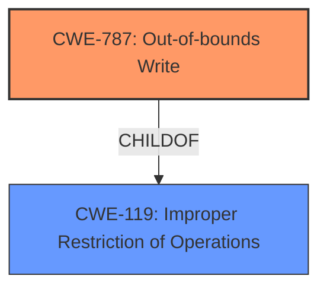

# Enhanced Analysis for CVE-2022-37937

# Summary
| CWE ID | CWE Name | Confidence | CWE Abstraction Level | CWE Vulnerability Mapping Label | CWE-Vulnerability Mapping Notes |
|---|---|---|---|---|---|
| CWE-787 | Out-of-bounds Write | 0.9 | Base | Allowed | Primary CWE |

## Evidence and Confidence

*   **Confidence Score:** 0.9
*   **Evidence Strength:** MEDIUM

## Relationship Analysis
The primary relationship influencing the selection is the ChildOf relationship between CWE-787 and CWE-119 (Improper Restriction of Operations within the Bounds of a Memory Buffer). CWE-787 is a base-level CWE, which is preferred. The graph suggests other CWEs like CWE-120, CWE-416, and CWE-415, but the description points directly to memory corruption due to out-of-bounds write, making CWE-787 the most appropriate and specific choice.



## Vulnerability Chain
The chain is quite short. There is a **pre-auth memory corruption**, which leads directly to an **out-of-bounds write** (CWE-787).

## Summary of Analysis
The initial assessment strongly points towards memory corruption due to an out-of-bounds write. The vulnerability description mentions "**Pre-auth memory corruption**" in HPE Serviceguard. The top retriever result is CWE-787 (Out-of-bounds Write), which aligns perfectly with the described memory corruption.

The other CWEs considered were:

*   CWE-416 (Use After Free) and CWE-415 (Double Free): While memory corruption can sometimes lead to these issues, the primary description focuses on the initial **memory corruption** itself, not specifically on freeing the same memory twice or using memory after it has been freed.

*   CWE-823 (Use of Out-of-range Pointer Offset): This is a possibility, but the general term "**memory corruption**" suggests a broader problem than just an offset issue.

*   CWE-316 (Cleartext Storage of Sensitive Information in Memory): This is not relevant as the description doesn't mention sensitive information storage.

*   CWE-123 (Write-what-where Condition): This is a more general case of CWE-787, but CWE-787 is more specific to the type of **memory corruption** being described.

*   CWE-134 (Use of Externally-Controlled Format String): This is not relevant as there is no mention of format strings.

*   CWE-704 (Incorrect Type Conversion or Cast) and CWE-843 (Access of Resource Using Incompatible Type ('Type Confusion')): These are also possibilities, but not as directly related to the **memory corruption** as CWE-787.

The decision to select CWE-787 is based on the direct evidence of "**Pre-auth memory corruption**" and the fact that CWE-787 is a base-level CWE that precisely describes the vulnerability. The retriever results support this decision, with CWE-787 being the top match. The MITRE mapping guidance allows for this selection, and the abstraction level is appropriate. The confidence is high due to the clear match between the description and the CWE definition.


## CWE Relationship Analysis

Current CWEs represent these abstraction levels: .


### Vulnerability Chain Analysis

**Chain starting from CWE-704:**
- 704 (Incorrect Type Conversion or Cast) - ROOT


**Chain starting from CWE-823:**
- 823 (Use of Out-of-range Pointer Offset) - ROOT


### CWE Relationship Diagram

```mermaid
graph TD
    classDef primary fill:#f96,stroke:#333,stroke-width:2px
    classDef secondary fill:#69f,stroke:#333
    classDef tertiary fill:#9e9,stroke:#333
```