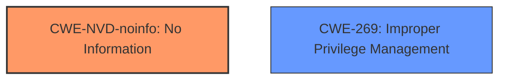

# Analysis Report for CVE-2022-37969

# Vulnerability Analysis Report: CVE-2022-37969

## Description


## Analysis (with Relationship Data)

# Summary
| CWE ID    | CWE Name                                                                     | Confidence | CWE Abstraction Level | CWE Vulnerability Mapping Label | CWE-Vulnerability Mapping Notes |
| :-------- | :--------------------------------------------------------------------------- | :--------- | :---------------------- | :------------------------------ | :------------------------------ |
| CWE-NVD-noinfo | No Information                                                               | 0.70      | N/A                       | Primary                        | N/A |
| CWE-269     | Improper Privilege Management                                                                  | 0.40       | Class                     | Secondary                    | Allowed-with-Review               |

## Evidence and Confidence

*   **Confidence Score:** 0.70
*   **Evidence Strength:** LOW

## Relationship Analysis
The primary identified CWE is CWE-NVD-noinfo, indicating a lack of specific information for precise classification. As a secondary consideration, CWE-269 (Improper Privilege Management) is considered, reflecting the stated "elevation of privilege" impact, a general class of weaknesses. The relationships between these CWEs are not directly hierarchical or chained but represent different levels of specificity in describing the vulnerability. Abstraction levels influenced selection as CWE-NVD-noinfo provides no abstraction.



## Vulnerability Chain
The vulnerability chain starts with an unspecified weakness in the Common Log File System Driver, leading to an elevation of privilege. Due to lack of information, a precise root cause cannot be determined.

## Summary of Analysis
The initial assessment strongly leans towards CWE-NVD-noinfo due to the absence of detailed information in the vulnerability description. The key phrases primarily focus on the impact ("elevation of privilege") and affected component ("Common Log File System Driver") rather than a specific root cause.

The retriever results suggest several potential CWEs related to file access and synchronization issues, such as CWE-59 (Improper Link Resolution Before File Access), CWE-367 (Time-of-check Time-of-use (TOCTOU) Race Condition), and CWE-667 (Improper Locking). However, without more specific evidence, these remain speculative.

CWE-269 (Improper Privilege Management) is considered as a secondary candidate because the "elevation of privilege" impact aligns with this general category. However, it is a high-level class, and a more specific CWE would be preferable if more information were available.

The final decision is to primarily map to CWE-NVD-noinfo due to the lack of root cause information. CWE-269 is a secondary candidate based on the impact. This decision is based on the provided evidence only.

Relevant CWE Information:

# Enhanced Context (25 CWEs)
The following CWEs were identified as potentially relevant to this vulnerability:

## CWE-191: Integer Underflow (Wrap or Wraparound)
**Abstraction Level**: Base
**Similarity Score**: 0.81
**Source**: dense

## CWE-667: Improper Locking
**Abstraction Level**: Class
**Similarity Score**: 0.78
**Source**: dense

## CWE-197: Numeric Truncation Error
**Abstraction Level**: Base
**Similarity Score**: 0.77
**Source**: dense

## CWE-131: Incorrect Calculation of Buffer Size
**Abstraction Level**: Base
**Similarity Score**: 0.76
**Source**: dense

## CWE-59: Improper Link Resolution Before File Access ('Link Following')
**Abstraction Level**: Base
**Similarity Score**: 0.76
**Source**: dense

## CWE-404: Improper Resource Shutdown or Release
**Abstraction Level**: Class
**Similarity Score**: 0.76
**Source**: dense

## CWE-681: Incorrect Conversion between Numeric Types
**Abstraction Level**: Base
**Similarity Score**: 0.76
**Source**: dense

## CWE-754: Improper Check for Unusual or Exceptional Conditions
**Abstraction Level**: Class
**Similarity Score**: 0.76
**Source**: dense

## CWE-362: Concurrent Execution using Shared Resource with Improper Synchronization ('Race Condition')
**Abstraction Level**: Class
**Similarity Score**: 0.76
**Source**: dense

## CWE-703: Improper Check or Handling of Exceptional Conditions
**Abstraction Level**: Pillar
**Similarity Score**: 0.75
**Source**: dense

## CWE-367: Time-of-check Time-of-use (TOCTOU) Race Condition
**Abstraction Level**: Base
**Similarity Score**: 5617.50
**Source**: sparse

## CWE-59: Improper Link Resolution Before File Access ('Link Following')
**Abstraction Level**: Base
**Similarity Score**: 5498.24
**Source**: sparse

## CWE-667: Improper Locking
**Abstraction Level**: Class
**Similarity Score**: 5404.58
**Source**: sparse

## CWE-362: Concurrent Execution using Shared Resource with Improper Synchronization ('Race Condition')
**Abstraction Level**: Class
**Similarity Score**: 5404.35
**Source**: sparse

## CWE-1386: Insecure Operation on Windows Junction / Mount Point
**Abstraction Level**: Base
**Similarity Score**: 5289.96
**Source**: sparse

## CWE-476: NULL Pointer Dereference
**Abstraction Level**: base
**Similarity Score**: 4.33
**Source**: graph

## CWE-609: Double-Checked Locking
**Abstraction Level**: base
**Similarity Score**: 4.33
**Source**: graph

## CWE-123: Write-what-where Condition
**Abstraction Level**: base
**Similarity Score**: 3.36
**Source**: graph

## CWE-120: Buffer Copy without Checking Size of Input ('Classic Buffer Overflow')
**Abstraction Level**: base
**Similarity Score**: 3.36
**Source**: graph

## CWE-73: External Control of File Name or Path
**Abstraction Level**: base
**Similarity Score**: 3.36
**Source**: graph

## CWE-416: Use After Free
**Abstraction Level**: variant
**Similarity Score**: 3.24
**Source**: graph

## CWE-386: Symbolic Name not Mapping to Correct Object
**Abstraction Level**: base
**Similarity Score**: 3.03
**Source**: graph

## CWE-367: Time-of-check Time-of-use (TOCTOU) Race Condition
**Abstraction Level**: Base
**Similarity Score**: 2.89
**Source**: graph

## CWE-252: Unchecked Return Value
**Abstraction Level**: base
**Similarity Score**: 2.87
**Source**: graph

## CWE-364: Signal Handler Race Condition
**Abstraction Level**: base
**Similarity Score**: 2.87
**Source**: graph


## CWE Relationship Analysis

Current CWEs represent these abstraction levels: .


### Vulnerability Chain Analysis

**Chain starting from CWE-609:**
- 609 (Double-Checked Locking) - ROOT


**Chain starting from CWE-123:**
- 123 (Write-what-where Condition) - ROOT


### CWE Relationship Diagram

```mermaid
graph TD
    classDef primary fill:#f96,stroke:#333,stroke-width:2px
    classDef secondary fill:#69f,stroke:#333
    classDef tertiary fill:#9e9,stroke:#333
```


*Report generated on 2025-03-31 01:22:36*
