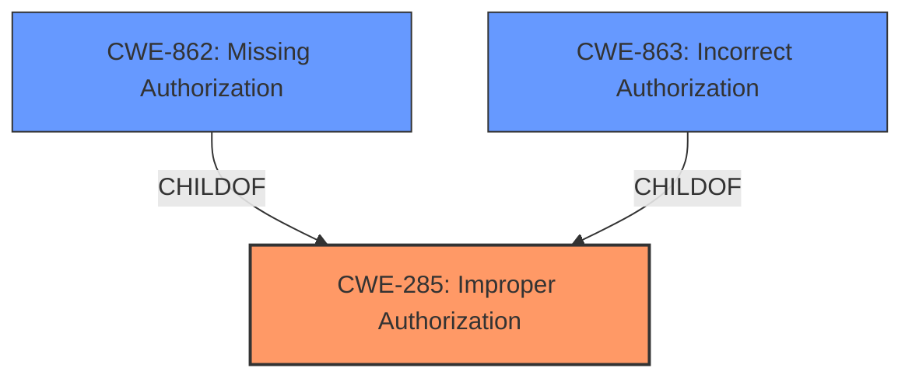

# Enhanced Analysis for CVE-2022-38064

# Summary
| CWE ID | CWE Name | Confidence | CWE Abstraction Level | CWE Vulnerability Mapping Label | CWE-Vulnerability Mapping Notes |
|---|---|---|---|---|---|
| CWE-285 | Improper Authorization | 0.8 | Class | Primary | Discouraged. However, it is the most accurate given the limited information. |
| CWE-862 | Missing Authorization | 0.6 | Class | Secondary | Allowed-with-Review. A possible, more specific alternative if authorization is completely missing. |
| CWE-863 | Incorrect Authorization | 0.6 | Class | Secondary | Allowed-with-Review. A possible, more specific alternative if authorization is implemented incorrectly. |

## Evidence and Confidence

*   **Confidence Score:** 0.8
*   **Evidence Strength:** MEDIUM

## Relationship Analysis
The primary CWE, CWE-285, is a Class-level CWE. It has child CWEs such as CWE-862 (Missing Authorization) and CWE-863 (Incorrect Authorization), which represent more specific scenarios. The selection of CWE-285 is based on the general description of a "permission bypass," which aligns with the concept of improper authorization. If more detail was provided about whether authorization was completely absent or incorrectly implemented, one of the child CWEs would be more appropriate.



## Vulnerability Chain
The vulnerability chain consists of:
1.  **Root Cause:** **Permission bypass** in the windowmanager component.
2.  **Impact:** Local attackers can bypass permission controls and gain access to sensitive information.

## Summary of Analysis
The initial analysis focused on identifying the root cause of the vulnerability. The description explicitly states a **permission bypass** vulnerability in OpenHarmony-v3.1.2, which allows local attackers to bypass permission control and access sensitive information.

The selection of CWE-285 (Improper Authorization) is primarily based on the vulnerability description key phrases which indicate a **permission bypass**. The CVE Reference Links Content Summary confirms this, stating that the vulnerability lies within the windowmanager and involves a **permission bypass** issue.

The retriever results also suggest CWE-285, but with a "Discouraged" usage. However, the lack of more specific details in the description prevents a more precise mapping to its children, such as CWE-862 (Missing Authorization) or CWE-863 (Incorrect Authorization). If the authorization check was completely missing, CWE-862 would be more appropriate. If the authorization check was present but flawed, CWE-863 would be a better fit. Since the provided information is ambiguous, CWE-285 serves as the most suitable high-level classification.

The final decision to use CWE-285 is a compromise between the available evidence and the recommended level of specificity. While the mapping guidance discourages the use of CWE-285, it remains the most accurate representation of the vulnerability given the limited information. The confidence score reflects this uncertainty.

Relevant CWE Information:

# Enhanced Context (25 CWEs)

## CWE-305: Authentication Bypass by Primary Weakness
**Abstraction Level**: Base
**Similarity Score**: 0.78
**Source**: dense

**Description**:
The authentication algorithm is sound, but the implemented mechanism can be bypassed as the result of a separate weakness that is primary to the authentication error.

**Mapping Guidance**:
- Usage: Allowed
- Rationale: This CWE entry is at the Base level of abstraction, which is a preferred level of abstraction for mapping to the root causes of vulnerabilities.

**Why not selected**: While this CWE describes authentication bypass, the vulnerability description does not mention any authentication issues. It is related to permission bypass, which is related to authorization.

## CWE-862: Missing Authorization
**Abstraction Level**: Class
**Similarity Score**: 0.132
**Source**: sparse

**Description**:
The product does not perform an authorization check when an actor attempts to access a resource or perform an action.

**Mapping Guidance**:
- Usage: Allowed-with-Review
- Rationale: This CWE entry is a Class and might have Base-level children that would be more appropriate

**Why Selected**: This is a potential secondary candidate if the authorization is completely missing. The evidence is insufficient to confirm this.

## CWE-732: Incorrect Permission Assignment for Critical Resource
**Abstraction Level**: Class
**Similarity Score**: 0.129
**Source**: sparse

**Description**:
The product specifies permissions for a security-critical resource in a way that allows that resource to be read or modified by unintended actors.

**Mapping Guidance**:
- Usage: Allowed-with-Review
- Rationale: While the name itself indicates an assignment of permissions for resources, this is often misused for vulnerabilities in which "permissions" are not checked, which is an "authorization" weakness (CWE-285 or descendants) within CWE's model [REF-1287].
**Comments:** Closely analyze the specific mistake that is allowing the resource to be exposed, and perform a CWE mapping for that mistake.

**Why not selected**: This CWE focuses on incorrect permission assignment rather than a general bypass. The description does not provide enough detail to determine if this is the case.

## CWE-285: Improper Authorization
**Abstraction Level**: Class
**Similarity Score**: 0.128
**Source**: sparse

**Description**:
The product does not perform or incorrectly performs an authorization check when an actor attempts to access a resource or perform an action.

**Mapping Guidance**:
- Usage: Discouraged
- Rationale: CWE-285 is high-level and lower-level CWEs can frequently be used instead. It is a level-1 Class (i.e., a child of a Pillar).

**Why Selected**: The vulnerability is a **permission bypass**, which falls under the umbrella of improper authorization. It's a higher-level class, but the details do not allow for a more specific mapping.

## CWE-863: Incorrect Authorization
**Abstraction Level**: Class
**Similarity Score**: 0.123
**Source**: sparse

**Description**:
The product performs an authorization check when an actor attempts to access a resource or perform an action, but it does not correctly perform the check.

**Mapping Guidance**:
- Usage: Allowed-with-Review
- Rationale: This CWE entry is a Class and might have Base-level children that would be more appropriate

**Why Selected**: This is a potential secondary candidate if the authorization is implemented incorrectly. The evidence is insufficient to confirm this.

## CWE-290: Authentication Bypass by Spoofing
**Abstraction Level**: Base
**Similarity Score**: 0.548
**Source**: dense

**Description**:
This attack-focused weakness is caused by incorrectly implemented authentication schemes that are subject to spoofing attacks.

**Mapping Guidance**:
- Usage: Allowed
- Rationale: This CWE entry is at the Base level of abstraction, which is a preferred level of abstraction for mapping to the root causes of vulnerabilities.

**Why not selected**: This CWE describes authentication bypass due to spoofing. The vulnerability description does not mention any authentication issues or spoofing. It is related to permission bypass, which is related to authorization.

## CWE-288: Authentication Bypass Using an Alternate Path or Channel
**Abstraction Level**: Base
**Similarity Score**: 0.002
**Source**: graph

**Description**:
The product requires authentication, but the product has an alternate path or channel that does not require authentication.

**Mapping Guidance**:
- Usage: Allowed
- Rationale: This CWE entry is at the Base level of abstraction, which is a preferred level of abstraction for mapping to the root causes of vulnerabilities.

**Why not selected**: While this CWE describes authentication bypass using alternate path, the vulnerability description does not mention any alternate path to bypass permission controls. It is related to permission bypass, which is related to authorization.

## CWE-927: Use of Implicit Intent for Sensitive Communication
**Abstraction Level**: Variant
**Similarity Score**: 0.120
**Source**: sparse

**Description**:
The Android application uses an implicit intent for transmitting sensitive data to other applications.

**Mapping Guidance**:
- Usage: Allowed
- Rationale: This CWE entry is at the Variant level of abstraction, which is a preferred level of abstraction for mapping to the root causes of vulnerabilities.

**Why not selected**: This CWE is specific to Android applications and the use of implicit intents. The vulnerability description does not specify that the affected product is an Android application.

## CWE-269: Improper Privilege Management
**Abstraction Level**: Class
**Similarity Score**: 0.116
**Source**: sparse

**


## CWE Relationship Analysis

Current CWEs represent these abstraction levels: .


### Vulnerability Chain Analysis

**Chain starting from CWE-862:**
- 862 (Missing Authorization) - ROOT


**Chain starting from CWE-290:**
- 290 (Authentication Bypass by Spoofing) - ROOT


### CWE Relationship Diagram

```mermaid
graph TD
    classDef primary fill:#f96,stroke:#333,stroke-width:2px
    classDef secondary fill:#69f,stroke:#333
    classDef tertiary fill:#9e9,stroke:#333
```